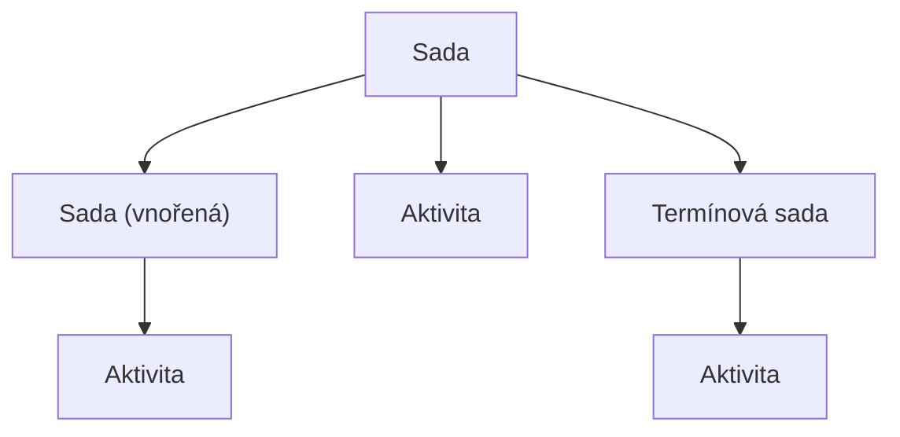

# Aktivita: model a životní cyklus

Aktivita je základní organizační jednotka vzdělávacího obsahu v systému Competent.
Tato stránka vysvětluje, jaké typy aktivit existují, jak jsou vzájemně uspořádány
v hierarchii a jakými stavy každá aktivita v průběhu svého životního cyklu prochází.
Je určena administrátorům, kteří chtějí pochopit model před tím, než začnou obsah
vytvářet nebo konfigurovat.

---

## Čtyři typy aktivit

Při vytváření nové položky Vám systém Competent nabídne čtyři typy. Každý typ
plní jinou roli v organizaci vzdělávacího obsahu:

### Aktivita

Aktivita je nejmenší samostatná vzdělávací jednotka – „list" ve stromové
struktuře obsahu. Neobsahuje žádné podřízené objekty. Při vytváření je nutné zvolit subtyp,
který určuje charakter obsahu: k dispozici jsou subtypy **Elearning**
a **Školení** (podrobnosti viz [Subtypy aktivit (připravujeme)](#)).

### Sada

Sada je kontejner, který sdružuje aktivity a další Sady. Slouží k vytváření
víceúrovňových vzdělávacích programů. Sadu lze vnořit do jiné Sady, a tak
vybudovat libovolně hlubokou hierarchii.

### Termínová sada

Termínová sada je kontejner s termíny a kapacitou. Slouží ke scénářům, kde
se uživatelé registrují na konkrétní datum, čas, místo a kde existuje omezený
počet míst. Termínová sada může obsahovat **pouze Aktivity** – nelze do ní
vkládat Sady ani další Termínové sady. Výchozí subtyp Termínové sady se
jmenuje **Komplexní Sada** (podrobnosti viz [Subtypy aktivit (připravujeme)](#)).

### Hodnocení

Hodnocení je hodnoticí formulář stojící mimo standardní stromovou strukturu.
Nevytváří se přes strom obsahu, ale v samostatné části systému. Podrobnosti
najdete v sekci [Disambiguace pojmu *Hodnocení*](#disambiguace-pojmu-hodnoceni)
níže.

---

## Hierarchie a vnořování

Typy nejsou zaměnitelné – každý typ má pevně daná pravidla, co může obsahovat
a kde může být umístěn:

| Typ | Může obsahovat | Typické umístění |
|-----|----------------|-----------------|
| Aktivita | nic (je to list) | uvnitř Sady nebo Termínové sady |
| Sada | Aktivity a další Sady | uvnitř jiné Sady nebo na kořenové úrovni |
| Termínová sada | pouze Aktivity | uvnitř jiné Sady nebo na kořenové úrovni |
| Hodnocení | nic (je to list) | samostatná sekce Hodnocení |

Graficky lze vztahy znázornit takto:

Termínová sada záměrně neumožňuje vkládání dalších Sad nebo Termínových sad.
Toto omezení je produktovým pravidlem: Termínová sada organizuje Aktivity kolem
konkrétních termínů a kapacit, nikoliv jako obecný hierarchický kontejner.

---

## Životní cyklus aktivity: 10 stavů

Každá aktivita prochází v průběhu svého existence stavem, který určuje, jak
je viditelná a přístupná pro uživatele. Systém rozlišuje celkem 10 stavů:

| # | Stav | Význam |
|---|------|--------|
| 1 | **Skryto** | Aktivita existuje v systému, ale není dostupná pro žádné uživatele |
| 2 | **Předregistrace** | Aktivita je avizována uživatelům, přihlášení ještě není možné |
| 3 | **Registrace** | Registrace je otevřena; uživatelé se mohou přihlásit |
| 4 | **Před spuštěním** | Registrace je uzavřena; čeká se na zahájení aktivity |
| 5 | **Viditelné** | Aktivita je viditelná v katalogu |
| 6 | **Spuštěno** | Aktivita probíhá; nové registrace již nejsou možné |
| 7 | **Spuštěno (R)** | Aktivita probíhá a registrace je stále otevřena – „(R)" označuje, že registrace (*Registration*) pokračuje |
| 8 | **Hodnocení** | Aktivita skončila; probíhá vyhodnocování pokusů |
| 9 | **Ukončeno** | Aktivita je finálně uzavřena |
| 10 | **Archivováno** | Aktivita je archivována; nezobrazuje se v běžných přehledech |

Jednotlivé stavy představují sémantické fáze životního cyklu aktivity.
Podrobnosti o přechodech viz [Stavy aktivity (připravujeme)](#).

## Disambiguace pojmu *Hodnocení*

!!! note "Disambiguace pojmu *Hodnocení*"
    Slovo **Hodnocení** se v systému Competent vyskytuje ve třech různých
    významech:

    1. **Sekce Hodnocení** – samostatná navigační oblast v systému, kde se
       spravují hodnoticí formuláře.
    2. **Typ aktivity Hodnocení** – hodnoticí formulář jako objekt (vytváří
       se v sekci Hodnocení, nikoliv ve stromové struktuře aktivit).
    3. **Stav aktivity Hodnocení** – fáze životního cyklu aktivity (řádek 8
       v tabulce výše), kdy probíhá vyhodnocování výsledků.

    V textu dokumentace je vždy upřesněno, o který z těchto tří významů jde.

---

## Co aktivita není

**Aktivita není „kurz" v administrátorském kontextu.** Slovo „kurz" se
v systému Competent vyskytuje pouze v portálovém (studentském) rozhraní –
například v sekci „Katalog kurzů". V administrátorském rozhraní se pro všechny
typy vzdělávacích objektů používá zastřešující pojem „aktivita".

---

## Související stránky

- [Subtypy aktivit (připravujeme)](#)
- [Stavy aktivity (připravujeme)](#)
- [Schémata aktivity (připravujeme)](#)
- [Termíny a kapacita (připravujeme)](#)
- [Jak vytvořit aktivitu (připravujeme)](#)
- [Jak přiřadit aktivitu uživatelům (připravujeme)](#)
