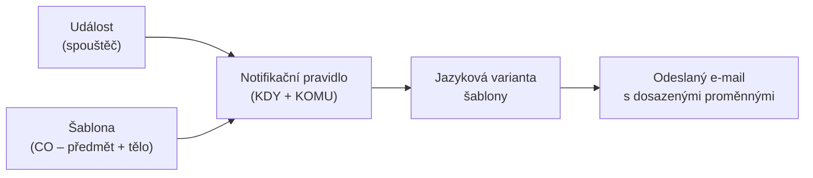

# E-mailové notifikace: jak funguje doručování zpráv

Systém Competent odesílá e-maily automaticky – v reakci na události, jako je
vytvoření účtu, blížící se termín aktivity nebo dokončení kurzu. Tato stránka
vysvětluje **mechanismus**, který za odesíláním stojí: co je šablona, co je
notifikační pravidlo, jak se určuje příjemce a jazyk, a proč se někdy e-mail
nepošle.

Je určena administrátorům, kteří chtějí pochopit principy systému před tím,
než začnou šablony upravovat nebo konfigurovat pravidla.

---

## Šablona a notifikační pravidlo: dvě části jednoho e-mailu

Každý automatický e-mail vzniká spojením **dvou nezávislých komponent**:

**Šablona** určuje **obsah** – text předmětu a tělo zprávy. Šablona neví nic
o tom, komu ani kdy se e-mail pošle; řeší pouze to, co bude v obálce.
Šablony spravujete v menu **Nastavení**, záložka **Šablony e-mailů**.

**Notifikační pravidlo** určuje **kontext doručení** – na jakou událost
(spouštěč) systém zareaguje a komu e-mail odešle (např. uživateli, hodnotiteli).
Pravidla spravujete v menu **Nastavení**, záložka **Notifikace**.

Toto oddělení umožňuje změnit obsah šablony bez zásahu do pravidel – nebo
přesvědčit systém, aby stejnou šablonu použil pro více různých událostí.

---

## Událost: kdy systém e-mail odešle

Notifikační pravidlo je svázáno s **událostí** (v dokumentaci také „spouštěč"),
která říká, za jakých okolností se e-mail má odeslat. Systém rozlišuje desítky
událostí – například:

- vytvoření uživatelského účtu
- blížící se termín aktivity
- splnění aktivity
- příchozí zpráva

Část událostí je **časovaná**: nespustí se okamžitě, ale určitý počet dní
před datem nebo po datu (typicky termín aktivity). Díky tomu lze posílat
připomínky a navazující zprávy v přesně definovaný čas relativně k aktivitě.

!!! note "Počet a přesné popisy událostí"
    Systém obsahuje desítky přednastavených událostí. Jejich výčet a podrobné
    popisy budou k dispozici v samostatné referenční stránce
    [Přehled notifikačních událostí](../reference/prehled-notifikacnich-udalosti.md).

---

## Proměnné: dynamický obsah zprávy

Text předmětu i tělo šablony mohou obsahovat **proměnné** ve tvaru `${nazev}`.
Při odeslání e-mailu systém každou proměnnou nahradí konkrétní hodnotou
platnou pro daného příjemce a událost.

Příklady proměnných:

| Proměnná | Co se dosadí |
|----------|--------------|
| `${firstName}` | jméno příjemce |
| `${activityName}` | název aktivity, které se událost týká |
| `${link}` | odkaz vedoucí do systému (přihlášení, aktivita apod.) |
| `${login}` | přihlašovací jméno příjemce |

Úplný seznam proměnných dostupných pro konkrétní šablonu naleznete přímo
v editoru šablony, pod polem **Tělo emailu**, kde je přehled
**Povolené proměnné pro tělo e-mailu**. Kliknutím na proměnnou ji vložíte
na pozici kurzoru.

---

## Jazyk e-mailu a jazykové varianty šablony

E-mail se vždy odešle v **jazyce nastaveném u příjemce**. Každá skupina šablon
proto může obsahovat více jazykových variant – jednu pro každý jazyk, který
Vaši uživatelé používají.

Pokud pro jazyk příjemce varianta neexistuje, e-mail se v daném jazyce
**neodešle**. Toto chování je záměrné: systém raději zprávu nepošle, než aby
ji doručil ve špatném jazyce.

Praktický důsledek: pokud přidáváte nový jazyk prostředí, zkontrolujte, zda
máte pro každou aktivní skupinu šablon přidanou příslušnou jazykovou variantu.

---

## Agregace: více událostí, jeden e-mail

Systém podporuje **agregaci** – sloučení několika zpráv do jednoho souhrnného
e-mailu. To se hodí například tehdy, kdy by uživatel jinak obdržel
více podobných zpráv v krátkém časovém úseku.

Agregovaná šablona se od základní liší tím, že má navíc **Hlavičku** a
**Patičku**, které obalují opakované tělo. Každá agregovaná událost přispěje
jedním blokem těla; hlavička a patička se zobrazí jednou, na začátku a konci
celé zprávy.

---

## Nastavení pro konkrétní aktivitu

Notifikační pravidlo je ve výchozím stavu **globální** – platí pro všechny
aktivity stejně. U konkrétní aktivity lze toto globální pravidlo přepsat:

- nastavit jiné pravidlo specifické pro tuto aktivitu (přepíše globální),
- nebo notifikaci pro tuto aktivitu zcela vypnout.

Tím lze například vypnout automatické upomínky u aktivit, které administrátor
spravuje manuálně, aniž by se změnila globální konfigurace pro zbytek systému.

---

## Pozor na

- **Náhled odeslaného e-mailu není k dispozici.** Editor šablony zobrazuje
  formátování HTML těla, ale proměnné (`${...}`) zůstávají v textu
  nenahrazeny. Výslednou podobu zprávy s dosazením konkrétních hodnot nelze
  v systému přímo otestovat.

- **Vypnutí notifikace patří na pravidlo, ne na šablonu.** Šablona sama o sobě
  nemá přepínač „aktivní / neaktivní". Chcete-li e-mail přestat posílat,
  upravte nebo vypněte příslušné notifikační pravidlo v záložce **Notifikace**.

- **Chybějící jazyková varianta = nedoručeno.** Pokud příjemce používá jazyk,
  pro který šablona nemá variantu, e-mail se nepošle. Tato situace nevyvolá
  chybovou hlášku – zpráva je tiše přeskočena.

---

## Související stránky

- [Úprava šablony e-mailu](../how-to/nastaveni/uprava-sablony-emailu.md)
- [Obrazovka Šablony e-mailů](../reference/obrazovka-sablony-emailu.md)
- [Přehled notifikačních událostí](../reference/prehled-notifikacnich-udalosti.md)
- [Nastavení notifikací aktivity (připravujeme)](#)
- [Role a oprávnění](role.md)
