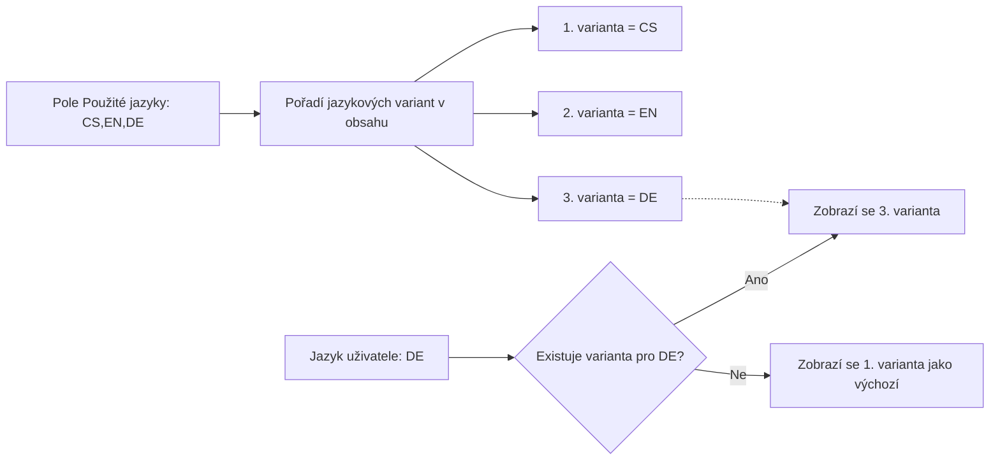

# Jazyková podpora: model a principy

Competent pracuje se dvěma zcela nezávislými jazykovými mechanismy: statickými
překlady uživatelského rozhraní a vícejazyčným obsahem, který si do systému
vkládají sami uživatelé a administrátoři. Tato stránka vysvětluje, jak spolu
oba mechanismy souvisejí, kde se určuje seznam a pořadí použitých jazyků a jak
volba jazyka konkrétního uživatele ovlivňuje to, co se mu v systému zobrazí.

---

## Dva nezávislé jazykové systémy

Competent rozlišuje:

- **Statické překlady rozhraní** – tlačítka, popisky polí, nápovědy a další
  texty aplikace. Jsou pevně dané souborem překladů pro každý jazyk.
- **Vícejazyčný uživatelský obsah** – názvy a popisy objektů, které si do
  systému vkládají sami uživatelé (například název aktivity nebo popis
  uživatelské skupiny).

Oba systémy fungují nezávisle na sobě, ale řídí se stejným nastavením pořadí
jazyků (viz další kapitola) a stejnou volbou jazyka uživatele (viz [Volba
jazyka uživatelem](#volba-jazyka-uzivatelem)).

Přidání zcela nového jazyka rozhraní (tedy nového souboru statických
překladů) není samoobslužná operace – vyžaduje zásah dodavatele systému.

---

## Použité jazyky instalace a jejich pořadí

Seznam jazyků, které daná instalace používá, a jejich závazné pořadí určuje
pole **Použité jazyky**. Pole obsahuje kódy jazyků oddělené čárkou, například
`CS,EN` – pořadí kódů v poli je zároveň pořadím jazykových variant, se kterým
pracuje vícejazyčný obsah (viz další kapitola).

Použité jazyky nastavíte v sekci **Nastavení**, na obrazovce dostupné přes tab
**Superadmin** – přístup k němu vyžaduje oprávnění **Pokročilé nástroje**.

Pokud pole zůstane prázdné, instalace běží jednojazyčně – bere se vždy jediná
(první) jazyková varianta.

Pokud administrátor nemá k obrazovce Superadmin přístup, pořadí použitých
jazyků lze zjistit i nepřímo – z pořadí možností v poli **Jazyk** na obrazovce
[Detail uživatele](../reference/detail-uzivatele.md).



---

## Vícejazyčný obsah objektů: oddělovač "|"

Do textového pole (typicky **Název**, u některých objektů i **Popis**) lze
vložit více jazykových variant oddělených znakem `|`, v pořadí odpovídajícím
nastavení použitých jazyků. Ilustrační příklad se třemi jazyky (čeština,
angličtina, němčina) z pole Název aktivity:

```
Bezpečnost práce|Occupational safety|Sicherheit am Arbeitsplatz
```

Mechanismus je systémový a týká se řady typů objektů v celém systému:

| Objekt | Lokalizovatelná pole | Kde pole najdete |
|---|---|---|
| Aktivita | Název, Popis | [Detail aktivity](../reference/detail-aktivity.md) (Název lze editovat i přímo na [obrazovce Aktivity](../reference/obrazovka-aktivity.md)) |
| Sada | Název, Popis | [Detail aktivity](../reference/detail-aktivity.md) |
| Termínová sada | Název, Popis | [Detail aktivity](../reference/detail-aktivity.md) |
| Hodnocení | Název, Popis | [Detail aktivity](../reference/detail-aktivity.md) |
| Uživatelská skupina | Název, Popis | [Detail skupiny](../reference/detail-skupiny.md) |
| Složka | Název | [Obrazovka Aktivity](../reference/obrazovka-aktivity.md) |
| Štítek | Název | [Tab Štítky](../reference/tab-stitky.md) |
| Role | Název | [Role a oprávnění](role.md) |
| Subtyp | Název | [Tab Subtypy](../reference/tab-subtypy.md) |
| Místo | Název | [Tab Místa](../reference/tab-mista.md) |

Pokud pro aktuální jazyk uživatele chybí odpovídající varianta (pole obsahuje
méně segmentů, než je nastavených jazyků), zobrazí se první, primární
jazyková varianta jako náhrada.

!!! warning "Znak | nelze použít jako běžný znak"
    Znak `|` je vyhrazen jako oddělovač jazykových variant. Použití tohoto
    znaku uvnitř běžného textu názvu nebo popisu by text rozdělilo na
    neplatné jazykové varianty.

---

## Volba jazyka uživatelem

Jazyk rozhraní i jazyk zobrazeného vícejazyčného obsahu je volba jednotlivého
uživatele, ne globální nastavení celé aplikace – uloží se u konkrétního
uživatele a řídí obojí současně.

- Administrátor nastavuje jazyk jinému uživateli v poli **Jazyk** na
  obrazovce [Detail uživatele](../reference/detail-uzivatele.md).
- Uživatel si nastavuje jazyk sám sobě na obrazovce
  [Profil](../reference/detail-uzivatele.md#profil-vlastni-ucet).

Zajímavým důsledkem této volby je, že e-mailové notifikace se odesílají
v jazyce příjemce; pokud pro daný jazyk chybí šablona, systém řeší náhradu
automaticky. Podrobnosti o šablonách a notifikačních pravidlech viz
[E-mailové notifikace: jak funguje doručování zpráv](emailove-notifikace.md).

---

## Pozor na

!!! note "Širší jazykový katalog"
    Systém zná širší nabídku jazyků, než kolik jich je v dané instalaci
    aktivně použito v poli Použité jazyky.

---

## Související stránky

- [Detail uživatele](../reference/detail-uzivatele.md)
- [E-mailové notifikace: jak funguje doručování zpráv](emailove-notifikace.md)
- [Role a oprávnění](role.md)
