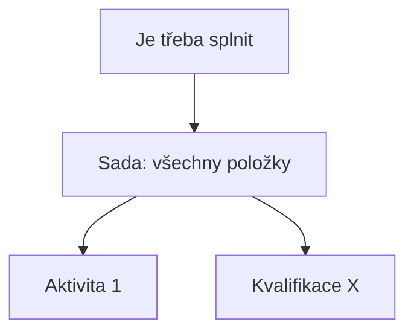

# Kvalifikace: model a principy

Kvalifikace představuje způsobilost nebo osvědčení, které uživatel v systému Competent
může získat a držet – typickým příkladem je jazykový certifikát. Tato stránka
vysvětluje, z čeho se kvalifikace skládá, jakými stavy prochází u konkrétního uživatele,
jak se nastavuje její platnost a jak fungují podmínky, které určují požadavky na její
splnění. Je určena administrátorům, kteří chtějí model pochopit dříve, než začnou
kvalifikace v administraci konfigurovat.

!!! note
    Modul Kvalifikace nemusí být dostupný ve všech instalacích – závisí na konfiguraci
    systému.

---

## Definice kvalifikace a kvalifikace přiřazená uživateli

Pojem „kvalifikace" v systému existuje ve dvou rovinách:

- **Definice kvalifikace** – šablona spravovaná v administraci. Určuje
  vlastnosti, které platí pro každé přiřazení této kvalifikace.
- **Kvalifikace přiřazená uživateli** – konkrétní držení dané kvalifikace
  konkrétním uživatelem, se svým vlastním stavem a termíny.

Kvalifikaci lze přiřadit jak jednotlivým **uživatelům**, tak celým **uživatelským
skupinám**.

---

## Stavy kvalifikace u uživatele

Kvalifikace přiřazená uživateli nabývá vždy jednoho z pěti stavů:

| Stav | Význam |
|------|--------|
| **Přiřazená** | Kvalifikace byla uživateli přiřazena, zatím nebyla splněna. |
| **Splněná** | Uživatel kvalifikaci splnil (získal). |
| **Nesplněná** | Kvalifikace nebyla splněna – například vypršel termín, ve kterém měla být splněna. |
| **Zrušená** | Přiřazení kvalifikace bylo zrušeno. |
| **Expirovaná** | Kvalifikace byla dříve splněna, ale její platnost mezitím vypršela. |

Souhrnně se tento údaj v systému označuje jako **stav kvalifikace**.

---

## Platnost kvalifikace

Definice kvalifikace určuje, jak dlouho zůstává splněná kvalifikace platná. K dispozici
jsou tři režimy:

- **Neomezeně** – kvalifikace nemá žádné časové omezení.
- **Do termínu** – platnost je vázána na pevné kalendářní datum.
- **Od data splnění** – platnost se počítá jako zadaný počet **Dnů** od okamžiku,
  kdy uživatel kvalifikaci splnil.

Pokud u splněné kvalifikace vyprší platnost, systém stav automaticky změní na
**Expirovaná**. Pokud naopak uživatel nesplní kvalifikaci ve stanoveném termínu,
systém stav automaticky změní na **Nesplněná**.

---

## Podmínky: definice požadavků

Definice kvalifikace může obsahovat **Podmínky** – seznam požadavků pod nadpisem
**Je třeba splnit**, který určuje, co má uživatel splnit, aby kvalifikaci mohl
získat. Požadavkem může být buď **konkrétní aktivita**, nebo **jiná kvalifikace**.

Jednotlivé požadavky se seskupují do **sad**. Sada může vyžadovat splnění
**všech** svých položek, nebo stačí splnit **libovolnou jednu** z nich (částečné
splnění) – tím lze vyjádřit i alternativní cesty ke splnění kvalifikace.

Podmínky určují, co je pro splnění kvalifikace požadováno – splnění vybraných
aktivit, případně jiných kvalifikací. Stav kvalifikace u uživatele (Přiřazená,
Splněná a další) systém eviduje.

---

## Pozor na

- Tato stránka nepopisuje mechanismus, kterým se stav kvalifikace u uživatele
  mění na **Splněná**. Podmínky definují **požadavky** na splnění – jejich
  konkrétní vyhodnocení a přechod uživatele do stavu Splněná není součástí
  tohoto přehledu.

---

## Související stránky

- [Obrazovka Kvalifikace](../reference/obrazovka-kvalifikace.md) – popis seznamové
  obrazovky a vytvoření nové kvalifikace
- [Detail kvalifikace](../reference/detail-kvalifikace.md) – popis záložek
  Uživatelé, Popis, Podmínky a Práva
- [Certifikát: princip a generování](certifikat.md)
- [Aktivita: model a životní cyklus](aktivita.md) – objekt, na který se mohou
  podmínky kvalifikace odkazovat
- [Podmínky přístupu: prerekvizity a vyhodnocení](podminky-pristupu.md)
