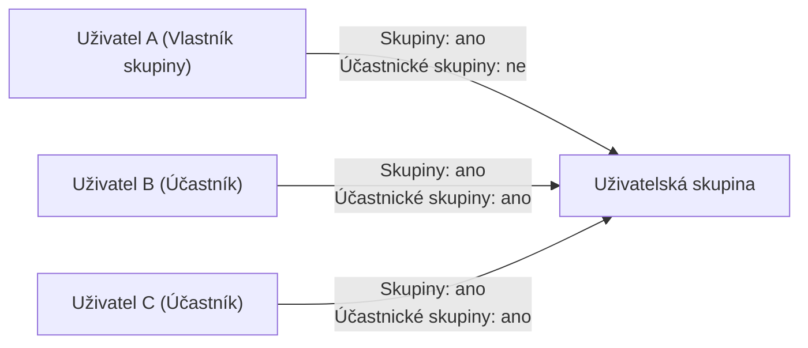
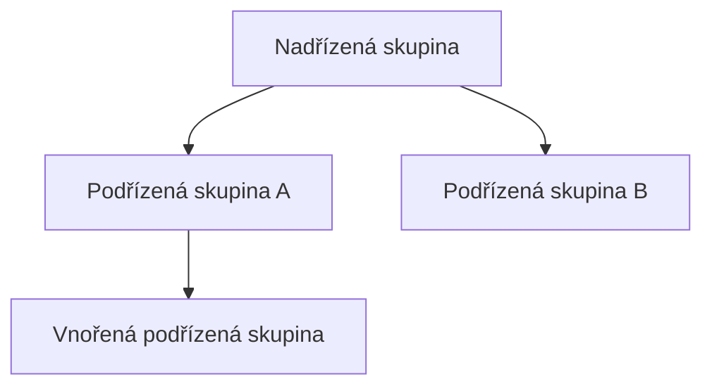

# Uživatelská skupina: model a principy

Uživatelská skupina je jeden z hlavních objektů systému Competent. Tato
stránka vysvětluje, k čemu skupiny slouží, jak funguje členství a role
v rámci skupiny, proč systém rozlišuje pohledy **Skupiny** a **Účastnické skupiny**,
a jak skupiny tvoří hierarchii. Je určena administrátorům, kteří chtějí pochopit
model před tím, než začnou skupiny vytvářet nebo spravovat.

---

## Co je uživatelská skupina

Uživatelská skupina slouží ke **klasifikaci uživatelů**. Sdružuje uživatele
podle libovolného kritéria – organizačního, projektového nebo jiného – a umožňuje
s celou skupinou pracovat jako s jedním celkem.

Skupiny v systému Competent plní tyto hlavní funkce:

- **Filtrování seznamu uživatelů** – přehled uživatelů lze filtrovat podle
  skupiny a rychle najít konkrétní okruh lidí.
- **Přiřazování oprávnění na základě skupiny** – oprávnění nebo přístup
  k aktivitám lze nastavit pro celou skupinu najednou.
- **Odeslání zprávy členům skupiny** – hromadná komunikace s členy skupiny
  je dostupná přímo ze systému.
- **Automatické přiřazování aktivit** – funkce Přiřazení dle skupin umožňuje
  automatické přiřazování vzdělávacích aktivit uživatelům na základě jejich
  členství ve skupině
  ([Přiřazení dle skupin (připravujeme)](#)).

---

## Členství a systémové role

Každé členství uživatele ve skupině vždy nese **roli**. Role určuje, jaká
oprávnění uživatel vůči skupině a jejím zdrojům má. Některé role přiděluje
systém automaticky, jiné lze přiřadit ručně.

Systém Competent definuje dvě systémové role pro skupiny:

**Vlastník skupiny**
: Role přiřazená automaticky uživateli, který skupinu vytvořil. Vlastník skupiny
  má nad skupinou plná práva. Tuto roli nelze přiřadit ručně – systém ji přiděluje
  výhradně sám v okamžiku vytvoření skupiny.

**Účastník**
: Výchozí role nového člena skupiny. Účastník získá základní práva odpovídající
  jeho členství. Tato role se přiřazuje při zařazení uživatele do skupiny.

Obecný model rolí a dědění oprávnění je popsán v části
[Role a oprávnění](role.md).

---

## Skupiny a Účastnické skupiny: jeden objekt, dva pohledy

V přehledu uživatelů se na první pohled může zdát, že existují dva různé druhy
skupin: **Skupiny** a **Účastnické skupiny**. Ve skutečnosti jde o **jeden druh
objektu nahlížený dvěma různými pohledy podle role členství**.

Přesněji řečeno:

| Pohled | Co zobrazuje | Sloupec v přehledu skupin |
|--------|--------------|---------------------------|
| **Skupiny** | Všechny skupiny, jejichž je uživatel členem – v jakékoli roli | **Uživatelů** |
| **Účastnické skupiny** | Skupiny, kde je uživatel konkrétně v roli **Účastník** | **Účastníků** |

Sloupec **Uživatelů** v přehledu skupin tedy zobrazuje celkový počet všech členů
skupiny bez ohledu na jejich roli. Sloupec **Účastníků** zobrazuje pouze ty,
kteří jsou ve skupině v roli Účastník.

!!! note "Účastnická skupina není zvláštní typ skupiny"
    Termín „Účastnické skupiny" popisuje pohled na skupiny podle role uživatele,
    nikoliv samostatný druh skupiny. Všechny skupiny v systému jsou uživatelské
    skupiny – liší se jen tím, v jaké roli je daný uživatel jejich členem.

---

## Hierarchie skupin

Skupiny lze organizovat do hierarchie: každá skupina může mít **nadřízené**
a **podřízené** skupiny. Tímto způsobem lze modelovat například organizační
strukturu firmy.

Oprávnění a role se v hierarchii **dědí směrem dolů**: pokud má uživatel
určitou roli u nadřízené skupiny, platí jeho oprávnění i pro skupiny
podřízené. Podrobný popis dědění oprávnění ve stromě objektů najdete na
stránce [Role a oprávnění](role.md).

---

## Subtyp skupiny

Skupina nemá pevně daný „typ" – veškeré rozlišení skupin probíhá výhradně
prostřednictvím **subtypu**. Subtyp určuje, jaké parametry skupina má a jaké
dodatečné vlastnosti lze vyplnit. Ve výchozí instalaci systému Competent
existuje jediný subtyp: **Uživatelská skupina**.

Subtyp se nastavuje **pouze při vytváření skupiny** a nelze ho později měnit.
Parametry skupiny (jako například **Název** nebo **Popis**) závisí na zvoleném
subtypu.

---

## Pozor na

Přiřazení dle skupin (automatické přiřazování aktivit na základě členství)
je samostatná funkce systému, která není součástí základní správy skupin.
Podrobnosti najdete v části [Přiřazení dle skupin (připravujeme)](#).

---

## Související stránky

- [Jak vytvořit uživatelskou skupinu](../how-to/lide/vytvoreni-uzivatelske-skupiny.md)
- [Jak vytvořit nového uživatele](../how-to/lide/vytvoreni-uzivatele.md)
- [Role a oprávnění](role.md)
- [Přiřazení uživatele do skupiny](../how-to/lide/prirazeni-uzivatele-do-skupiny.md)
- [Detail skupiny](../reference/detail-skupiny.md)
- [Přiřazení dle skupin (připravujeme)](#)
