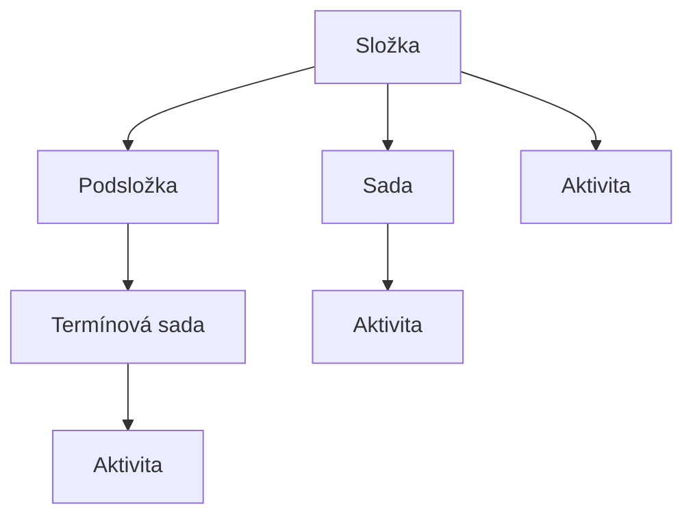

# Složky aktivit: organizace obsahu v hierarchii

Složka je organizační kontejner v systému Competent, který pomáhá udržet přehlednost ve správě vzdělávacího obsahu. Slouží výhradně ke strukturování hierarchie aktivit – sama o sobě výukový obsah nenese a nelze ji přiřadit uživateli. Tato stránka vysvětluje, co složka je, co může obsahovat, jak se liší od Sady a štítku, a jaké operace s ní administrátor může provádět.

---

## Co je složka

Složka slouží jako organizační kontejner v hierarchii aktivit. Od ostatních typů objektů v systému Competent se odlišuje v několika zásadních ohledech:

- **Přiřazení uživateli není možné.** Složka není typ aktivity a plnění se u ní nesleduje. Přiřadit lze Sadu nebo jednotlivé aktivity – ne složku.
- **Složka nemá vlastní detail.** Kliknutím na složku se otevře její obsah, ne konfigurační formulář. Naproti tomu Sada nebo aktivita vlastní detailní stránku mají.
- **Složky lze libovolně zanořovat.** Složka může obsahovat podsložky, čímž vzniká víceúrovňová hierarchie.

Název složky lze lokalizovat do více jazyků.

---

## Co složka může obsahovat

Složka je nejuniverzálnějším kontejnerem v hierarchii obsahu. Srovnání pravidel vnořování pro všechny typy:

| Typ | Může obsahovat |
|-----|----------------|
| Složka | podsložky, Sady, Termínové sady, Aktivity |
| Sada | Sady, Termínové sady, Aktivity (ne podsložky) |
| Termínová sada | pouze Aktivity |
| Aktivita | nic |

Graficky lze vztahy v hierarchii znázornit takto:

---

## Složky v obrazovce Aktivity

Správa složek probíhá na obrazovce **Aktivity**, která je rozdělena do dvou panelů:

- **Strom aktivit** (levý panel) – zobrazuje hierarchii složek jako rozbalovatelný strom. Kliknutím na uzel ve stromu se jeho obsah zobrazí v pravém panelu.
- **Složkové zobrazení** (pravý panel) – ukazuje obsah aktuálně vybrané složky nebo sady. Ve výchozím stavu jsou zobrazeny pouze položky přímo v aktivní složce; filtrování umožňuje zobrazit najednou položky ze všech podsložek. V takovém přehledu se složky jako uzly skryjí – viditelné zůstanou jen aktivity, Sady a Termínové sady.

Nejvyšší složka v systému – označovaná v příkladech jako „root" – tvoří kořen celého stromu. Zobrazení této složky závisí na přiřazených oprávněních; ne každý uživatel ji nutně uvidí.

Podrobný přehled panelů a ovládacích prvků obrazovky naleznete v části [Obrazovka Aktivity](../reference/obrazovka-aktivity.md).

---

## Operace se složkami

### Vytvoření

V Stromu aktivit nebo ve Složkovém zobrazení otevřete kontextové menu a vyberte typ Složka. Poté zadejte název a potvrďte.

### Přejmenování

Přejmenování je dostupné prostřednictvím volby přejmenování v kontextovém menu složky.

### Přesun

Přesun složky nebo jiných objektů mezi složkami lze provést dvěma způsoby:

- **Přetažením** ikony v Stromu aktivit na cílový uzel.
- **Pomocí panelu Přesunout do**: v kontextovém menu vyberte „Přesunout do", poté v panelu navigujte ke cílové složce nebo sadě a klikněte na tlačítko **Přesunout sem**.

### Smazání

!!! danger "Smazání složky je nevratné a kaskádové"
    Smazáním složky dojde k trvalému smazání veškerého jejího obsahu –
    včetně všech podsložek, Sad, Termínových sad i aktivit uvnitř.
    Tato operace je nevratná.

    Před smazáním ověřte, že žádná z podřízených aktivit nadále není potřeba.

---

## Složka a Sada: odlišnosti

Složka a Sada jsou dva koncepty, které se na první pohled mohou jevit podobně, ale mají zásadně odlišnou roli:

| Vlastnost | Složka | Sada |
|-----------|--------|------|
| Typ entity | organizační kontejner | typ aktivity |
| Lze přiřadit uživateli | ne | ano |
| Sledování plnění | ne | ano |
| Životní cyklus | ne | ano |
| Vlastní detail | ne – kliknutí otevře obsah | ano |
| Může obsahovat podsložky | ano | ne |

Podrobnosti o Sadě naleznete na stránce [Sada: struktura, hierarchie a splnění](sada.md).

---

## Složka a štítek: odlišení

Systém Competent nabízí dva organizační mechanismy, které se liší svou povahou:

- **Složka** – hierarchická organizace. Každá aktivita náleží právě do jedné složky. Složky tvoří strom a jsou viditelné ve Stromu aktivit.
- **Štítek** – plochá klasifikační značka. Jedné aktivitě lze přiřadit více štítků. Štítky nejsou uzly stromu – slouží k filtrování aktivit napříč hierarchií.

Podrobnosti o štítcích naleznete na stránce [Štítky](stitky.md).

---

## Oprávnění a dědičnost práv

Oprávnění udělená na složce se automaticky dědí na celý podstrom – platí tedy pro všechny podsložky i aktivity uvnitř. Díky tomu stačí nastavit přístup jednou na nadřazené složce; manuální konfigurace pro každou podřízenou aktivitu není nutná.

Podrobný model oprávnění naleznete na stránce [Role a oprávnění](role.md).

---

## Související stránky

- [Aktivita: model a životní cyklus](aktivita.md)
- [Sada: struktura, hierarchie a splnění](sada.md)
- [Termínová sada](terminova-sada.md)
- [Subtypy aktivit](subtypy-aktivit.md)
- [Štítky](stitky.md)
- [Role a oprávnění](role.md)
- [Obrazovka Aktivity](../reference/obrazovka-aktivity.md)
- [Sdílené aktivity (připravujeme)](#)
