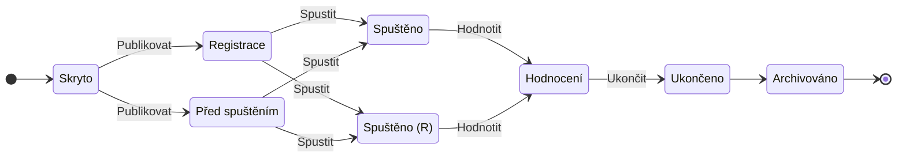

# Stavy aktivity: přechody a životní cyklus

Každá aktivita v systému Competent se nachází v jednom z deseti stavů. Stav
určuje, jak je aktivita viditelná a přístupná pro uživatele. Tato stránka
vysvětluje, **jak a proč se stav mění** – tedy mechanismus přechodů a logiku
životního cyklu. Úplné významy jednotlivých stavů najdete v
[Aktivita: model a životní cyklus](aktivita.md).

---

## Co stav určuje

Stav aktivity je **uložená hodnota**, která systému říká, do jaké míry je
aktivita viditelná a přístupná pro uživatele. Není to příznak vypočítávaný
za běhu – systém drží stav jako explicitní nastavení a podle něj pak
řídí viditelnost aktivity v katalogu, dostupnost registrace i přístup
k obsahu.

---

## Stav nastavuje administrátor

!!! warning "Přechody jsou ruční – stav se nemění sám od sebe"
    Stav aktivity se **nikdy** nemění automaticky podle data ani uplynutého
    času. Přejít do dalšího stavu může pouze administrátor s příslušným
    oprávněním. Časové údaje u aktivity (například datum registrace nebo
    datum spuštění) ovlivňují dostupnost obsahu pro uživatele, nikoliv
    stav aktivity samotné.

Administrátor se stávajícím oprávněním **Změna stavu aktivity** má dvě
cesty, jak stav změnit:

1. **Akční tlačítka** – systém nabídne tlačítka navrhovaných přechodů
   podle aktuálního stavu aktivity. K dispozici jsou tlačítka
   **Publikovat**, **Spustit**, **Hodnotit** a **Ukončit**. Nabídka se mění
   v závislosti na tom, ve kterém stavu se aktivita právě nachází.

2. **Přímá volba stavu** – administrátor může nastavit kterýkoli
   z deseti stavů přímo, bez ohledu na nabídku akčních tlačítek.

---

## Životní cyklus stavů

Pro orientaci lze deset stavů rozdělit do tří fází:

| Fáze | Stavy |
|------|-------|
| Před spuštěním | Skryto, Předregistrace, Registrace, Před spuštěním |
| Probíhá a vyhodnocení | Spuštěno, Spuštěno (R), Hodnocení |
| Po skončení | Ukončeno, Archivováno |

Stav **Viditelné** stojí mimo toto lineární schéma – používá se zejména
u vícenásobných termínových aktivit (viz část
[Stavy a termínové aktivity](#stavy-a-terminove-aktivity) níže).

Hlavní průběh životního cyklu pro typickou aktivitu zachycuje diagram:

Tlačítko **Ukončit** je navíc dostupné z většiny stavů (Skryto, Registrace,
Před spuštěním, Spuštěno, Spuštěno (R) i Hodnocení) a vždy přepne aktivitu
přímo do stavu Ukončeno. Administrátor může také nastavit kterýkoli stav
přímou volbou, bez ohledu na nabídku akčních tlačítek.

Podrobný popis toho, co každý stav znamená pro viditelnost aktivity
a přístup uživatelů, najdete v tabulce stavů v
[Aktivita: model a životní cyklus](aktivita.md).

---

## Spuštěno a Spuštěno (R)

Systém rozlišuje dva stavy, v nichž aktivita aktivně probíhá:

- **Spuštěno** – aktivita běží, registrace je uzavřená. Noví uživatelé se
  přihlásit nemohou.
- **Spuštěno (R)** – aktivita běží a registrace zůstává otevřená.
  Zkratka „(R)" označuje, že registrace (*Registration*) stále pokračuje.

Do kterého z těchto dvou stavů administrátor přejde po stisknutí tlačítka
**Spustit**, závisí na tom, zda má aktivita povolenou registraci.

---

## Stavy a termínové aktivity

Popsané přechody a akční tlačítka platí přímo pro **beztermínové a
jednorázové termínové aktivity**.

U **vícenásobných termínových aktivit** (aktivit s více termíny) funguje
rozdělení odpovědnosti jinak: hlavní aktivita nese jen hrubé stavové
přechody (typicky Skryto → Viditelné → Ukončeno → Archivováno), zatímco
podrobné stavy registrace a spuštění jsou řízeny na úrovni jednotlivých
termínů. Stav **Viditelné** je proto u tohoto typu aktivit klíčový –
signalizuje, že aktivita je zveřejněna a uživatelé si mohou vybírat
z termínů.

Podrobnosti o schématech aktivit a chování termínů naleznete na stránce
[Schémata aktivity](schemata-aktivity.md).

---

## Stav aktivity vs stav přístupu uživatele

!!! note "Dvě různé věci se stejným názvem"
    Pojmy **Spuštěno**, **Hodnocení** a **Archivováno** se vyskytují jak
    jako stavy aktivity (popsané na této stránce), tak jako stavy
    uživatelského **přístupu** k aktivitě. Jde o dva odlišné objekty
    s vlastními, na sobě nezávislými stavy. Tato stránka se zabývá výhradně
    stavem aktivity jako celku. Stavy uživatelského přístupu jsou popsány
    na samostatné stránce [Pokusy uživatele (připravujeme)](#).

---

## Související stránky

- [Aktivita: model a životní cyklus](aktivita.md) – úplná tabulka 10 stavů
  s jejich významem
- [Sada](sada.md)
- [Termínová sada](terminova-sada.md)
- [Schémata aktivity](schemata-aktivity.md)
- [Pokusy uživatele (připravujeme)](#)
