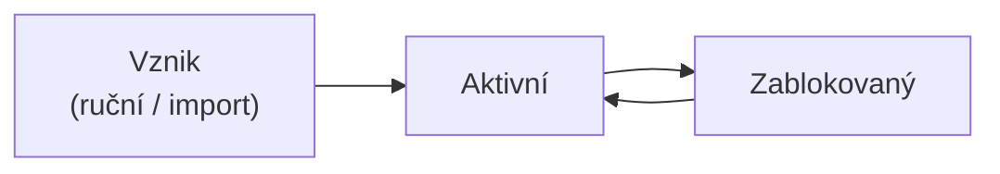

# Uživatel: model a životní cyklus

Uživatel je základní evidenční objekt systému Competent – každá osoba zavedená
do systému existuje jako objekt uživatele s vlastními parametry, rolemi a přístupy
k aktivitám. Tato stránka vysvětluje, co uživatelský objekt obsahuje, jakými
stavy účet prochází a jak uživatel souvisí s dalšími částmi systému. Je určena
administrátorům, kteří chtějí pochopit model před tím, než začnou uživatele
spravovat nebo konfigurovat jejich přístupy.

---

## Co je uživatel

Uživatelem rozumíme každou osobu zavedenou do systému Competent: správce,
hodnotitele, účastníky kurzů i osoby evidované v systému bez aktivního přístupu
k rozhraní. Obrazovka, kde spravujete uživatele, se jmenuje **Lidé**.

V technickém smyslu lze rozlišit dvě roviny:

- **Uživatel** – fyzická osoba, za níž záznam stojí.
- **Objekt uživatele** – datový záznam v systému s parametry, rolemi a vazbami.

Toto rozlišení je užitečné zejména při uvažování o tom, co se děje při
zablokování účtu nebo při automatickém přiřazování aktivit – akce vždy míří na
objekt, nikoliv přímo na osobu.

---

## Parametry účtu

Každý uživatel má sadu parametrů. Níže jsou klíčové z nich:

| Parametr | Popis |
|----------|-------|
| **Jméno a Příjmení** | Identifikace osoby v systému |
| **E-mail** | Musí být unikátní v celém systému; používá se pro notifikace |
| **Přihlašovací jméno** | Unikátní identifikátor pro přihlášení |
| **Heslo** | Uloženo v zašifrované podobě |
| **Jazyk** | Jazyk rozhraní systému pro daného uživatele; nemá vliv na jazyk obsahu kurzů |
| **Subtyp** | Určuje sadu parametrů uživatele; nastavuje se při vytvoření a nelze ho později změnit |

Uživatelské subtypy umožňují přidat vlastní parametry; jejich správa je
v **Nastavení**. Detailní přehled všech parametrů najdete na stránce
[Detail uživatele (připravujeme)](#).

---

## Stav účtu

Uživatelský účet má právě dva možné stavy:

- **Aktivní** – uživatel se může přihlásit a pracovat v systému podle svých
  oprávnění.
- **Zablokovaný** – přihlášení není možné; uživatelský záznam zůstává v systému
  zachován včetně veškeré historie.

Jiné stavy účtu neexistují. Zablokování se provede přímo v detailu uživatele;
záznam se z databáze nemaže.

---

## Životní cyklus uživatele

Uživatel vzniká jedním ze dvou způsobů:

- **Ručním založením** – administrátor vytvoří záznam přímo v obrazovce **Lidé**
  ([Jak vytvořit nového uživatele](../how-to/lide/vytvoreni-uzivatele.md)).
- **Importem** – hromadné zavedení uživatelů ze souboru xlsx
  ([Jak importovat uživatele](../how-to/lide/import-uzivatelu.md)).

Po celou dobu existence uživatelského záznamu systém eviduje **historii akcí**:
veškeré změny parametrů i přiřazení jsou zaznamenány a dostupné v detailu
uživatele.

Deaktivace probíhá nastavením stavu **Zablokovaný**. Záznam se z databáze
nemaže – historická data a přístupy k aktivitám zůstávají zachovány.

---

## Role a oprávnění

Uživatel může mít oprávnění přidělena dvěma způsoby:

- **Globální role** – přiřazeny přímo uživateli a platí v celém systému.
- **Objektové role** – vážou se ke konkrétnímu objektu (aktivitě, skupině apod.)
  a platí jen pro tento objekt.

Role lze přidělit uživateli přímo nebo prostřednictvím jeho členství
v uživatelské skupině. Detailní popis modelu oprávnění najdete na stránce
[Role a oprávnění](role.md).

---

## Skupiny

Uživatel může být členem jedné nebo více **uživatelských skupin**. Skupiny
slouží ke klasifikaci uživatelů a umožňují hromadné přiřazování oprávnění nebo
aktivit. Podrobnosti najdete na stránce
[Uživatelská skupina](skupina.md).

---

## Přístupy k aktivitám

Vztah uživatele k aktivitám není uložen přímo na uživateli – pro každou
kombinaci uživatel a aktivita vzniká samostatný objekt zvaný **přístup**.
Přístup popisuje, od kdy a do kdy má uživatel aktivitu k dispozici, v jakém
stavu se plnění nachází a jaké pokusy proběhly. Podrobnosti najdete na stránce
[Přiřazení aktivity uživateli (přístup)](prirazeni-aktivity-uzivateli-pristup.md).

---

## Pozor na

!!! warning "Super administrátor"
    Systém Competent nabízí příznak **Super administrátor**, který uděluje
    přihlášenému uživateli plná práva bez ohledu na přiřazené role. Jeho
    nastavení se nedoporučuje – použijte raději cíleně přidělené role.
    Podrobnosti o rolích najdete na stránce [Role a oprávnění](role.md).

---

## Související stránky

- [Jak vytvořit nového uživatele](../how-to/lide/vytvoreni-uzivatele.md)
- [Jak importovat uživatele](../how-to/lide/import-uzivatelu.md)
- [Jak přiřadit roli uživateli](../how-to/lide/prirazeni-role-uzivateli.md)
- [Role a oprávnění](role.md)
- [Uživatelská skupina](skupina.md)
- [Přiřazení aktivity uživateli (přístup)](prirazeni-aktivity-uzivateli-pristup.md)
- [Přiřazení dle skupin](prirazeni-dle-skupin.md)
