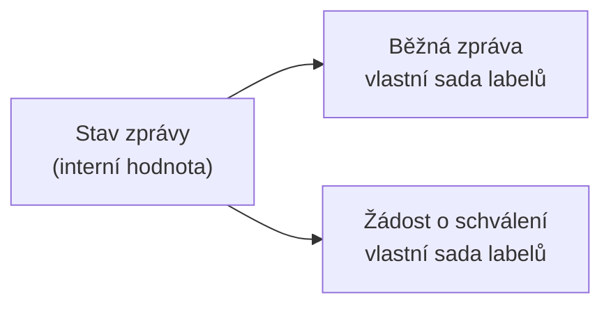

# Zprávy: model a principy

Competent obsahuje interní systém zpráv, který slouží ke komunikaci mezi
uživateli a systémem – od běžných uživatelských vzkazů přes systémová hlášení
až po žádosti o schválení přístupu k aktivitě. Tato stránka vysvětluje, co
modul Zprávy pokrývá, jaké typy zpráv rozlišuje a proč se stejný stav zprávy
může zobrazit dvěma různými způsoby. Popis samotné obrazovky a jejích polí
najdete v referenci [Obrazovka Zprávy](../reference/obrazovka-zpravy.md).

---

## Co je modul Zprávy

Modul **Zprávy** je vnitřní systém zpráv Competent. Kromě běžné komunikace
mezi uživateli pokrývá i systémová hlášení, komentáře k pokusům uživatele
a žádosti o schválení (přístup k aktivitě, nová aktivita).

Modul **není položkou hlavního menu**. Otevírá se výhradně přes **zvonek
notifikací** v hlavičce aplikace, odkazem „Zobrazit všechny zprávy". Jde
o jedinou cestu na obrazovku Zprávy.

Dostupnost modulu je navíc podmíněná nastavením systému. Pokud je modul
v daném prostředí vypnutý, zvonek notifikací se v hlavičce nezobrazuje
vůbec a k obrazovce Zprávy se nelze dostat žádnou jinou cestou.

!!! note "Zprávy nejsou e-mailové notifikace"
    Modul Zprávy je samostatný systém, oddělený od
    [e-mailových notifikací](emailove-notifikace.md). Propojení mezi nimi
    zajišťuje jen volitelný přepínač **Notifikace e-mailem**, který lze
    zapnout u konkrétní zprávy – tím se o dané zprávě navíc pošle e-mail.

---

## Typy zpráv

Systém rozlišuje 9 typů zpráv. Uživatel může ručně vytvořit jen 5 z nich přes
tlačítko **Nová zpráva** – zbývající typy vznikají výhradně automaticky, jako
důsledek jiné akce v systému.

| Typ | Vytvořitelný ručně | Vzniká |
|-----|--------------------|--------|
| **Uživatelská** | ano | ručně, přes Nová zpráva |
| **Chyba** | ano | ručně, přes Nová zpráva |
| **Úkol** | ano | ručně, přes Nová zpráva |
| **Žádost o přístup** | ano | ručně, přes Nová zpráva |
| **Žádost o novou aktivitu** | ano | ručně, přes Nová zpráva |
| **Systém** | ne | automaticky |
| **Skupinová** | ne | automaticky |
| **Komentář** | ne | automaticky |
| **Notifikace** | ne | automaticky |

Typ **Komentář** je způsob, jakým se do systému zpráv promítají
[komentáře k pokusům uživatele](pokusy-uzivatele.md). Každý takový komentář
vznikne jako zpráva typu Komentář s automaticky sestaveným předmětem ve tvaru
„Pokus uživatele `<uživatel>` na aktivitě `<aktivita>`". Zobrazení komentářů
přímo v modálním okně Pokusy uživatele popisuje stránka věnovaná pokusům.

---

## Stavy zpráv a jejich dualita

Zpráva má **stav**, který popisuje, v jaké fázi řešení se nachází. Systém
rozlišuje 6 hodnot stavu (včetně prázdné hodnoty bez řešení). Klíčová
vlastnost, kterou je potřeba znát před prací se zprávami: **stejná stavová
hodnota se v uživatelském rozhraní zobrazuje jinak podle typu zprávy**.

Rozlišují se dva kontexty:

- **běžná zpráva** – typy Uživatelská, Chyba, Úkol, Systém, Skupinová,
  Komentář, Notifikace,
- **žádost o schválení** – typy Žádost o přístup a Žádost o novou aktivitu.

Stejná interní hodnota stavu tedy nese dva různé texty podle toho, jestli je
zpráva běžná, nebo jde o žádost o schválení. Každý řádek tabulky odpovídá
jedné a téže hodnotě stavu:

| Label – běžná zpráva | Label – žádost o schválení |
|------------------------|------------------------------|
| Žádný | Žádný |
| **Otevřeno** | **Čeká na schválení** |
| **Vyřešeno** | **Žádost schválena** |
| **Čeká na řešení** | **Čeká na řešení** |
| **Nebude řešeno** | **Žádost zamítnuta** |
| **Zrušeno** | **Žádost stažena** |

Bez znalosti typu zprávy proto nelze stav správně interpretovat – například
stav zobrazený jako „Čeká na schválení" je z pohledu systému stejná hodnota
jako „Otevřeno" u běžné zprávy, jen jinak pojmenovaná pro kontext žádosti.

---

## Pozor na

- Stav zprávy je jedna interní hodnota, ale zobrazený text se liší podle
  typu zprávy (běžná zpráva vs. žádost o schválení). Při čtení stavu vždy
  zohledněte, o jaký typ zprávy jde.
- Modul Zprávy je dostupný jen tehdy, je-li v systému zapnutý. Pokud zvonek
  notifikací v hlavičce chybí, modul je v daném prostředí vypnutý.
- U žádostí o schválení nabízí detail navíc akce pro schválení nebo zamítnutí
  žádosti. Podrobný popis obrazovky a jednotlivých akcí přesahuje rámec této
  stránky, viz [Obrazovka Zprávy](../reference/obrazovka-zpravy.md).

---

## Související stránky

- [Obrazovka Zprávy](../reference/obrazovka-zpravy.md)
- [E-mailové notifikace](emailove-notifikace.md)
- [Pokusy uživatele](pokusy-uzivatele.md)
