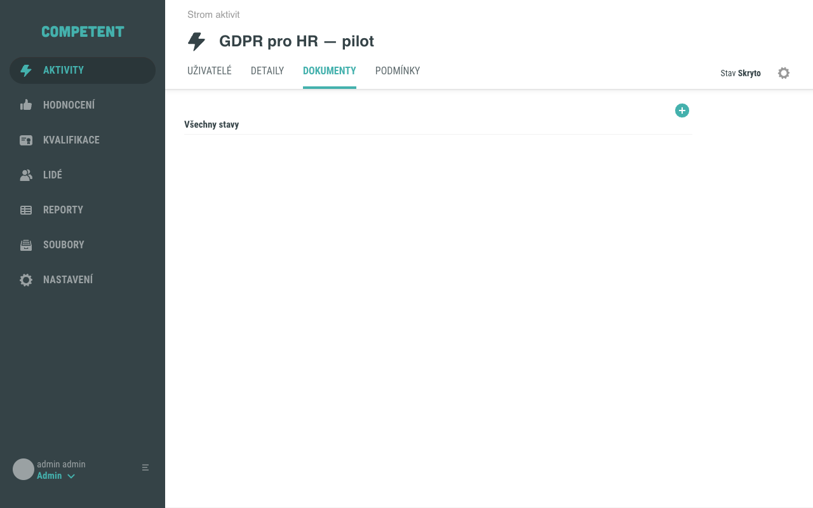
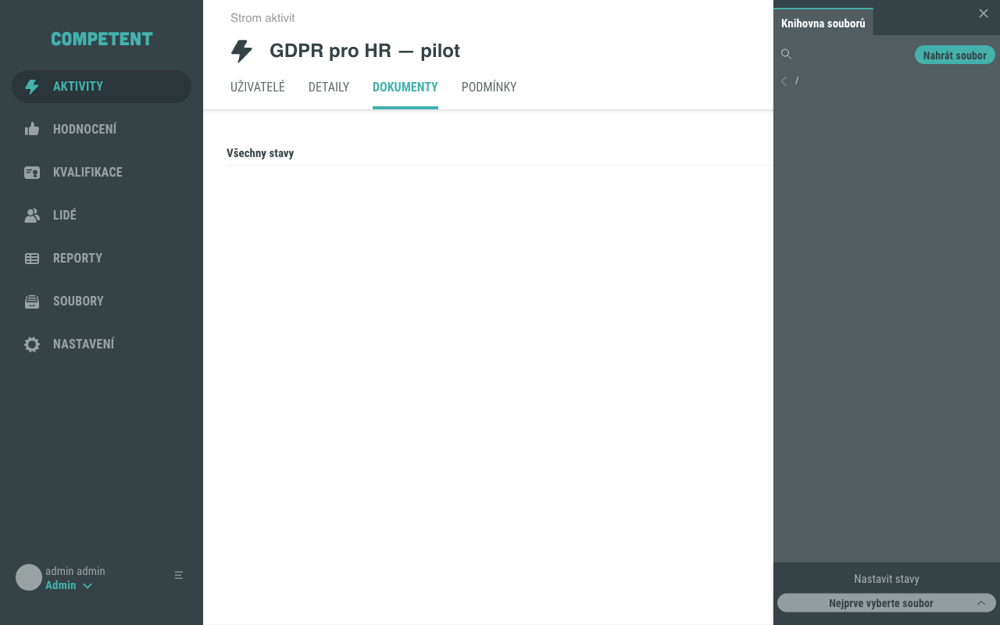
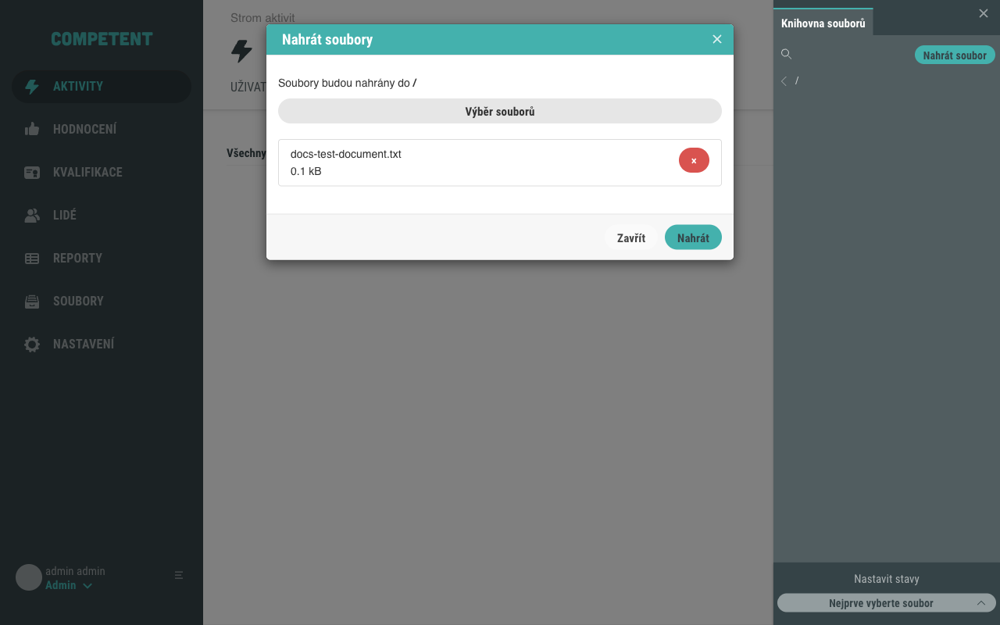
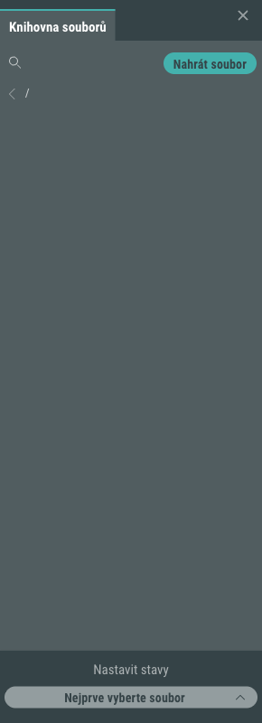
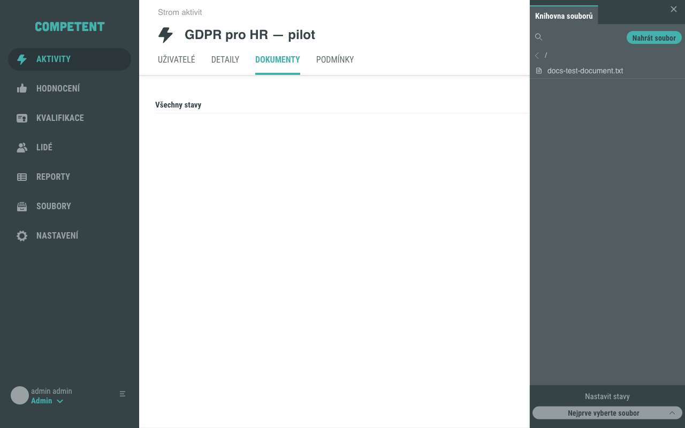
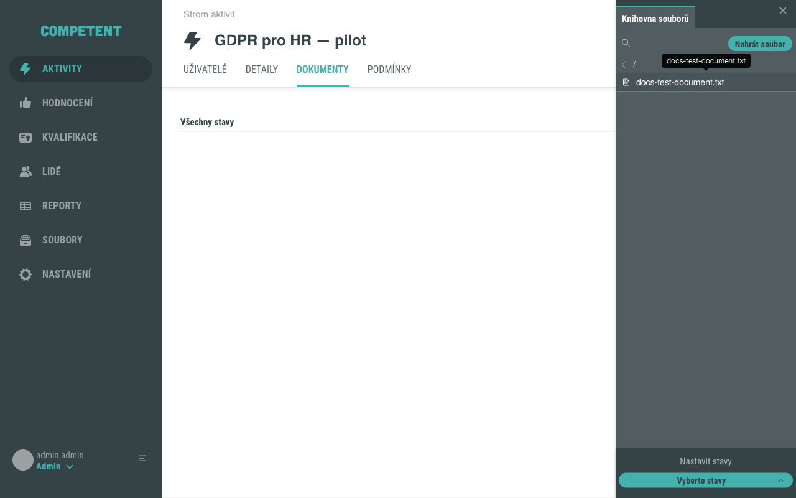
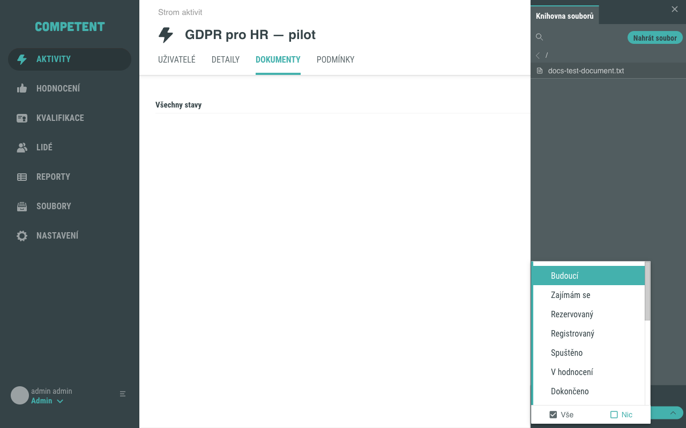
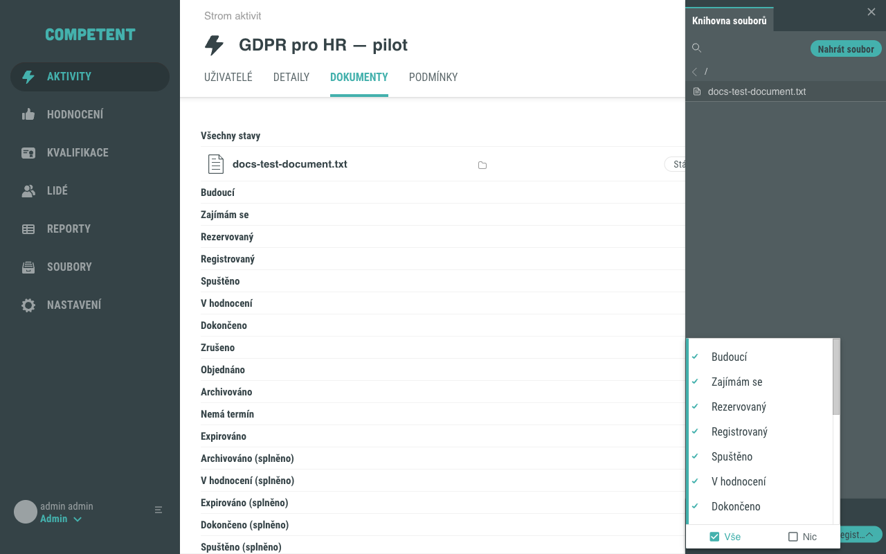
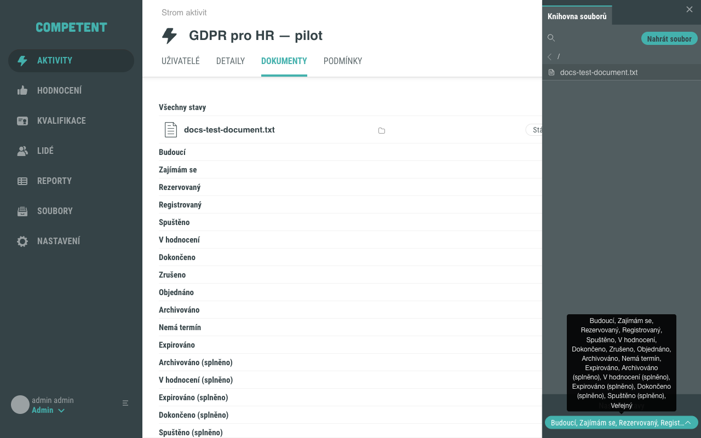

# Jak přidat dokument k aktivitě

Záložka **Dokumenty** v detailu aktivity slouží k přiřazení souborů, které budou uživatelům dostupné ke stažení v závislosti na jejich aktuálním stavu přístupu k aktivitě. Tento návod popisuje, jak soubor k aktivitě přiřadit, nastavit jeho viditelnost pro jednotlivé stavy přístupu a v případě potřeby soubor od aktivity odebrat.

## Předpoklady

- Jste přihlášeni jako administrátor s oprávněním upravovat aktivity (máte přístup k editaci aktivity v administraci).
- Aktivita existuje v systému.
- Soubor, který chcete přiřadit, je dostupný v Knihovně souborů, nebo ho máte připravený k nahrání.

## Postup

### 1. Otevřete záložku Dokumenty

V detailu aktivity přejděte na záložku **Dokumenty**. Pokud k aktivitě dosud nebyl přiřazen žádný soubor, je záložka prázdná.

### 2. Otevřete Knihovnu souborů

Klikněte na tlačítko **plus** (kulaté) v záložce. Otevře se vedlejší panel **Knihovna souborů**.

### 3. Vyberte soubor nebo nahrajte nový

**Pokud soubor je v Knihovně souborů:**

Proklikejte se do příslušné složky. Kliknutím na název souboru ho označíte – soubor se vizuálně vyznačí jako vybraný.

**Pokud soubor v Knihovně souborů není:**

Soubor nahrajte přímo z vedlejšího panelu jedním ze dvou způsobů:

- Přetáhněte soubor do oblasti **Soubory přetáhněte** v panelu.
- Klikněte na **vyberte v počítači**, vyberte soubor z počítače a poté klikněte na **Nahrát soubor**.

Po nahrání se soubor zobrazí v panelu a je připravený k přiřazení.

!!! note "Soubor nahraný bez otevřené složky"
    Pokud soubor nahrajete bez předem otevřené složky v panelu, zobrazí se informace, že nahraný soubor bude k dispozici pouze v této aktivitě a nebude dostupný v knihovně souborů.

### 4. Nastavte viditelnost dokumentu

V dolní části panelu klikněte na sekci **Nastavit stavy**. Otevře se výběr stavů uživatelského přístupu, při kterých bude dokument uživateli viditelný.

Kliknutím do výběrového pole rozbalíte dostupné stavy přístupu.

Vyberte jeden nebo více stavů, při kterých má být dokument viditelný. Chcete-li dokument zobrazovat ve všech stavech přístupu, klikněte na **Vše**.

### 5. Ověřte přiřazení

Po výběru stavů se soubor automaticky přiřadí k aktivitě a zobrazí se v záložce **Dokumenty**, roztříděný do skupin podle vybraných stavů přístupu.

Tím je postup dokončen.

## Odebrání souboru z aktivity

Chcete-li soubor od aktivity odebrat, klikněte na ikonu křížku u daného souboru přímo v záložce **Dokumenty**.

!!! note
    Přiřazením souboru k aktivitě vzniká interní kopie. Soubor zůstane uživatelům aktivity dostupný ke stažení i v případě, že se původní soubor odstraní z Knihovny souborů.

## Pozor na

- Soubory přiřazené k aktivitě jsou v záložce **Dokumenty** seřazeny do skupin podle stavů uživatelského přístupu (například **Budoucí, Zajímám se, Registrovaný, Spuštěno, Dokončeno** a další). Dokumenty nastavené pro všechny stavy jsou ve skupině **Všechny stavy**, dokumenty bez nastaveného stavu jsou ve skupině **Bez stavu**.
- Slovo **stavy** v tomto kontextu označuje stavy uživatelského přístupu k aktivitě – nikoli stav dokumentu samotného. Přehled a popis jednotlivých stavů najdete na stránce [Stavy přístupu uživatele k aktivitě](../../concepts/stavy-aktivity.md).

## Související stránky

- [Dokumenty v aktivitě](../../concepts/dokumenty-v-aktivite.md)
- [Stavy přístupu uživatele k aktivitě](../../concepts/stavy-aktivity.md)
- [Detail aktivity](../../reference/detail-aktivity.md)
