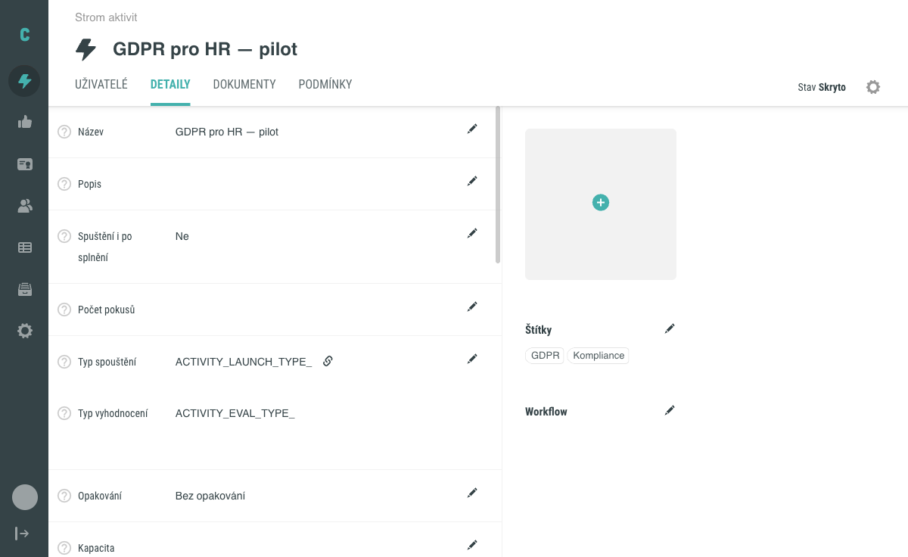
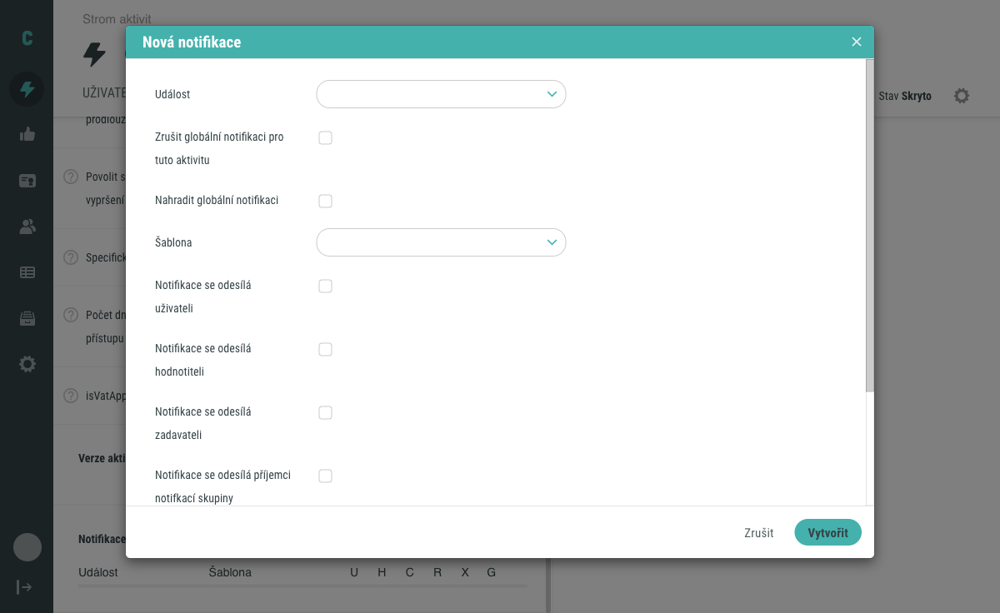
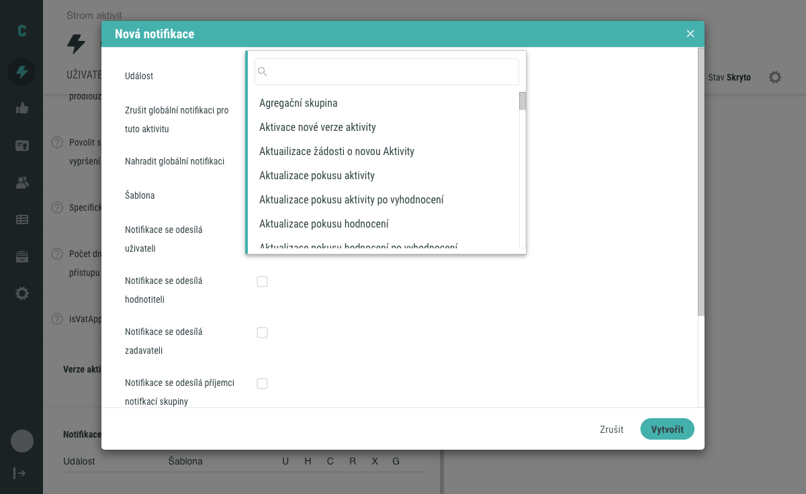

# Nastavení notifikací aktivity

Kromě globálních notifikačních pravidel, která platí pro celý systém, můžete notifikaci nastavit i pro konkrétní aktivitu nebo sadu. Tento návod popisuje, jak takovou lokální notifikaci vytvořit a jak ovlivní chování vůči globálním notifikacím stejné události.

## Předpoklady

- Máte administrátorský přístup k editaci aktivit.
- V systému existuje aktivita, pro kterou chcete nastavit lokální notifikaci.

## Postup

### 1. Otevřete sekci Notifikace v detailu aktivity

V detailu aktivity, kterou chcete nastavit, přejděte na záložku **Detaily** a najděte sekci **Notifikace**.

### 2. Klikněte na Nová notifikace

Tlačítkem **Nová notifikace** otevřete modál pro vytvoření nového notifikačního pravidla.

### 3. Vyplňte základní pole notifikace

Vyplňte pole **Událost** a **Šablona** a zvolte příjemce zaškrtnutím odpovídajících polí. Jde o stejná pole, jaká se používají u globálních notifikací – jejich podrobný popis najdete v [Záložka Notifikace](../../reference/tab-notifikace.md). Přehled dostupných událostí obsahuje [Přehled notifikačních událostí](../../reference/prehled-notifikacnich-udalosti.md).

### 4. Nastavte chování vůči globální notifikaci

Modál pro lokální notifikaci obsahuje navíc dva checkboxy, které řídí, jak se lokální pravidlo chová vůči případné globální notifikaci stejné události. Nejde o synonyma, ale o dva odlišné mechanismy:

- **Zrušit globální notifikaci pro tuto aktivitu** – potlačí odeslání všech globálních notifikací dané události účastníkům této aktivity. Globální konfiguraci nijak nemění, jen pro tuto aktivitu znemožní její odeslání.
- **Nahradit globální notifikaci** – u událostí spouštěných na základě času zablokuje daný přístup pro globální notifikaci a nahradí ho lokální; u událostí, které používají vlastní e-mail příjemce, slouží k deduplikaci e-mailových adres.

Oba checkboxy najdete přímo v modálu Nová notifikace vedle polí Událost a Šablona, viz obrázek výše.

!!! warning "Checkboxy nejsou zaměnitelné"
    Zaškrtnutí jednoho checkboxu nenahrazuje funkci druhého.

### 5. Uložte notifikaci

Klikněte na tlačítko **Vytvořit**. Nové notifikační pravidlo se zařadí do seznamu notifikací aktivity.

## Nastavení notifikace pro sadu

Stejný postup platí i pro Sady. V modálu pro sadu je navíc k dispozici pole **Neaplikovat na podřízené přístupy sad**: ve výchozím stavu se lokální notifikace vztahuje i na podřízené přístupy sady, zaškrtnutím pole propagaci na potomky vypnete.

## Související stránky

- [Záložka Notifikace](../../reference/tab-notifikace.md) – popis polí sdíleného modálu a globálních notifikací
- [Přehled notifikačních událostí](../../reference/prehled-notifikacnich-udalosti.md) – katalog dostupných událostí
- [E-mailové notifikace](../../concepts/emailove-notifikace.md) – princip fungování notifikací a agregace
- [Detail aktivity](../../reference/detail-aktivity.md) – přehled záložek a polí detailu aktivity
