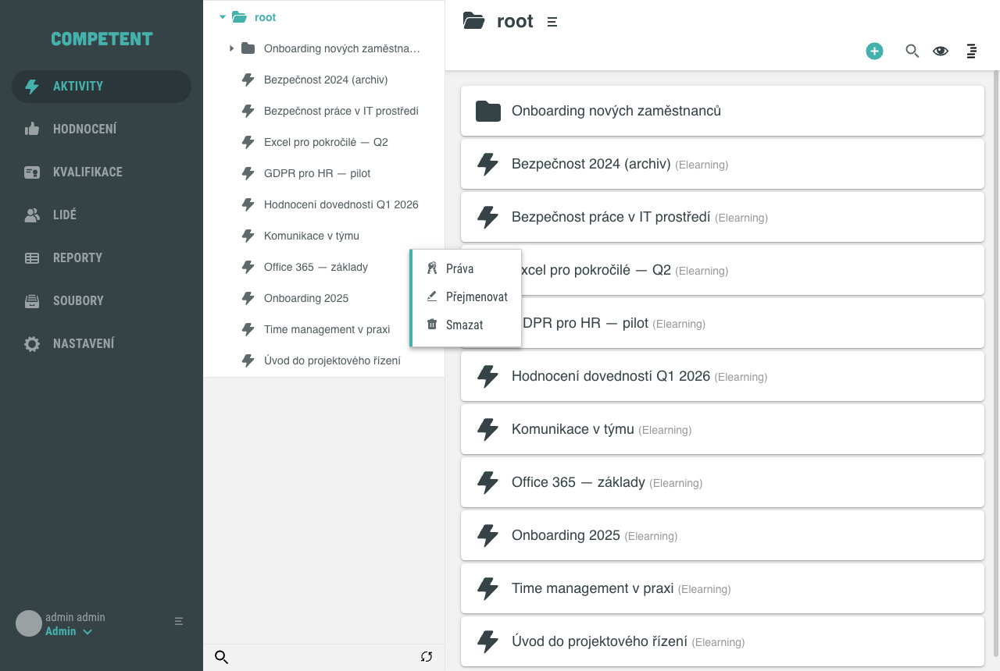
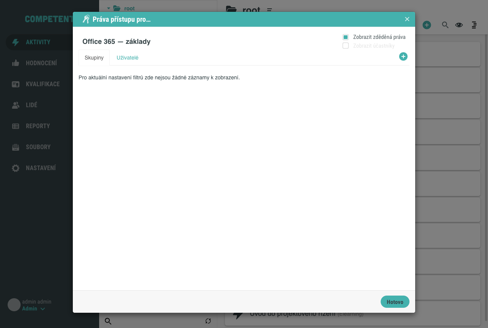
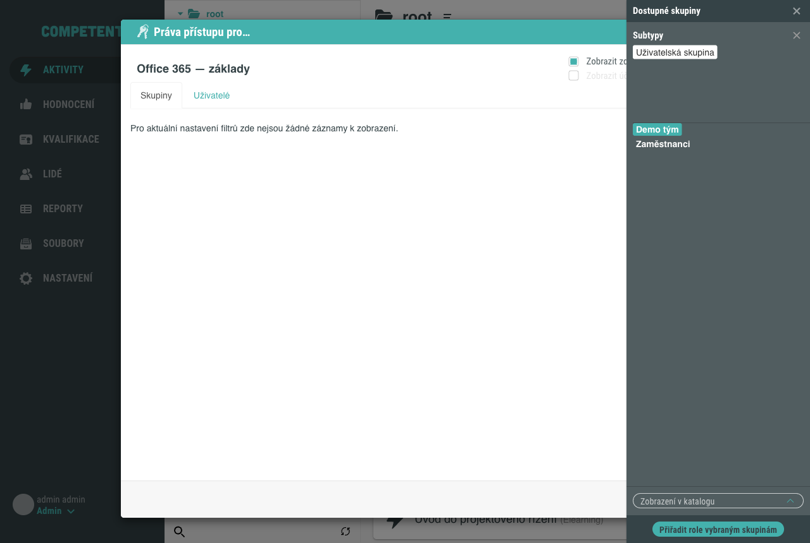
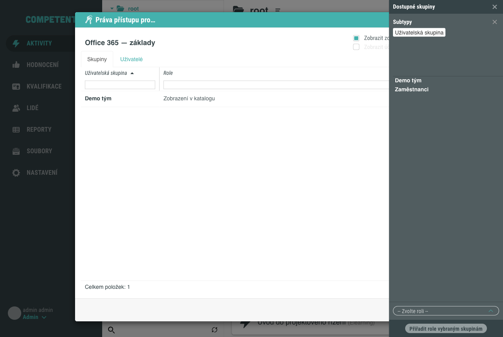
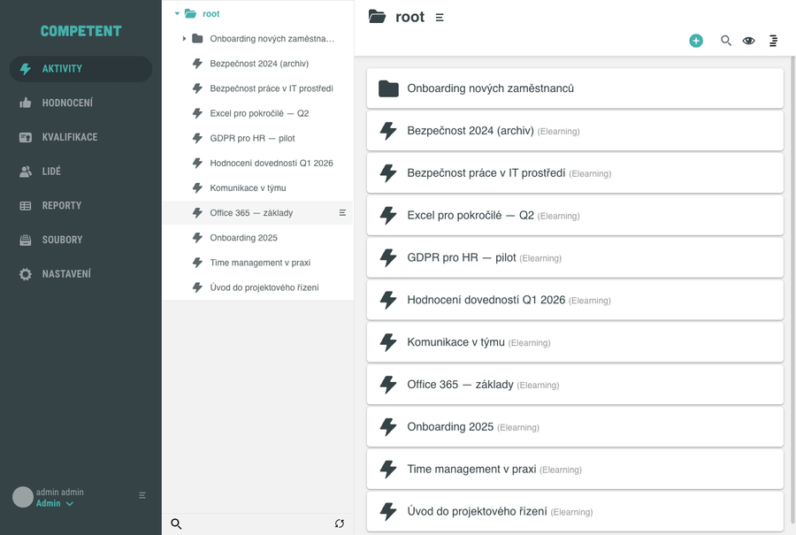

# Nastavení práv k aktivitě

Práva přístupu k aktivitě určují, které skupiny a uživatelé aktivitu vidí a co s ní mohou dělat. Tento návod popisuje, jak skupině udělit přístup k aktivitě prostřednictvím dialogu **Práva přístupu pro…**, který otevřete z akce **Práva** ve stromu aktivit.

## Předpoklady

- Máte přístup do administrace a oprávnění spravovat práva dané aktivity (typicky administrátor nebo vlastník aktivity).
- V systému existuje aktivita a skupina nebo uživatel, kterému přístup udělíte.

Pokud aktivitu teprve zakládáte, řiďte se samostatným návodem k vytvoření aktivity.

## Postup

### 1. Otevřete akci Práva ve stromu aktivit

Přejděte do administrace aktivit do zobrazení stromu. Najeďte na řádek aktivity a klikněte na ikonu nabídky na konci řádku. V nabídce zvolte **Práva**.

!!! note "Práva jsou akce ve stromu, ne záložka v detailu"
    Dialog s právy otevřete z akce **Práva** na řádku aktivity ve stromu aktivit. Nejde o záložku v detailu aktivity.

### 2. Prohlédněte si dialog Práva přístupu

Otevře se dialog **Práva přístupu pro…**; pod titulkem je uveden název aktivity. Dialog obsahuje dvě záložky, **Skupiny** a **Uživatelé**, přepínače **Zobrazit zděděná práva** a **Zobrazit účastníky** a tlačítko **+** pro přidání. U nové aktivity bývá seznam prázdný se zprávou „Pro aktuální nastavení filtrů zde nejsou žádné záznamy k zobrazení."

### 3. Přidejte skupinu a zvolte roli

Klikněte na tlačítko **+**. Vpravo se otevře boční panel **Dostupné skupiny**. Na záložce **Skupiny** vyberte skupinu, které chcete udělit přístup (například **Demo tým**). V rozbalovacím seznamu **-- Zvolte roli --** vyberte roli **Zobrazení v katalogu**.

V demu lze aktivitě přiřadit role **Zobrazení v katalogu** (aktivita je viditelná v katalogu) a **Možnost zažádat v katalogu** (uživatel může požádat o přístup). Další role bývají dostupné u instalací s vlastními rolemi.

### 4. Potvrďte přiřazení

Klikněte na tlačítko **Přiřadit role vybraným skupinám**. Skupina se zařadí do dialogu s přidělenou rolí.

Celý postup od akce **Práva** po přiřazení role skupině ukazuje následující animace:

Dialog uzavřete tlačítkem **Hotovo**.

## Odebrání přiřazené role

1. Otevřete dialog **Práva přístupu pro…** z akce **Práva** u aktivity.
2. Rozklikněte řádek skupiny nebo uživatele. V panelu **Přiřazená práva** klikněte na přidělenou roli, čímž ji odeberete.
3. Po odebrání se záznam ze seznamu odstraní. Dialog uzavřete tlačítkem **Hotovo**.

## Jak číst závorky u rolí

U přidělených rolí používá aplikace ustálenou konvenci:

- **Role bez závorek** je přiřazená ručně (například **Zobrazení v katalogu**).
- **[Role v hranatých závorkách]** je systémová role, kterou přiděluje systém automaticky (například **[Vlastník aktivity]** nebo **[Účastník]**). Tyto role nelze ručně přiřadit ani odebrat.
- **(Role v kulatých závorkách)** je zděděná z nadřazeného objektu ve stromu. Zděděné role zobrazíte přepínačem **Zobrazit zděděná práva**.

Účastníky aktivity zobrazíte přepínačem **Zobrazit účastníky**.

## Pozor na

- Roli ve sloupci **Role** lze v rozbalovacím seznamu vybrat až po výběru skupiny. Tlačítko **Přiřadit role vybraným skupinám** je do té doby neaktivní.
- Systémové role v **[hranatých závorkách]** a zděděné role v **(kulatých závorkách)** slouží jen pro přehled. Ručně upravujete pouze role bez závorek.

## Související stránky

- [Role a oprávnění (koncept)](../../concepts/role.md)
- [Přehled rolí a oprávnění](../../reference/prehled-roli-a-opravneni.md)
- [Obrazovka Aktivity](../../reference/obrazovka-aktivity.md)
- [Detail aktivity](../../reference/detail-aktivity.md)
