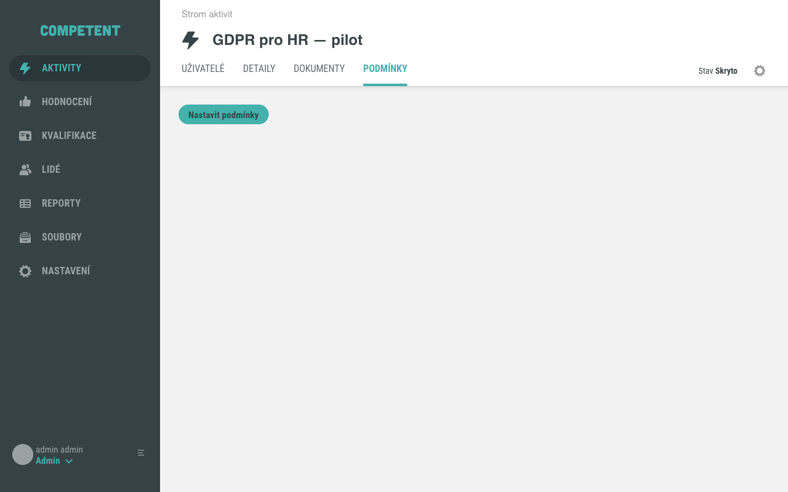
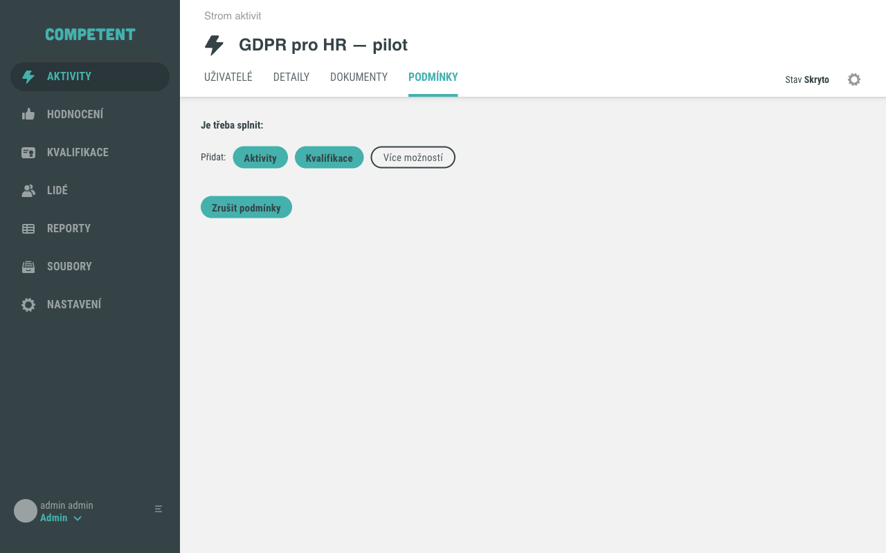
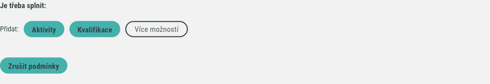
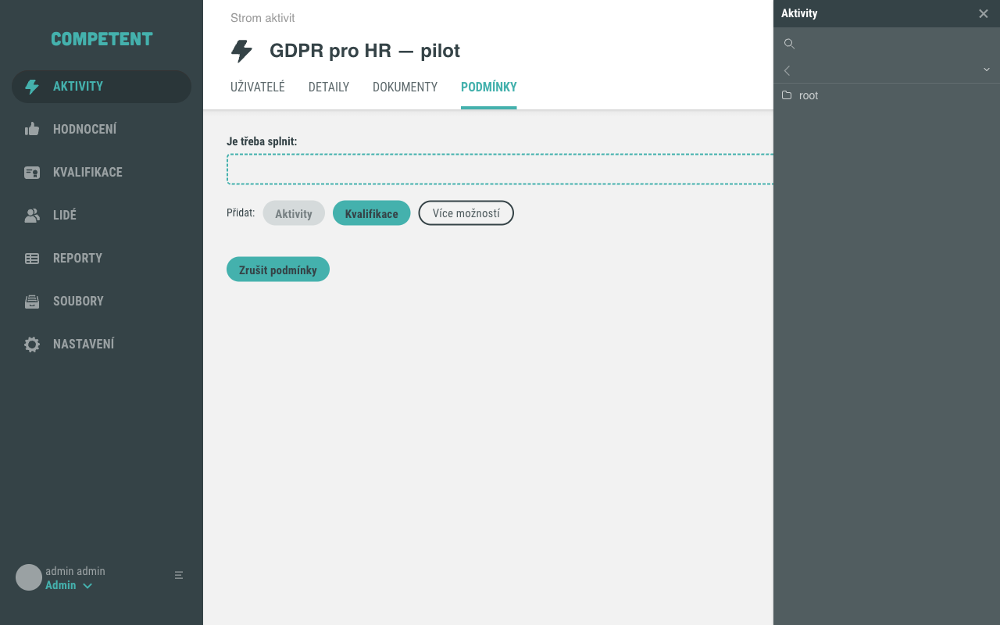
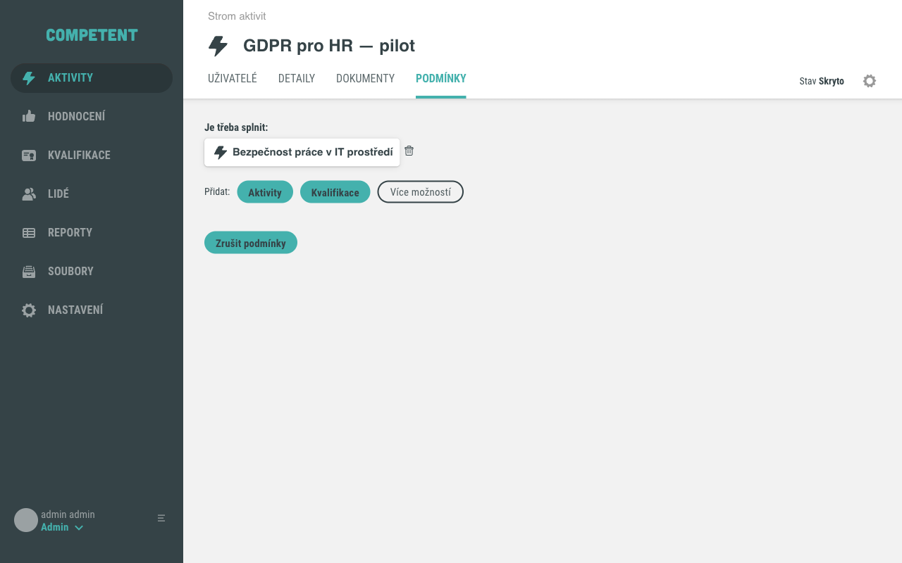
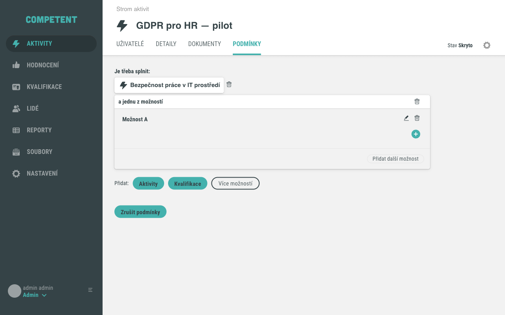
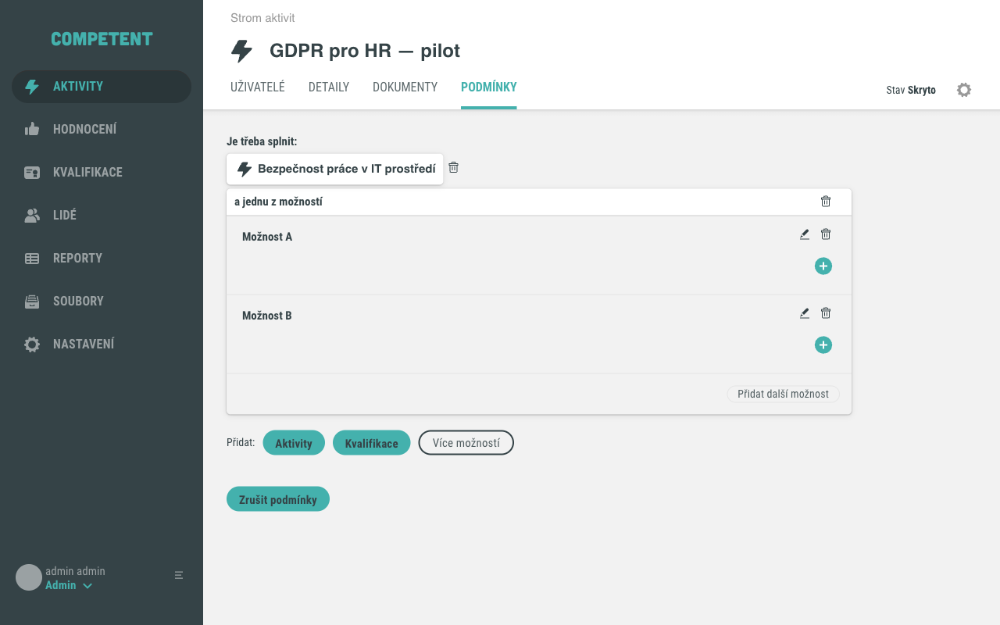

# Nastavení podmínek přístupu k aktivitě

Podmínky přístupu umožňují omezit, kdo se může k aktivitě přihlásit nebo ji spustit.
Systém zkontroluje, zda uživatel splnil požadované předpoklady – například absolvování jiné aktivity –
a teprve poté mu aktivitu zpřístupní. Podmínky se nastavují v záložce **Podmínky** v detailu aktivity.

## Předpoklady

- Jste přihlášeni jako administrátor s oprávněním upravovat aktivity.
- Aktivita existuje v systému. Podmínky přístupu lze nastavit na jakémkoli typu aktivity kromě hodnocení.

## Postup

### 1. Otevřete záložku Podmínky

V detailu aktivity klikněte na záložku **Podmínky**.

Pokud aktivita zatím nemá žádné podmínky přístupu, záložka zobrazuje tlačítko **Nastavit podmínky**.

### 2. Inicializujte editor podmínek

Klikněte na **Nastavit podmínky**. Systém inicializuje editor podmínek a zobrazí sekci **Je třeba splnit:**
s tlačítky pro přidání podmínek.

Na řádku **Přidat:** jsou dostupná tři tlačítka:

- **Aktivity** – přidá požadavek na absolvování konkrétní aktivity
- **Kvalifikace** – přidá požadavek na kvalifikaci (viz upozornění v sekci [Pozor na](#pozor-na))
- **Více možností** – vloží skupinu podmínek ve vztahu nebo (stačí splnit alespoň jednu)

### 3. Přidejte podmínku na aktivitu

Klikněte na **Aktivity**. Otevře se vedlejší panel s výběrem aktivit ze stromu.

V panelu klikněte na **Přidat** u aktivity, která má být splněna jako předpoklad.
Aktivita se zobrazí v sekci **Je třeba splnit:**.

Klikněte na **Hotovo** pro potvrzení výběru a zavření panelu.

### 4. Přidejte skupinu pro alternativní podmínky (volitelné)

Pokud chcete, aby stačilo splnit alespoň jednu z několika podmínek, klikněte na **Více možností**.
Do stromu podmínek se vloží skupina **a jednu z možností** se dvěma větvemi: **Možnost A** a **Možnost B**.

Do každé větve (Možnost A, Možnost B) pak pomocí akčního menu větve přidáte podmínky,
které musí být splněny v rámci dané varianty.

Pokud potřebujete přidat další variantu, klikněte na **Přidat další možnost** uvnitř skupiny.

### 5. Zkontrolujte výsledný strom podmínek

Strom podmínek zobrazuje všechny nastavené požadavky. Podmínky na stejné úrovni platí ve vztahu
a zároveň – uživatel musí splnit všechny. Skupina **a jednu z možností** vyjadřuje vztah nebo.

### 6. Odebrání podmínek

Jednotlivou podmínku odeberete kliknutím na tlačítko **Odebrat** u dané položky.
Systém zobrazí potvrzovací dialog.

Chcete-li odebrat všechny podmínky najednou, klikněte na **Zrušit podmínky** a potvrďte dialog.
Záložka se vrátí do prázdného stavu s tlačítkem **Nastavit podmínky**.

## Pozor na

- Podmínka na aktivitu je splněna teprve ve chvíli, kdy je uživatelský přístup k požadované aktivitě
  ve stavu **Dokončeno** nebo **Splněno**.
- Pokud je aktivita součástí sady aktivit, lze podmínky přístupu převzít z nadřazené sady
  kliknutím na **Převzít podmínky z nadřazené Aktivity**.
- Pokud aktivita zdědila podmínky z nadřazené sady, zobrazí se informace „Tato podmínka je
  nastavena dle podmínky na nadřazené Aktivitě" a tlačítka **Osamostatnit od podmínky na
  nadřazené Aktivitě** (odpojí podmínku od nadřazené sady) a **Zrušit podmínky**.
- Mimo podmínek na aktivity systém umožňuje přidat i podmínku na kvalifikaci. Dostupnost
  a funkčnost podmínek na kvalifikace závisí na konfiguraci instalace – ověřte u dodavatele
  Educasoft.

## Související stránky

- [Podmínky přístupu k aktivitě](../../concepts/podminky-pristupu.md) – popis principu vyhodnocování
- [Detail aktivity](../../reference/detail-aktivity.md) – přehled všech záložek detailu
- [Stavy aktivity](../../concepts/stavy-aktivity.md)
