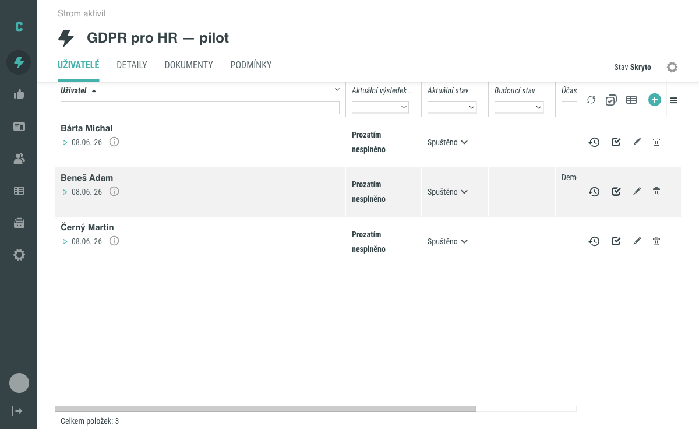
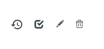
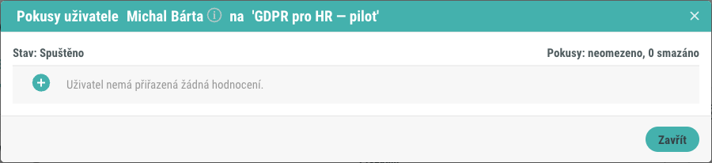
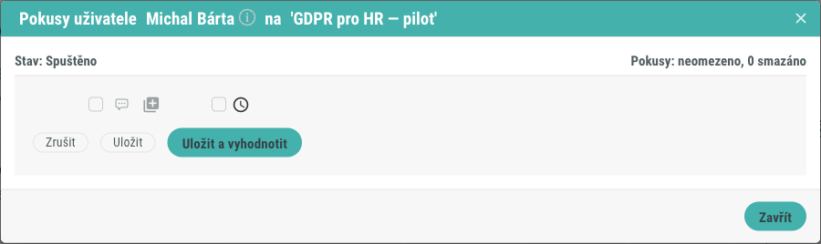
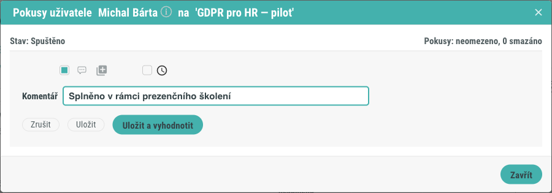
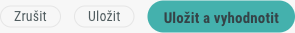

# Jak přidat a upravit pokus uživatele

Pokus je jeden záznam o absolvování aktivity konkrétním uživatelem. U aktivit,
které hodnotí administrátor nebo pověřený hodnotitel, můžete pokusy zadávat
a upravovat ručně. Tento postup popisuje, jak otevřít modál **Pokusy uživatele**,
jak přidat nový pokus a jak upravit pokus stávající.

## Předpoklady

- Máte oprávnění hodnotit aktivitu (jste přihlášeni jako administrátor nebo
  hodnotitel s právem hodnotit aktivity).
- Uživatel má k aktivitě přiřazený přístup, tedy figuruje na záložce **Uživatelé**
  v Detailu aktivity.
- Aktivita má nastavený typ hodnocení. Přesná podoba formuláře pokusu se podle
  tohoto nastavení liší.

## Postup

### 1. Otevřete záložku Uživatelé

V Detailu aktivity přejděte na záložku **Uživatelé**. Zobrazí se seznam
uživatelů, kteří mají k aktivitě přiřazený přístup, společně s jejich aktuálním
výsledkem a stavem.

### 2. Spusťte hodnocení uživatele

V řádku konkrétního uživatele klikněte na tlačítko **Hodnotit**. Ikony akcí
najdete na pravém konci řádku.

Otevře se modál **Pokusy uživatele**.

### 3. Prohlédněte si přehled pokusů

V záhlaví modálu vidíte jméno uživatele, název aktivity a souhrnné údaje:

- **Stav** – zda uživatel aktivitu splnil, nebo nesplnil.
- **Pokusy** – počet využitých, zbývajících a smazaných pokusů. Pokud aktivita
  nemá omezený počet pokusů, zobrazí se údaj **neomezeno**.

Každý řádek v seznamu představuje jeden pokus. U pokusu se podle nastavení
aktivity zobrazuje začátek pokusu, konec pokusu, výsledek pokusu, slovní
hodnocení a hodnotitel. Pokud uživatel zatím nemá žádný pokus, zobrazí se
informace, že uživatel nemá přiřazená žádná hodnocení.

### 4. Přidejte nový pokus

Klikněte na kulaté tlačítko **plus**. Otevře se formulář nového pokusu.

Pole formuláře závisí na typu hodnocení aktivity (například procenta, body nebo
prosté splnění). Do pole pro slovní hodnocení můžete zapsat komentář, který se
k pokusu uloží.

!!! note "Notifikace"
    Pokud formulář nabízí volbu **Neposílat notifikaci**, jejím zaškrtnutím
    potlačíte automatické e-mailové notifikace spojené s uložením pokusu.

### 5. Uložte a vyhodnoťte pokus

Po vyplnění údajů máte k dispozici tři možnosti uložení:

- **Uložit** – uloží pokus bez vyhodnocení splnění aktivity.
- **Uložit a vyhodnotit** – uloží pokus a vyhodnotí, zda uživatel aktivitu splnil.
- **Vyhodnotit jako nesplněné** – uloží pokus a označí aktivitu jako nesplněnou.

Které z těchto tlačítek se zobrazí, závisí na typu hodnocení aktivity.

### 6. Upravte stávající pokus

Existující pokus upravíte tlačítkem **Upravit** u příslušného řádku. Otevře se
formulář s aktuálními hodnotami pokusu. Po úpravě použijete stejná tlačítka pro
uložení jako při přidání nového pokusu.

Modál nakonec zavřete tlačítkem **Zavřít**.

## Pozor na

- Pokud uživatel dosáhl maximálního povoleného počtu pokusů, tlačítko **plus**
  je nedostupné a systém zobrazí informaci, že další pokus nelze přidat.
- Rozdíl mezi tlačítky **Uložit** a **Uložit a vyhodnotit** je v tom, zda se
  zároveň přepočítá splnění aktivity. Tlačítkem **Uložit** zaznamenáte pokus,
  aniž byste měnili výsledek splnění.

## Související stránky

- [Pokusy uživatele (koncept)](../../concepts/pokusy-uzivatele.md)
- [Stavy aktivity](../../concepts/stavy-aktivity.md)
- [Detail aktivity](../../reference/detail-aktivity.md)
