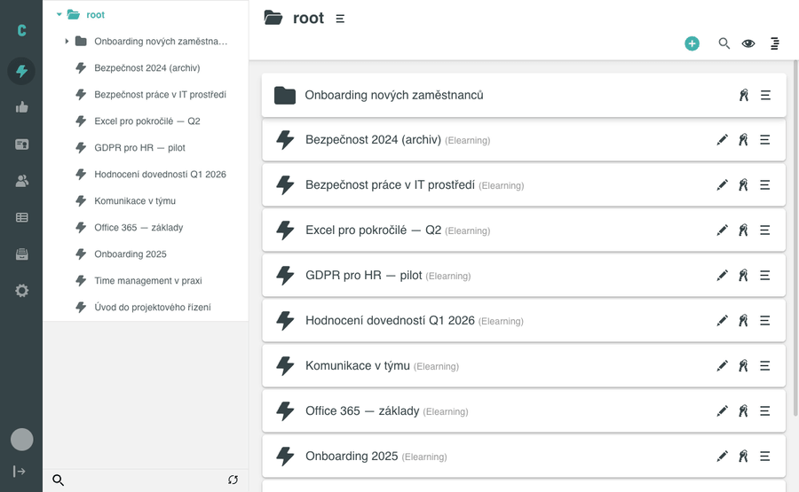

# Přesun objektu

V administraci Competent můžete přesouvat objekty (aktivity, sady, termínové sady, složky) ve stromu aktivit pomocí dialogu **Přesunout do…**. Každý objekt má kontextové menu s volbami pro přesun, přejmenování a smazání.

## Než začnete

- Jste přihlášeni jako administrátor (nebo máte roli s oprávněním spravovat aktivity).
- V levém menu je otevřena sekce **AKTIVITY**, zobrazení je přepnuto do stromu.
- Cílová složka, kam chcete objekt přesunout, už ve stromu existuje (pokud ne, nejprve ji založte – viz [Vytvoření nového objektu](vytvoreni-noveho-objektu.md)).

## Postup

### 1. Otevřete kontextové menu objektu

Najeďte myší na řádek s objektem v pravém seznamu. Vpravo se zobrazí trojice ikon – klikněte na **ikonu tří vodorovných čárek** (hamburger menu).

Kontextové menu obsahuje tři volby:

- **Přesunout do…**
- **Přejmenovat**
- **Smazat**

Vyberte **Přesunout do…**.

### 2. Vyberte cílovou složku

Vpravo se otevře panel **Přesunout do…** se stromovou navigací. Panel obsahuje:

- pole pro hledání (ikona lupy),
- šipku pro návrat o úroveň výš (breadcrumb),
- seznam složek, kam je možné objekt přesunout.

Procházejte panel a přejděte do požadované složky. Vedle každé složky se zobrazuje tlačítko **Přesunout sem** – klikněte na něj u cílové složky.

### 3. Ověření

Panel **Přesunout do…** se zavře a objekt zmizí z původního umístění. Kliknete-li ve stromu na cílovou složku, objekt se zobrazí mezi jejím obsahem.

## Pozor na

### Co lze přesunout kam

Ne každá kombinace přesunu je povolena. Níže je přehled toho, jaké typy objektů jednotlivé kontejnery přijímají:

| Cílový kontejner | Povolené typy objektů |
|---|---|
| **root** (kořen stromu) | Složka, Aktivita, Sada, Termínová sada |
| **Složka** | Složka, Aktivita, Sada, Termínová sada |
| **Sada** | Aktivita, Sada, Termínová sada |
| **Termínová sada** | Pouze Aktivita |
| **Aktivita** | Není kontejner – nelze do ní nic vložit |

!!! warning "Termínová sada"
    Termínová sada je speciální kontejner určený pouze pro aktivity. Sady ani další termínové sady do ní vložit nelze.

V panelu přesunu se zobrazují pouze cíle, do nichž je přesun povolen. Pokud systém kombinaci nepřipustí, cíl se v panelu nezobrazí nebo systém přesun odmítne s chybovou hláškou.

## Související stránky

- [Vytvoření nového objektu](vytvoreni-noveho-objektu.md)
