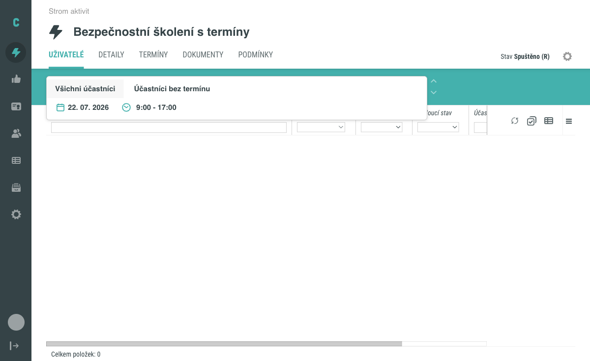
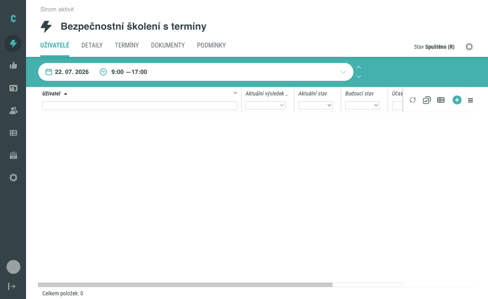
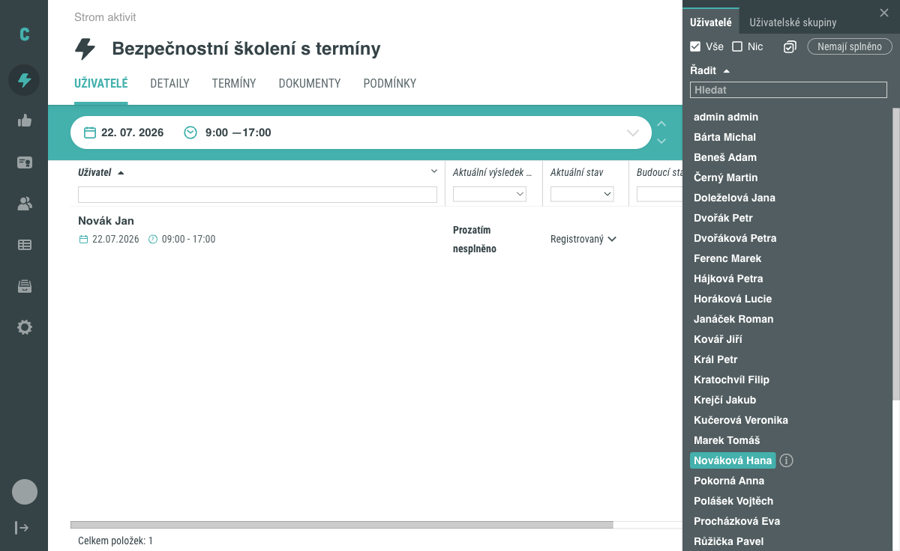
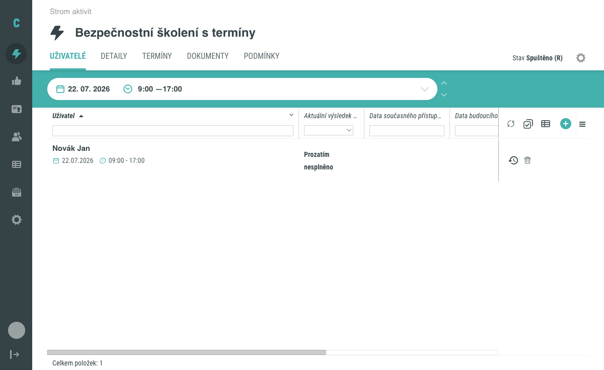

# Jak přiřadit uživatele k termínové aktivitě

Tento návod ukazuje, jak k aktivitě se schématem **S termíny** přiřadíte uživatele ke konkrétnímu termínu. Postup se v několika ohledech liší od přiřazení u aktivity se schématem **Bez termínu** – zejména v tom, že zde chybí samostatný krok nastavení dat přístupu. Tyto rozdíly návod popisuje v sekci [Pozor na](#pozor-na).

## Předpoklady

- Máte administrátorský přístup k editaci aktivit.
- V systému existuje aktivita se schématem **S termíny** a má alespoň jeden termín. Postup přidání termínu popisuje návod [Jak přidat termín k aktivitě](terminy-aktivity.md).

## Postup

### 1. Otevřete tab Uživatelé a zvolte termín

V detailu aktivity přejděte na tab **Uživatelé**. Nad tabulkou uživatelů se zobrazí volič s textem **Vyberte termín**. Po jeho rozkliknutí se nabídnou tři varianty:

- konkrétní termín, zobrazený jako datum a čas jeho konání,
- **Všichni účastníci**,
- **Účastníci bez termínu**.

### 2. Vyberte konkrétní termín

Klikněte na konkrétní termín v nabídce voliče. Volič se zavře a zobrazí zvolený termín jako svou aktuální hodnotu. Až po výběru konkrétního termínu se v nástrojové liště tabulky objeví tlačítko **+** pro přidání účastníků.

### 3. Otevřete panel Výběr účastníků

Klikněte na **+**. Otevře se boční panel **Výběr účastníků**, stejný jako u aktivity se schématem **Bez termínu**: přepínáte v něm mezi záložkami **Uživatelé** a **Uživatelské skupiny**, vyhledáváte polem **Hledat**, hromadně vybíráte tlačítky **Vše** a **Nic** nebo omezíte seznam filtrem **Nemají splněno**.

### 4. Vyberte uživatele

Klikněte v bočním seznamu na uživatele, kterého chcete k termínu přiřadit. Přiřazení se uloží **okamžitě po kliknutí** – žádné další potvrzení ani tlačítko **Uložit** není potřeba. Panel zůstává otevřený, takže stejným způsobem můžete přiřadit i další uživatele.

### 5. Ověřte výsledek

Po zavření panelu zkontrolujte tabulku na tabu **Uživatelé**. Přiřazený uživatel se v ní zobrazí s datem a časem zvoleného termínu a stavy **Prozatím nesplněno** a **Registrovaný**. Počet položek ve spodní části tabulky odpovídá počtu přiřazených uživatelů k danému termínu.

Tím je postup dokončen.

## Pozor na

- **Krok Nastavení plnění se u termínové aktivity vůbec nezobrazuje.** U aktivity se schématem Bez termínu následuje po výběru uživatele krok **Pokračovat nastavením plnění**, kde zadáváte data přístupu. U termínové aktivity tento krok chybí – kliknutím na uživatele se přiřazení k termínu rovnou uloží. Pokud tento postup znáte z aktivit Bez termínu, nehledejte proto po výběru uživatele žádný další formulář ani potvrzovací tlačítko.
- Data přístupu se u termínové aktivity neřídí individuálním nastavením, ale výhradně datem a časem zvoleného termínu. Sloupce **Data současného přístupu** a **Data budoucího přístupu** v tabulce (skryté ve výchozím zobrazení, lze je zapnout přes menu sloupců) proto u přiřazených uživatelů zůstávají prázdné.

    

- Schéma **S termíny** je vázané na subtyp aktivity. Podrobnosti o vazbě mezi subtypem a schématem najdete na stránce [Schémata aktivity](../../concepts/schemata-aktivity.md).

## Související stránky

- [Jak přidat termín k aktivitě](terminy-aktivity.md)
- [Přiřazení uživatelů k aktivitě](prirazeni-uzivatelu-k-aktivite.md)
- [Schémata aktivity](../../concepts/schemata-aktivity.md)
