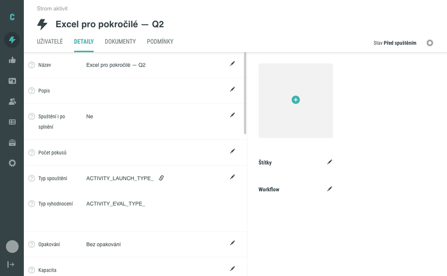
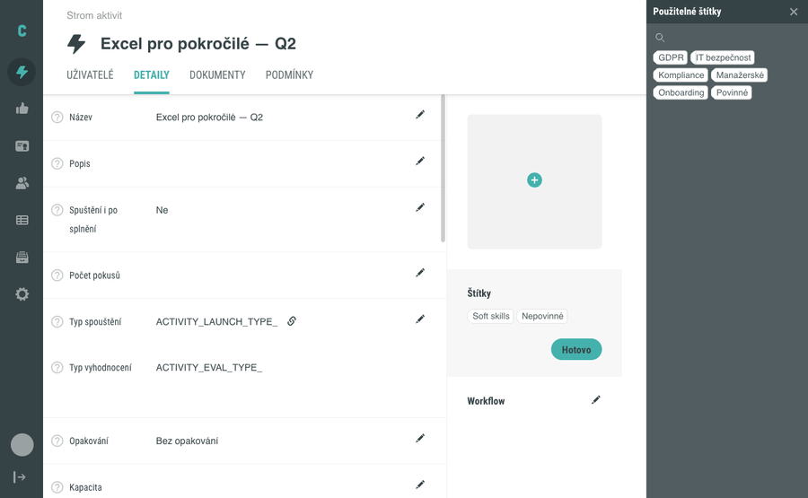
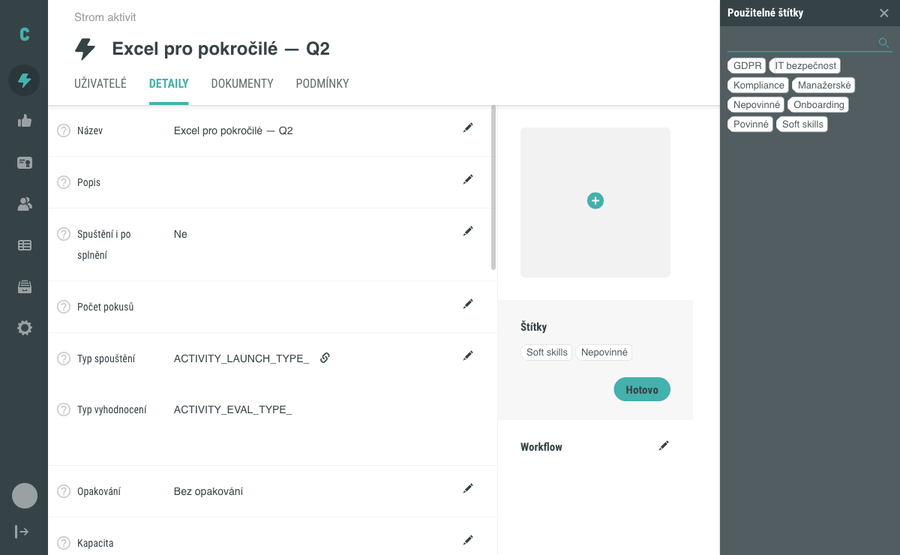

# Přiřazení a odebrání štítků aktivity

Štítky pomáhají třídit aktivity podle volně zvolených kategorií (například „GDPR", „Onboarding", „Povinné") a usnadňují [filtrování aktivit podle štítků](vyhledavani-v-aktivitach.md). Tento návod popisuje, jak štítek aktivitě přiřadit, jak ho zase odebrat a jak se v bočním panelu orientovat, pokud máte v systému velký počet štítků.

Štítky se vytvářejí v nastavení administrace (viz [Vytvoření a správa štítků](../nastaveni/stitky.md)). V této stránce předpokládáme, že potřebné štítky už máte k dispozici.

## Předpoklady

- Máte přístup k editaci aktivit v administraci.
- V systému jsou už založené štítky, které chcete přiřadit. Pokud žádné štítky nemáte, založte je nejprve v nastavení administrace.

## Přiřazení štítku k aktivitě

1. V administraci otevřete **Aktivity** a v seznamu klikněte na aktivitu, ke které chcete štítek přiřadit. Otevře se její detail.
2. Přepněte se na záložku **Detaily**.
3. V pravé části detailu najděte sekci **Štítky**. Pokud je aktivita bez štítků, je sekce zatím prázdná.
4. Klikněte na **ikonu editace** (tužka) vedle nadpisu **Štítky**. Otevře se boční panel s nadpisem **Použitelné štítky**, ve kterém vidíte štítky, které je možné aktivitě přiřadit.
5. V bočním panelu klikněte na štítek, který chcete přiřadit. Štítek se ihned objeví v sekci **Štítky** v detailu aktivity.
6. Stejným způsobem můžete přiřadit libovolný počet dalších štítků – počet štítků na jedné aktivitě není omezen.
7. Až budete s přiřazováním hotoví, klikněte v sekci **Štítky** na tlačítko **Hotovo**, případně boční panel zavřete křížkem v jeho pravém horním rohu.

## Vyhledání štítku v bočním panelu

Pokud máte v systému větší množství štítků, najdete konkrétní štítek rychleji pomocí vyhledávání přímo v bočním panelu.

1. Otevřete boční panel **Použitelné štítky** (postup viz krok 1–4 výše).
2. Klikněte na **ikonu lupy** v horní části panelu. Vedle ní se objeví vyhledávací pole.
3. Začněte psát část názvu štítku. Seznam štítků se průběžně filtruje na štítky, jejichž název obsahuje napsaný řetězec.
4. Smazáním textu (například klávesou Backspace) seznam štítků obnovíte do původního stavu.

## Odebrání štítku z aktivity

1. V detailu aktivity přepněte na záložku **Detaily** a najděte sekci **Štítky**.
2. Klikněte na **ikonu editace** (tužka) vedle nadpisu **Štítky**. Otevře se boční panel.
3. Přímo v sekci **Štítky** v detailu aktivity (tedy **nikoli** v bočním panelu) klikněte na štítek, který chcete odebrat. Štítek z aktivity zmizí.
4. Až budete hotoví, klikněte na **Hotovo**.

Odebrání odstraní pouze přiřazení štítku k této konkrétní aktivitě – samotný štítek nadále existuje a je k dispozici jiným aktivitám.

## Pozor na

- **Vyhledávání v bočním panelu rozlišuje velikost písmen a diakritiku.** Hledání „gdpr" nenajde štítek **GDPR** a hledání „povinne" nenajde štítek **Povinné**. Zadávejte název štítku přesně tak, jak je v systému uložen. Chování se liší od hlavního vyhledávacího pole v seznamu aktivit.
- **Po smazání textu ve vyhledávacím poli se zobrazí i již přiřazené štítky.** V bočním panelu se po vymazání filtru mohou objevit štítky, které aktivitě už přiřazené jsou – to je záměrné chování.
- **Smazání štítku v nastavení odebere přiřazení bez upozornění.** Pokud administrátor smaže štítek v [nastavení administrace](../nastaveni/stitky.md), štítek zmizí ze všech aktivit, kterým byl přiřazen, a to bez jakékoli notifikace. Pokud chcete zachovat přiřazení k aktivitám, štítek nemažte – místo toho ho přejmenujte nebo nepoužívejte.
- **Štítky jsou jen pro aktivity.** Sady ani dokumenty štítky nemají.

## Související

- [Obrazovka Aktivity](../../reference/obrazovka-aktivity.md) – popis obrazovky se seznamem aktivit, ze které otevřete detail konkrétní aktivity.
- [Detail aktivity](../../reference/detail-aktivity.md) – popis všech sekcí a záložek detailu.
- [Filtrování aktivit podle štítků](vyhledavani-v-aktivitach.md) – jak v seznamu aktivit najít všechny aktivity označené konkrétním štítkem.
- [Vytvoření a správa štítků](../nastaveni/stitky.md) – jak založit nový štítek v nastavení administrace.
- [Štítek](../../concepts/stitky.md)
