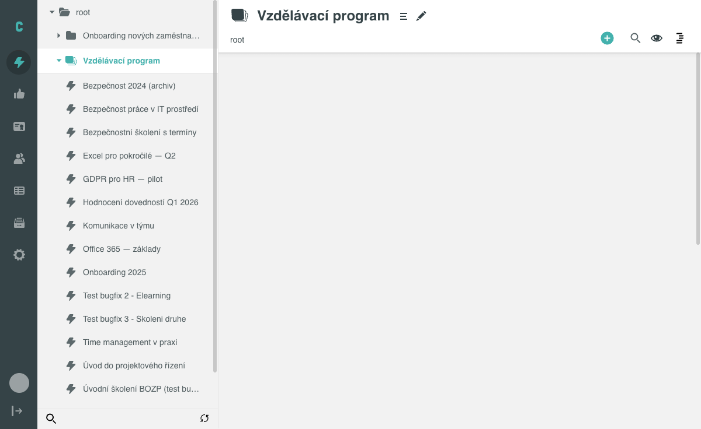
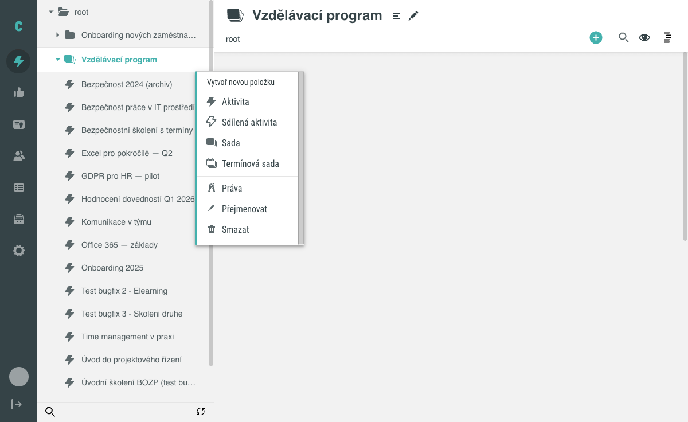
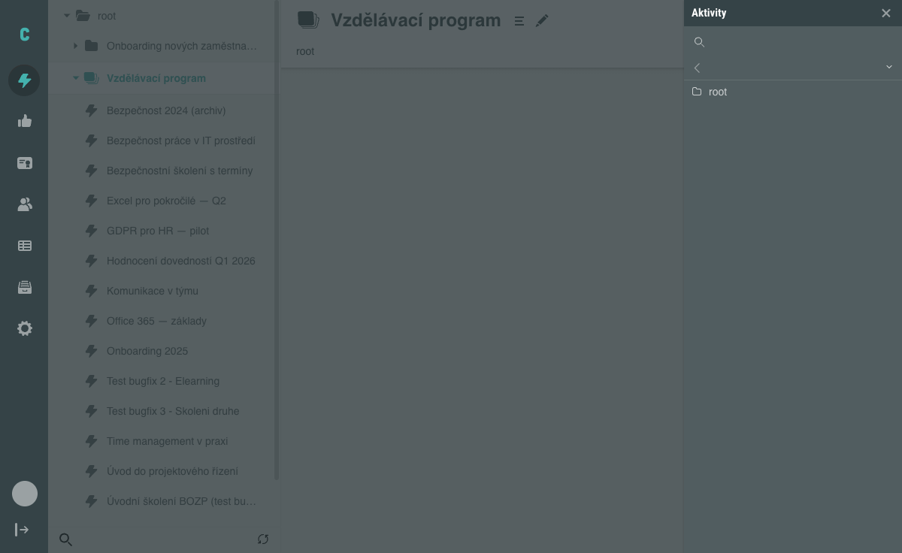
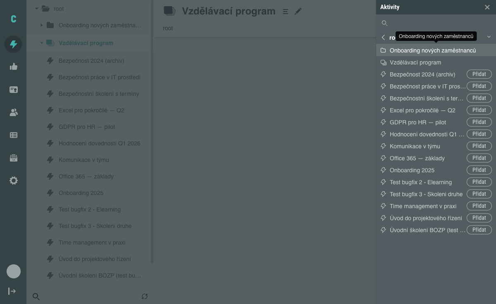
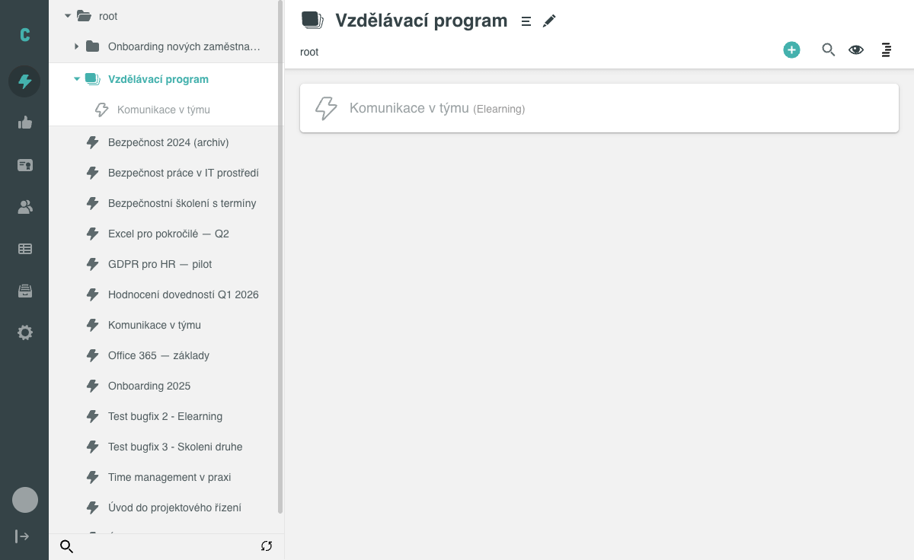

# Jak sdílet aktivitu

Sdílená aktivita zobrazí existující aktivitu na dalším místě Stromu aktivit,
aniž by vznikla její kopie. Tento návod popisuje klikací postup, jak sdílenou
aktivitu vytvořit. Princip fungování sdílené aktivity a rozdíly oproti běžné
aktivitě vysvětluje koncept [Sdílené aktivity](../../concepts/sdilene-aktivity.md).

## Předpoklady

- Máte administrátorský přístup k editaci Stromu aktivit.
- V systému existuje Sada (případně Termínová sada), do které chcete sdílenou
  aktivitu umístit, a aktivita, kterou chcete sdílet.

## Postup

### 1. Najděte Sadu ve stromu aktivit

Ve stromu aktivit najděte Sadu, do které chcete sdílenou aktivitu přidat.

### 2. Otevřete kontextové menu a zvolte Sdílená aktivita

U Sady klikněte na ikonu kontextového menu na konci řádku. V nabídce
**Vytvoř novou položku** zvolte položku **Sdílená aktivita**.

### 3. Otevřete seznam aktivit v panelu Aktivity

Otevře se boční panel **Aktivity**. Panel se zpočátku zobrazí jen s breadcrumb
navigací na položce **root** – klikněte na ni, aby se zobrazil seznam
dostupných aktivit s tlačítky **Přidat**.

### 4. Přidejte aktivitu

U požadované aktivity v seznamu klikněte na tlačítko **Přidat**.

### 5. Ověřte výsledek

Sdílená aktivita se zobrazí na vybraném místě stromu i v seznamu obsahu Sady.
Od běžné aktivity je odlišena světlejší (vyšisovanou) barvou textu i ikony;
žádný textový popisek typu „sdíleno" se nezobrazuje.

## Pozor na

- Volba **Sdílená aktivita** je dostupná jen v kontextovém menu Sady – u Složky
  se v nabídce **Vytvoř novou položku** nezobrazuje.
- V panelu **Aktivity** se k přidání nabízí pouze aktivity, které ještě nejsou
  sdílené na jiném místě stromu.

## Související stránky

- [Sdílené aktivity (koncept)](../../concepts/sdilene-aktivity.md)
- [Obrazovka Aktivity](../../reference/obrazovka-aktivity.md)
