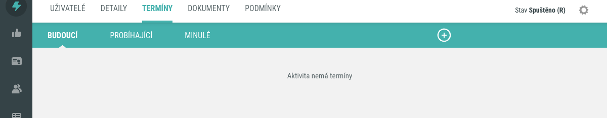
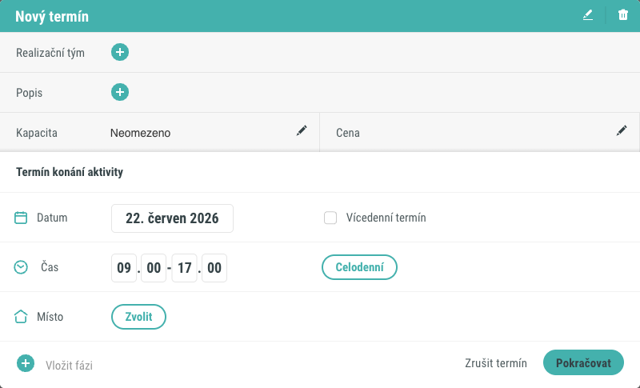
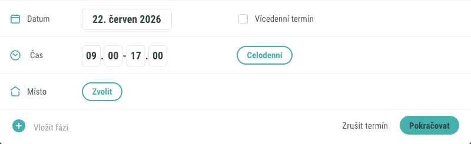
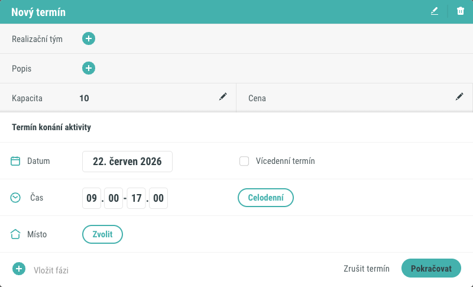
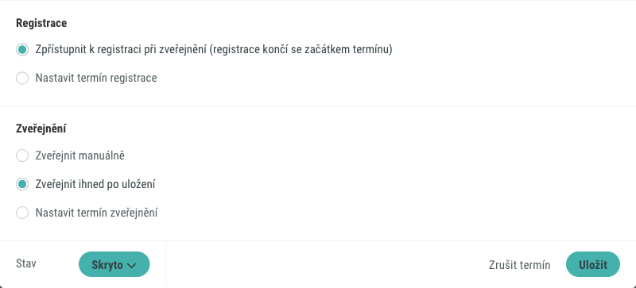
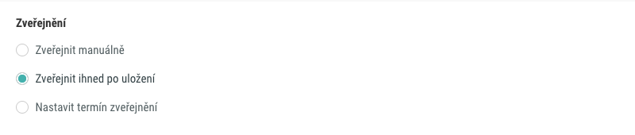
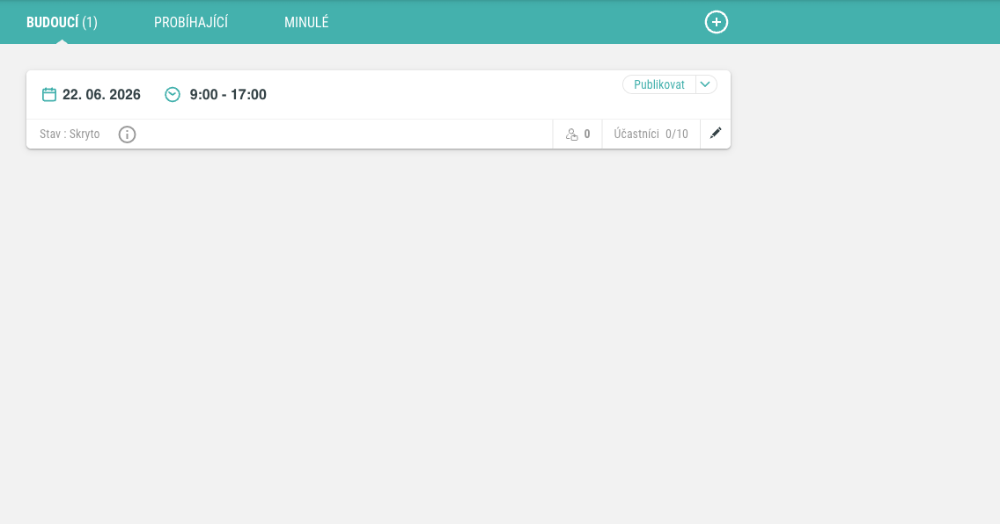

# Jak přidat termín k aktivitě

Termín určuje, kdy a kde se aktivita koná, a kolik uživatelů se jí může
zúčastnit. Tento postup popisuje, jak na záložce **Termíny** v Detailu aktivity
přidat nový termín, vyplnit jeho základní údaje a nastavit jeho zveřejnění.

## Předpoklady

- Máte oprávnění upravovat aktivitu v administraci (jste přihlášeni jako
  administrátor).
- Aktivita je Termínová sada, nebo má schéma **S termíny**. Jen u těchto aktivit
  je záložka **Termíny** dostupná.
- Aktivita nemusí mít žádné existující termíny ani přiřazené uživatele.

## Postup

### 1. Otevřete záložku Termíny

V Detailu aktivity přejděte na záložku **Termíny**. Záložka je rozdělena do tří
podzáložek: **Budoucí**, **Probíhající** a **Minulé**, podle data konání
termínů. Pokud aktivita zatím žádný termín nemá, zobrazí se informace **Aktivita nemá termíny**.

!!! note "Adresa záložky"
    V adrese prohlížeče má záložka technický parametr `activeTab=runs`. V rozhraní
    se však vždy jmenuje **Termíny**.

### 2. Otevřete formulář nového termínu

Klikněte na tlačítko **plus**. Otevře se formulář **Nový termín** s předvyplněným
zítřejším datem.

### 3. Vyplňte termín konání

V sekci **Termín konání aktivity** zadejte, kdy se termín koná:

- **Datum** – den konání termínu. Toto je jediný povinný údaj celého formuláře.
- **Čas** – čas začátku a konce termínu.
- **Vícedenní termín** – zaškrtnutím zobrazíte druhé datové pole pro konec
  vícedenního termínu.
- **Celodenní** – předvyplní časy na celý den.

### 4. Doplňte nepovinné údaje

Dále můžete vyplnit nepovinné parametry termínu:

- **Kapacita** – maximální počet účastníků. Tlačítkem **Neomezeno** omezení
  kapacity zrušíte.
- **Místo** – místo konání termínu. Vyberete je ze seznamu míst uložených
  v systému. Termín může probíhat i bez přiřazeného místa.
- **Realizační tým** – uživatelé s organizační rolí v termínu, například lektoři
  nebo zkoušející.
- **Popis** – libovolný text s informacemi nebo pokyny k termínu.
- **Cena** – cena termínu. Tato hodnota je pouze informativní a nemá žádné
  funkční napojení na platební systém.

Kliknutím na **Pokračovat** přejdete do druhého kroku.

### 5. Nastavte registraci a zveřejnění

Druhý krok zobrazí souhrn zadaných údajů a dvě sekce nastavení.

V sekci **Registrace** nastavte, kdy se termín zpřístupní uživatelům k přihlášení.

V sekci **Zveřejnění** určíte, kdy termín přejde do stavu, ve kterém je viditelný:

- **Zveřejnit manuálně** – termín zůstane po uložení skrytý a zveřejníte ho
  později ručně.
- **Zveřejnit ihned po uložení** – termín se zpřístupní okamžitě po uložení.
- **Nastavit termín zveřejnění** – termín se automaticky zveřejní v zadané datum
  a čas.

### 6. Uložte termín

Klikněte na **Uložit**. Nový termín se zobrazí v příslušné podzáložce (Budoucí,
Probíhající nebo Minulé) podle data konání. U termínu vidíte datum, čas, obsazenost
vůči kapacitě a jeho aktuální stav.

## Pozor na

- Kapacita se eviduje pro každý termín zvlášť. Při plné kapacitě již nelze
  k termínu přihlásit dalšího uživatele.
- Zvolíte-li **Zveřejnit manuálně**, termín zůstane ve stavu **Skryto** a pro
  uživatele není viditelný, dokud ho ručně nezveřejníte.

!!! tip "Vícefázové termíny"
    Pokud termín sestává z více fází (například konference s několika
    přednáškami), použijte ve formuláři termínu tlačítko **Vložit fázi**.

## Související stránky

- [Schémata aktivity](../../concepts/schemata-aktivity.md)
- [Termínová sada](../../concepts/terminova-sada.md)
- [Přiřazení uživatelů k aktivitě](prirazeni-uzivatelu-k-aktivite.md)
- [Detail aktivity](../../reference/detail-aktivity.md)
