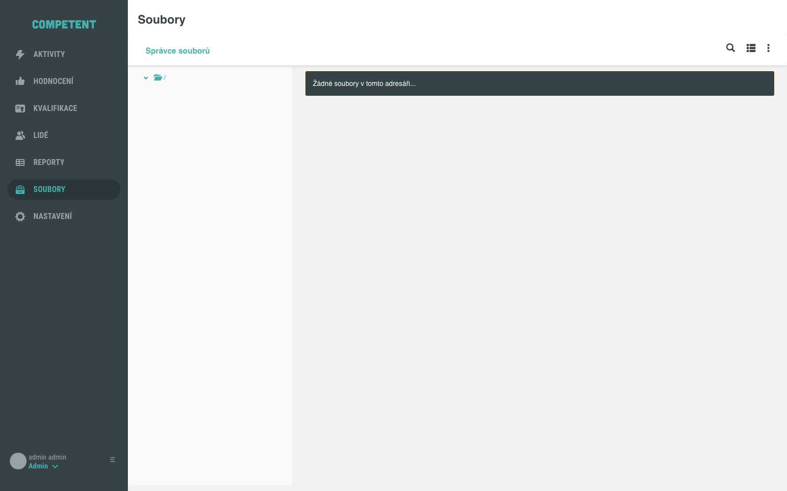
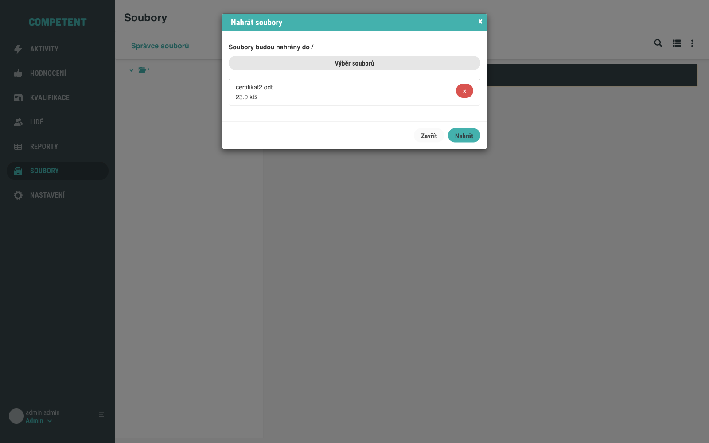
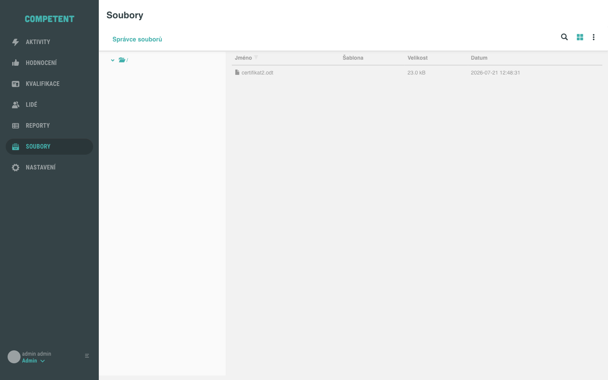
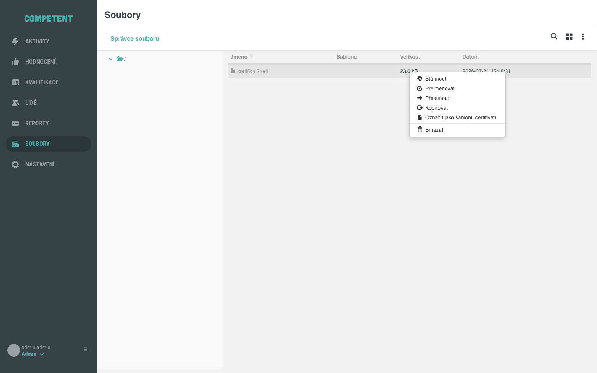
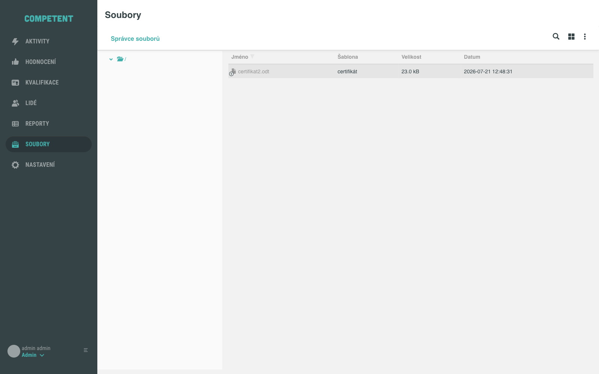
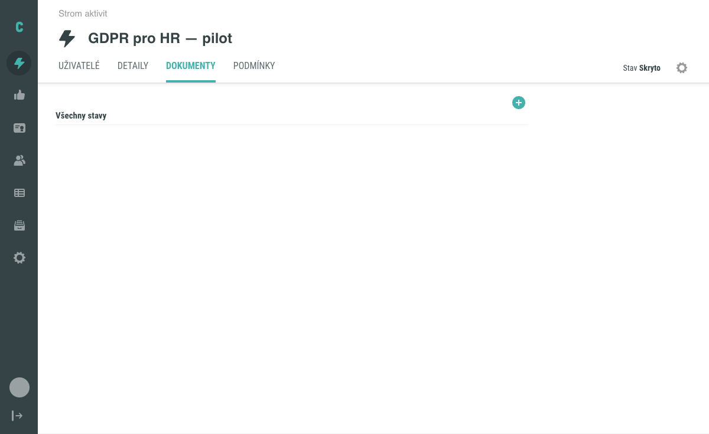
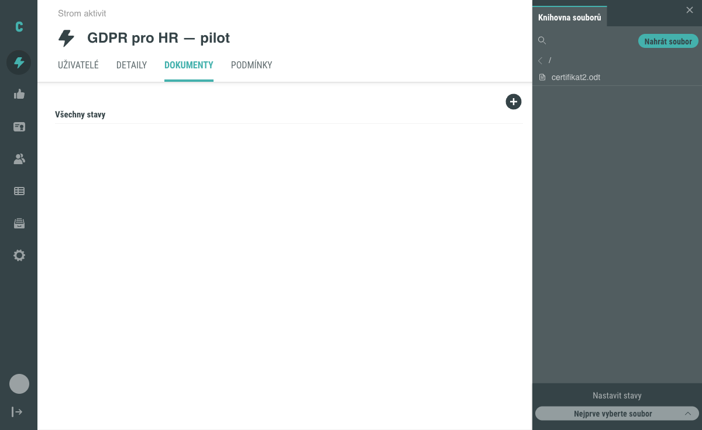
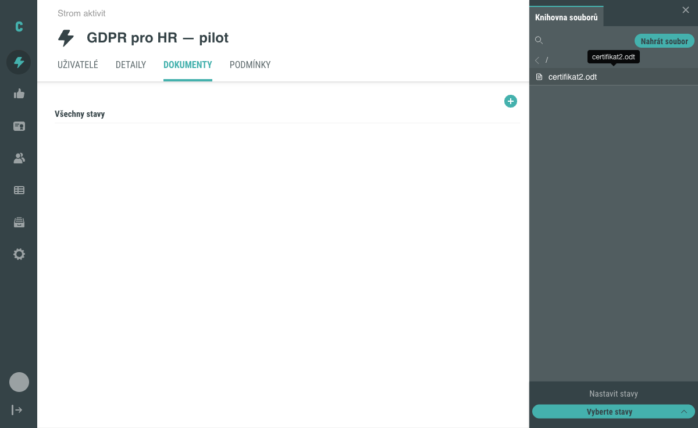
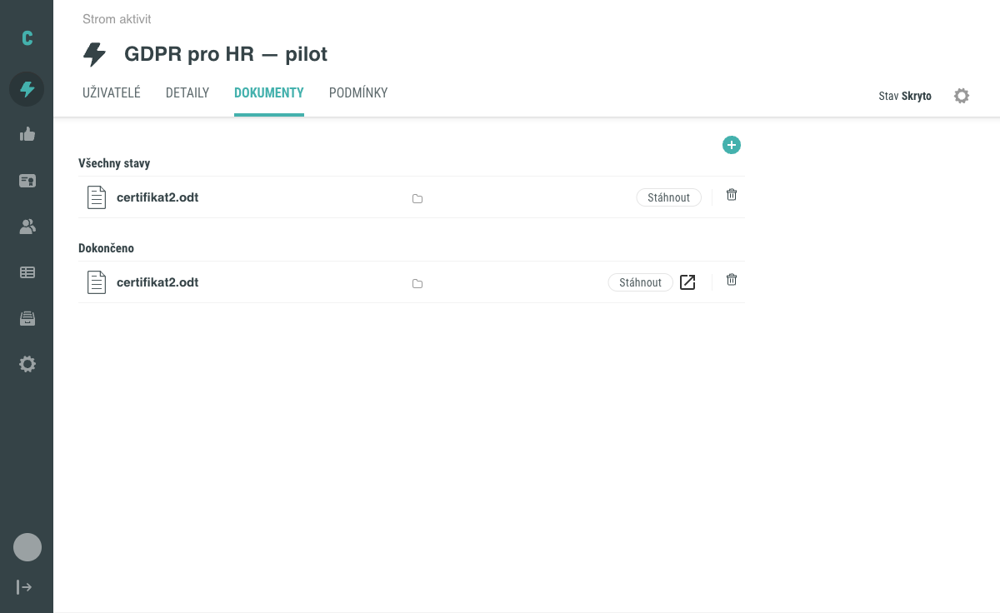

# Jak nastavit šablonu certifikátu

Aby Competent mohl uživatelům vygenerovat certifikát, potřebuje mít k dispozici šablonu ve formátu ODT, kterou administrátor označí jako šablonu certifikátu a následně přiřadí ke konkrétní aktivitě se zvoleným stavem dostupnosti. Tento návod provede celým postupem od nahrání souboru na obrazovce **Soubory** až po přiřazení šablony k aktivitě.

## Předpoklady

- Máte administrátorský přístup do Competent a oprávnění spravovat soubory a aktivity.
- V systému existuje aktivita, ke které chcete certifikát přiřadit, a máte připravený soubor šablony ve formátu `.odt`.

## Postup

### 1. Otevřete obrazovku Soubory

Z hlavního menu otevřete položku **Soubory**.

### 2. Nahrajte soubor šablony

Klikněte na tlačítko **+** v pravém horním rohu obrazovky (vedle přepínače zobrazení Ikony/Seznam) a v rozbaleném menu vyberte **Nahrát soubory**.

Otevře se modál **Nahrát soubory**. Klikněte na **Výběr souborů** a na svém počítači vyberte soubor šablony ve formátu `.odt`. Modál zobrazí informaci, do kterého adresáře bude soubor nahrán (text „Soubory budou nahrány do /" s aktuální cestou), a kartu s vybraným souborem. Klikněte na **Nahrát**.

### 3. Označte soubor jako šablonu certifikátu

Po nahrání se soubor zobrazí v seznamu souborů (přepněte zobrazení na **Seznam**, pokud je aktivní zobrazení Ikony). Sloupec **Šablona** je zatím prázdný.

Klikněte pravým tlačítkem na soubor a v kontextovém menu vyberte **Označit jako šablonu certifikátu**.

Ve sloupci **Šablona** se zobrazí hodnota „certifikát" – soubor je tím označen jako šablona certifikátu.

### 4. Otevřete záložku Dokumenty v detailu aktivity

Přejděte na detail aktivity, ke které chcete certifikát přiřadit, a otevřete záložku **Dokumenty**.

### 5. Vyberte šablonu v Knihovně souborů

Klikněte na tlačítko **+**. Otevře se vedlejší panel **Knihovna souborů** se seznamem nahraných souborů.

Klikněte na soubor šablony certifikátu, čímž jej vyberete. V dolní části panelu se aktivuje sekce **Nastavit stavy** (do výběru souboru je tlačítko této sekce neaktivní s popiskem „Nejprve vyberte soubor").

### 6. Zvolte stav dostupnosti certifikátu

Klikněte na tlačítko sekce **Nastavit stavy** (popisek se změní na „Vyberte stavy"). V rozbaleném seznamu stavů vyberte stav, při kterém má být certifikát uživateli dostupný.

Doporučeným stavem pro zpřístupnění certifikátu je stav odpovídající úspěšnému splnění aktivity, například **Dokončeno** – certifikát tak nebude dostupný dříve, než uživatel aktivitu úspěšně splní.

Přiřazení se aplikuje ihned po kliknutí na zvolený stav, bez dalšího potvrzovacího tlačítka.

### 7. Ověřte přiřazení

Zavřete panel **Knihovna souborů**. V záložce **Dokumenty** se šablona certifikátu zobrazí ve skupině odpovídající zvolenému stavu (v tomto příkladu **Dokončeno**).

Tím je postup dokončen.

## Pozor na

- Jako šablonu certifikátu lze označit pouze soubor ve formátu `.odt`.
- Chcete-li místo dosavadního souboru použít jinou šablonu, nejprve stávající soubor v kontextovém menu odznačte akcí **Odznačit jako šablonu certifikátu**.
- Zvolený stav v sekci **Nastavit stavy** neurčuje aktuální stav dané aktivity – jde o podmínku viditelnosti dokumentu vůči uživateli, nezávislou na tom, v jakém stavu se aktivita momentálně nachází.

## Související stránky

- [Certifikát: princip a generování](../../concepts/certifikat.md)
- [Dokumenty v aktivitě: přiřazení a viditelnost](../../concepts/dokumenty-v-aktivite.md)
- [Jak přidat dokument k aktivitě](../aktivity/dokumenty-v-aktivite.md)
- [Obrazovka Soubory](../../reference/obrazovka-soubory.md)
- [Detail aktivity](../../reference/detail-aktivity.md)
