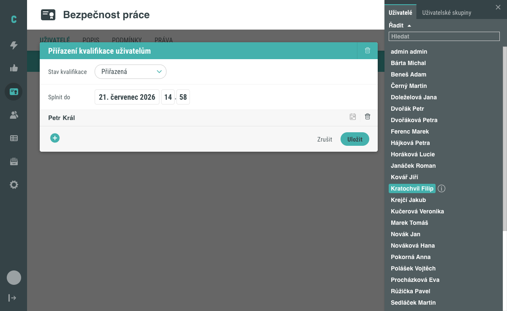
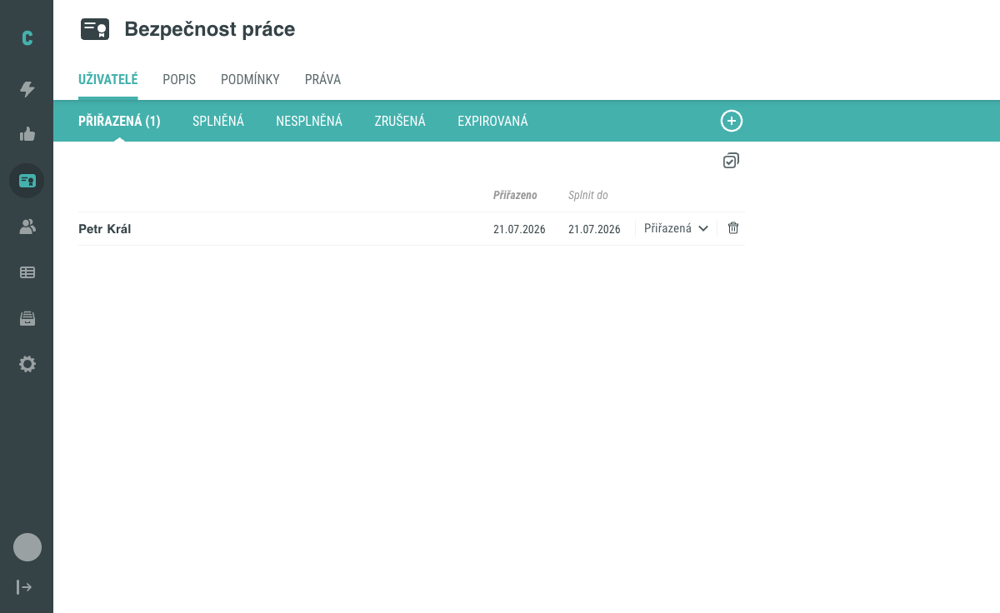
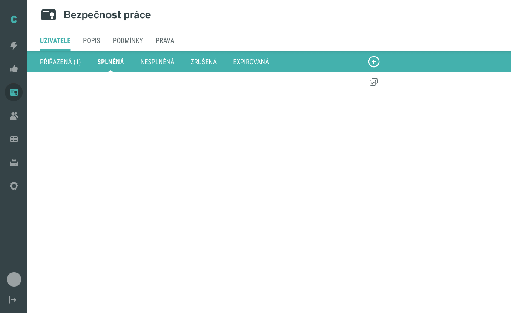

# Jak přiřadit kvalifikaci uživateli

Tento návod popisuje přiřazení existující kvalifikace jednomu nebo více
uživatelům (případně celým uživatelským skupinám) na záložce **Uživatelé**
v detailu kvalifikace, včetně nastavení počátečního stavu a termínu splnění.

## Předpoklady

- Máte administrátorský přístup do Competent.
- V systému existuje kvalifikace, kterou chcete uživateli přiřadit. Založení
  nové kvalifikace popisuje návod [Jak vytvořit kvalifikaci](vytvoreni-kvalifikace.md).

## Postup

### 1. Otevřete záložku Uživatelé

V detailu kvalifikace se přepněte na záložku **Uživatelé** (je zobrazena jako
výchozí po otevření detailu). V horní části záložky najdete stavové chipy
**Přiřazená**, **Splněná**, **Nesplněná**, **Zrušená** a **Expirovaná** a
tlačítko **+** v pravém rohu záhlaví.

### 2. Otevřete přiřazení a vyberte uživatele

Klikněte na tlačítko **+** v záhlaví záložky. Otevře se modál **Přiřazení
kvalifikace uživatelům** s poli **Stav kvalifikace** (výchozí hodnota
„Přiřazená") a **Splnit do** (datum a čas).

Uvnitř modálu klikněte na tlačítko **+**. Otevře se boční panel s taby
**Uživatelé** a **Uživatelské skupiny**, ve kterém můžete pomocí pole
**Hledat** vyhledat konkrétní položku. Kliknutím na uživatele nebo skupinu
v seznamu ji přidáte do modálu.

### 3. Nastavte stav a termín splnění

V modálu ponechte nebo upravte hodnotu pole **Stav kvalifikace** a podle
potřeby nastavte datum v poli **Splnit do**. Tato nastavení se uloží společně
s vybranými uživateli a skupinami.

### 4. Uložte přiřazení

Klikněte na tlačítko **Uložit** (zrušení provedete tlačítkem **Zrušit**).
Modál se zavře a přiřazený uživatel se zobrazí v tabulce na záložce
**Uživatelé** se sloupci **Přiřazeno** a **Splnit do**, stavovým rozbalovacím
seznamem a ikonou koše pro odebrání přiřazení.

### 5. Volitelně filtrujte podle stavu

Seznam přiřazených uživatelů můžete zúžit kliknutím na některý ze stavových
chipů (**Přiřazená**, **Splněná**, **Nesplněná**, **Zrušená**, **Expirovaná**).
Zobrazí se pouze uživatelé, jejichž kvalifikace se aktuálně nachází v daném
stavu.

Tím je postup dokončen.

!!! warning "Stav kvalifikace se po přiřazení nemění automaticky"
    Přiřazením kvalifikace uživateli nastavíte pouze počáteční stav (výchozí
    „Přiřazená"). Splnění požadavků definovaných na záložce Podmínky samo
    o sobě nezpůsobí, že systém stav automaticky změní na „Splněná". Model
    stavů kvalifikace popisuje stránka [Kvalifikace: model a principy](../../concepts/kvalifikace.md).

## Související stránky

- [Jak vytvořit kvalifikaci](vytvoreni-kvalifikace.md)
- [Kvalifikace (koncept)](../../concepts/kvalifikace.md)
- [Detail kvalifikace](../../reference/detail-kvalifikace.md)
