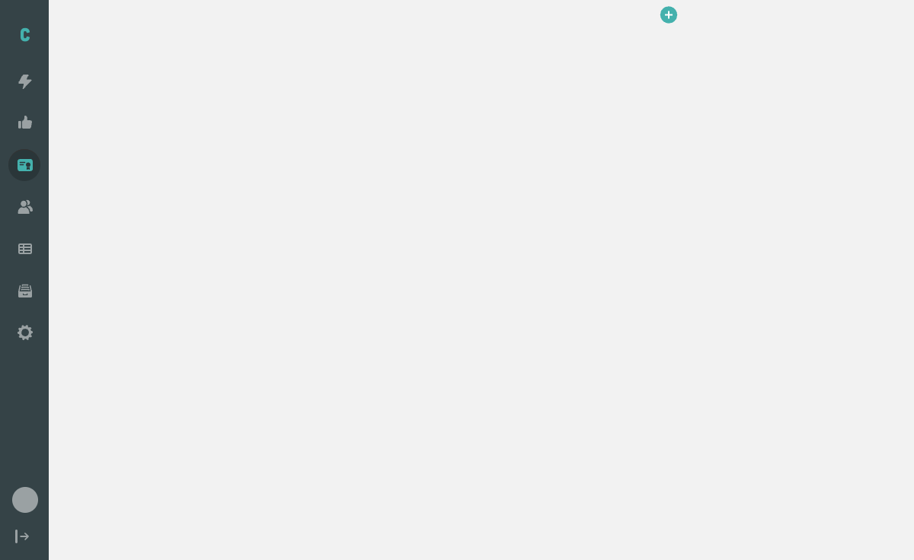
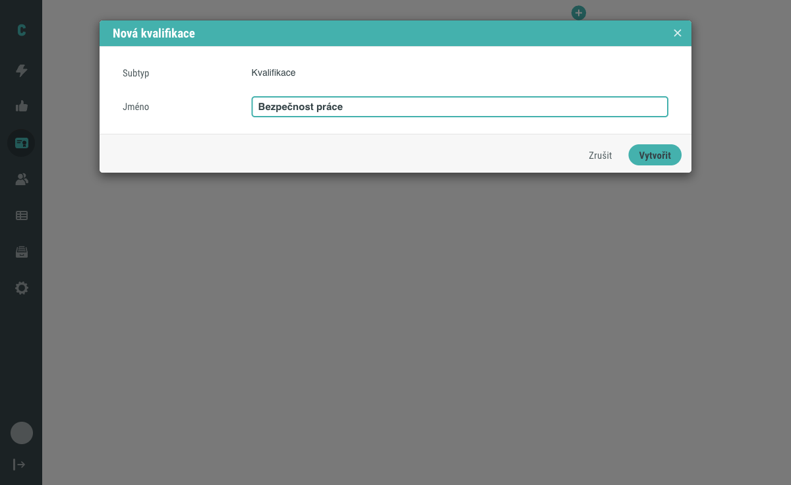
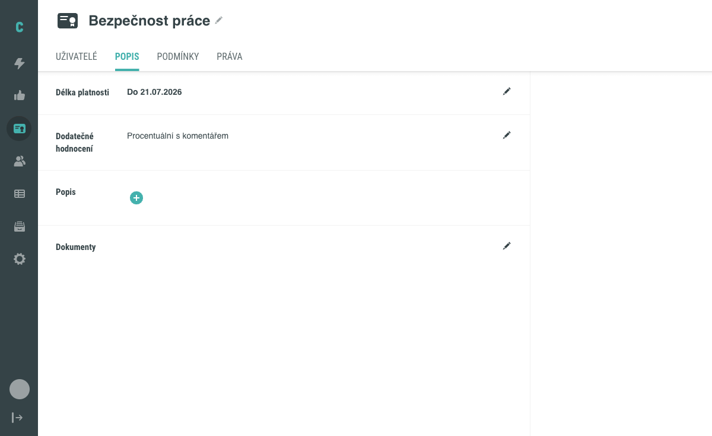
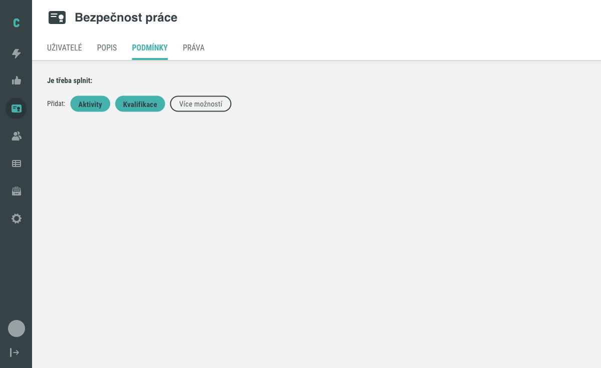
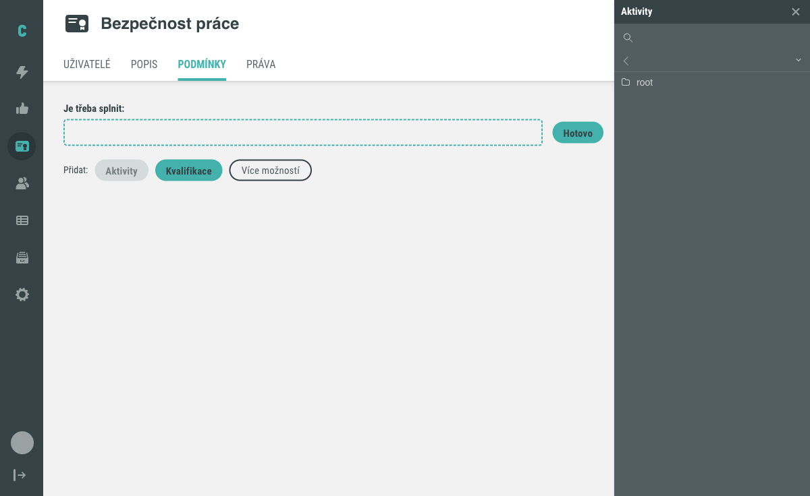

# Jak vytvořit kvalifikaci

Tento návod popisuje založení nové kvalifikace na obrazovce Kvalifikace, nastavení
její platnosti a dodatečného hodnocení na záložce Popis a otevření nastavení
požadavků na záložce Podmínky.

## Předpoklady

- Máte administrátorský přístup do Competent.
- V systému existuje alespoň jedna aktivita nebo kvalifikace, kterou lze použít
  jako požadavek, pokud chcete v posledním kroku otevřít výběr podmínek.

## Postup

### 1. Otevřete obrazovku Kvalifikace

Přejděte na obrazovku **Kvalifikace**.

### 2. Založte novou kvalifikaci

Klikněte na kulaté tlačítko **+** vlevo nahoře. Otevře se modál **Nová kvalifikace**.

Zvolte **Subtyp** a do pole **Jméno** zadejte název kvalifikace. Potvrďte tlačítkem
**Vytvořit** (zrušení provedete tlačítkem **Zrušit**).

Po vytvoření se otevře detail kvalifikace s výchozí záložkou **Uživatelé**.

### 3. Nastavte platnost a dodatečné hodnocení

Na záložce **Popis** upravte pole **Délka platnosti** kliknutím na ikonu tužky –
zvolte jednu z možností **Neomezeně** / **Do termínu** / **Od data splnění**
a potvrďte tlačítkem **Uložit**. Pokud jste zvolili **Do termínu**, doplňte
konkrétní datum. Stejným způsobem nastavte pole **Dodatečné hodnocení** na
hodnotu **Žádné** nebo **Procentuální s komentářem**.

### 4. Otevřete záložku Podmínky

Přepněte se na záložku **Podmínky**. Záložka nese nadpis **Je třeba splnit:**
a řádek **Přidat:** s tlačítky **Aktivity**, **Kvalifikace** a **Více možností**.

### 5. Přidejte požadavek

Klikněte na **Aktivity** (případně na **Kvalifikace**, pokud chcete jako požadavek
zvolit jinou kvalifikaci). Otevře se boční panel s vyhledávacím polem a stromovou
navigací od složky root.

Vyhledejte nebo dohledejte ve stromu požadovanou položku a u ní klikněte na
tlačítko **Přidat**. Panel zavřete tlačítkem **Hotovo** nebo křížkem.

!!! note "Pozor na"
    Pokud se položka po kliknutí na **Přidat** v seznamu **Je třeba splnit:**
    neobjeví, zkuste stránku obnovit.

!!! warning "Podmínky nejsou automatické vyhodnocení"
    Přidání požadavku na záložce Podmínky pouze definuje, co má uživatel splnit.
    Splnění podmínek uživatelem samo o sobě nezpůsobí, že systém automaticky
    změní stav kvalifikace u uživatele na Splněná. Přiřazení kvalifikace
    uživateli a přehled stavů popisuje záložka Uživatelé.

Tím je postup dokončen.

## Související stránky

- [Kvalifikace (koncept)](../../concepts/kvalifikace.md)
- [Obrazovka Kvalifikace](../../reference/obrazovka-kvalifikace.md)
- [Detail kvalifikace](../../reference/detail-kvalifikace.md)
- [Jak přiřadit kvalifikaci uživateli](prirazeni-kvalifikace.md)
