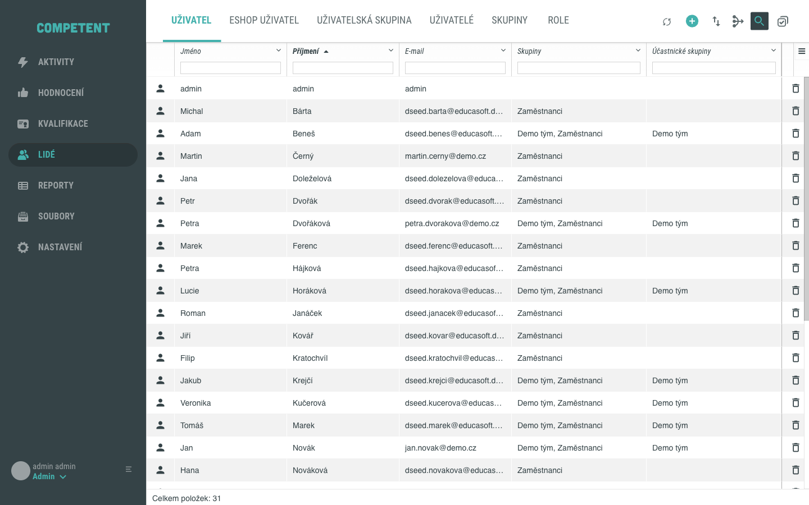
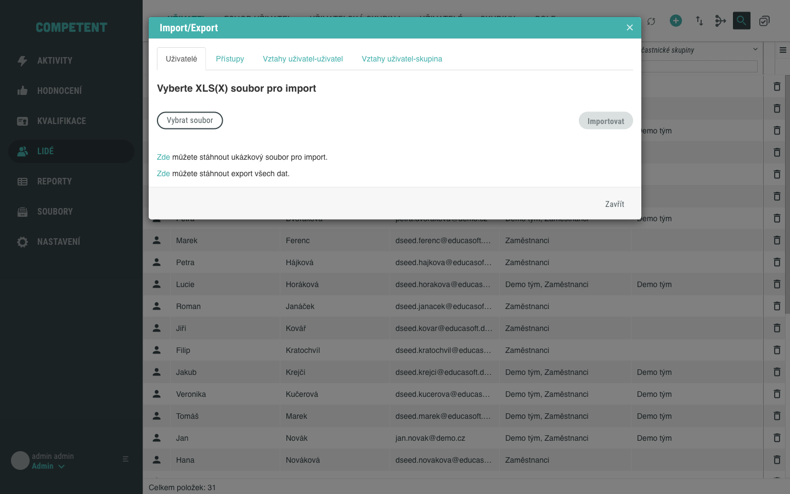

# Import uživatelů

Více uživatelů najednou založíte hromadným importem ze souboru XLS(X). Import spustíte z obrazovky **Lidé** přes okno **Import/Export**, ve kterém vyberete typ objektu, nahrajete připravený soubor a spustíte zpracování. Tento návod popisuje import samotných uživatelů.

## Předpoklady

- Máte přístup do administrace Competent a do obrazovky **Lidé**.
- Máte připravený soubor XLS(X), nebo si stáhnete ukázkový soubor přímo z okna **Import/Export**.

K importu vám stačí Microsoft Excel nebo kompatibilní tabulkový editor; nic dalšího není potřeba instalovat.

## Postup

### 1. Otevřete okno Import/Export

V obrazovce **Lidé** klikněte na ikonu **Import/Export** v záhlaví obrazovky.

### 2. Vyberte typ objektu

Otevře se okno **Import/Export**. Zkontrolujte, že je aktivní tab **Uživatelé** – ten slouží k importu uživatelů. Pro hromadné přiřazení uživatelů do skupin slouží tab **Vztahy uživatel-skupina**.

### 3. Stáhněte si ukázkový soubor

Pokud vzor ještě nemáte, klikněte na odkaz **Zde** u textu o stažení ukázkového souboru pro import. Systém připraví ukázkový soubor odpovídající nastavení vašeho Competentu, který si poté stáhnete.

!!! note "Sloupce se liší podle nastavení"
    Stáhněte si ukázkový soubor odkazem **Zde** – povinné a nepovinné sloupce jsou ve vzoru barevně odlišené. Text v závorce v záhlaví sloupce je technický identifikátor – neměňte jej, upravujte jen text mimo závorku.

### 4. Vyberte soubor a spusťte import

Klikněte na **Vybrat soubor** a vyberte připravený soubor XLS(X). Po jeho výběru se zpřístupní tlačítko **Importovat**, kterým import spustíte.

### 5. Zkontrolujte výsledek

Po dokončení importu se zobrazí souhrn úspěšných a chybných řádků a přehled uživatelů se obnoví.

Otevření okna a výběr tabu **Uživatelé** shrnuje následující animace:

Tím je postup dokončen.

## Pozor na

- **Formát je XLS(X), ne CSV.** Import přijímá soubory Microsoft Excel s příponou `.xls` nebo `.xlsx`.
- **Vždy vycházejte z aktuálního vzoru.** Ukázkový soubor respektuje nastavení konkrétní instance; pro každý subtyp obsahuje samostatný list, protože subtypy mají vlastní parametry.
- **Neměňte text v závorkách v záhlaví.** Text v závorce je technický identifikátor sloupce. Pokud jej změníte, import nemusí sloupec správně rozpoznat.

## Související stránky

- [Přiřazení uživatele do skupiny](prirazeni-uzivatele-do-skupiny.md)
- [Vytvoření uživatele](vytvoreni-uzivatele.md)
- [Detail skupiny](../../reference/detail-skupiny.md)
