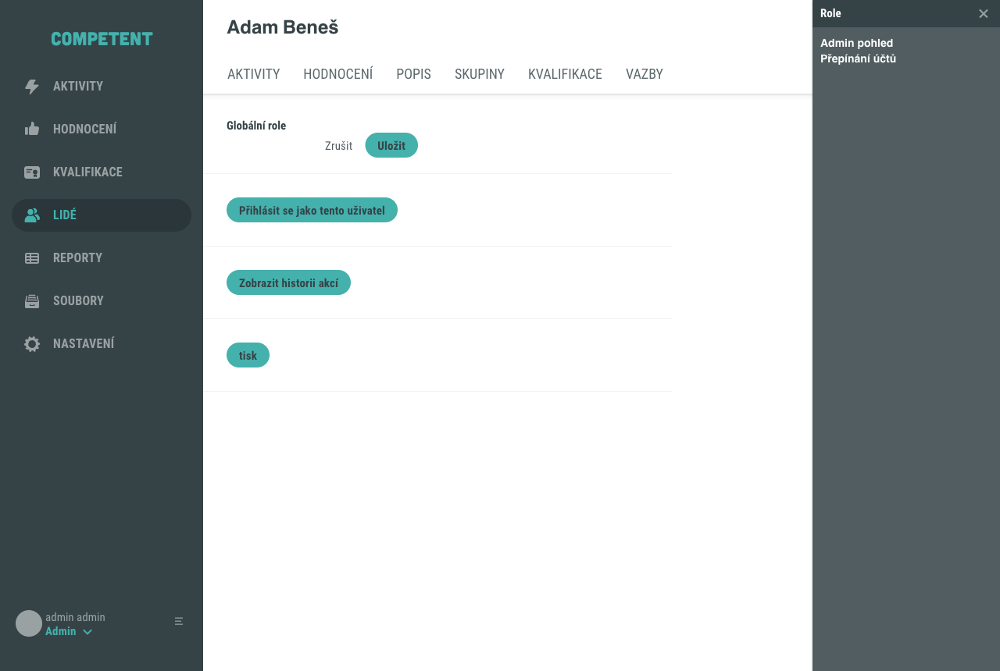
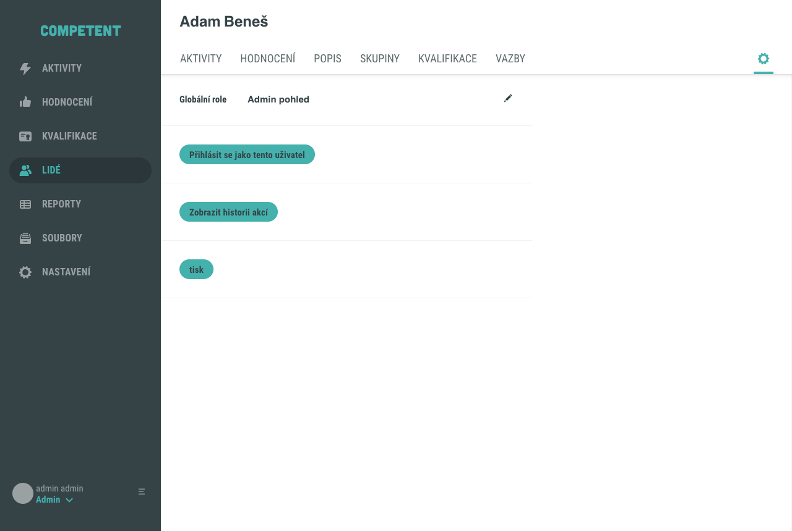
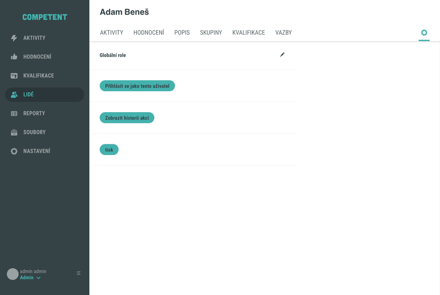

# Přiřazení globální role uživateli

Globální role platí v celém systému a uživateli rozšiřují možnosti napříč aplikací. Tento návod popisuje, jak konkrétnímu uživateli přidělit nebo odebrat globální roli v detailu uživatele, v pohledu **Nastavení**. Přidělení globální role je administrátorská akce a vyžaduje odpovídající oprávnění.

## Předpoklady

- Máte administrátorský přístup do Competent a do detailu uživatele.
- V systému existuje uživatel, kterému chcete roli přidělit.

Pokud uživatele teprve zakládáte, použijte návod [Vytvoření uživatele](vytvoreni-uzivatele.md).

## Postup

### 1. Otevřete pohled Nastavení v detailu uživatele

V seznamu **Lidé** otevřete detail uživatele. V pravém horním rohu záhlaví detailu klikněte na ikonu ozubeného kola (pohled **Nastavení**). Zobrazí se sekce **Globální role**.

!!! warning "Nezaměňte s přejmenováním"
    Ikona vedle jména uživatele otevírá pouze přejmenování (pole Křestní jméno a Příjmení). Pohled **Nastavení** s globálními rolemi otevřete ikonou v pravém horním rohu záhlaví, nikoliv ikonou u jména.

### 2. Přepněte sekci do režimu úprav

U nadpisu **Globální role** klikněte na ikonu tužky. Sekce přejde do režimu úprav (zobrazí se tlačítka **Zrušit** a **Uložit**) a vpravo se otevře boční panel **Role** s nabídkou přiřaditelných rolí.

V demu nabízí panel dvě globální role:

- **Admin pohled** – zpřístupní skryté a archivované záznamy v celém systému.
- **Přepínání účtů** – umožní přihlásit se za jiného uživatele.

### 3. Přidejte roli a uložte

V bočním panelu klikněte na roli, kterou chcete přidat (například **Admin pohled**). Role se ihned zařadí do sekce **Globální role**. Výběr potvrdíte uložením sekce: klikněte na tlačítko **Uložit**.

Celý postup od otevření pohledu Nastavení po uložení role ukazuje následující animace:

## Odebrání globální role

Odebrání probíhá ve stejné sekci:

1. U nadpisu **Globální role** klikněte na ikonu tužky.
2. V seznamu přiřazených rolí klikněte na roli, kterou chcete odebrat. Tím ji označíte k odebrání.
3. Klikněte na tlačítko **Uložit**.

Po uložení už role v sekci **Globální role** není uvedena.

## Pozor na

- Změny v sekci se projeví až po kliknutí na **Uložit**. Pokud režim úprav opustíte bez uložení (například tlačítkem **Zrušit**), zůstane původní stav zachován.
- Nabídka rolí v bočním panelu **Role** se může u jednotlivých instalací lišit. Standardně jsou k dispozici role **Admin pohled** a **Přepínání účtů**.

## Související stránky

- [Role a oprávnění (koncept)](../../concepts/role.md)
- [Přehled rolí a oprávnění](../../reference/prehled-roli-a-opravneni.md)
- [Přiřazení uživatele do skupiny](prirazeni-uzivatele-do-skupiny.md)
