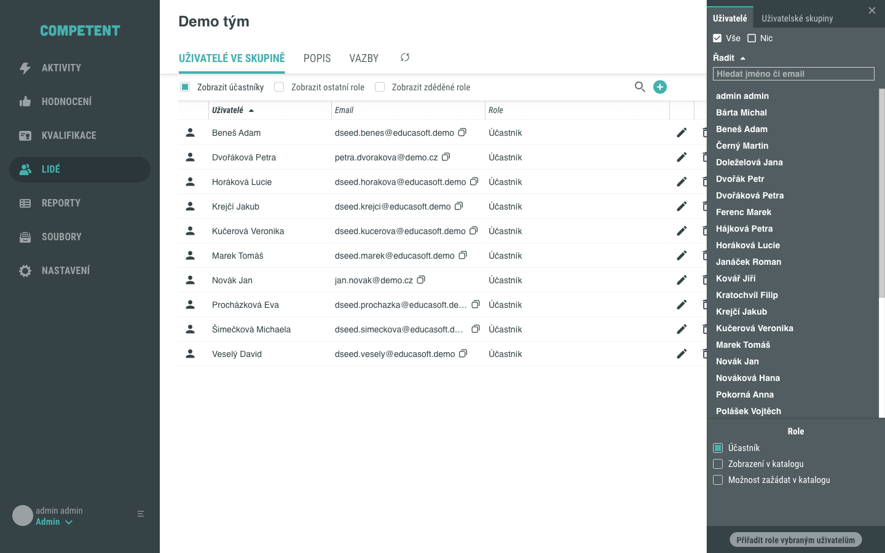
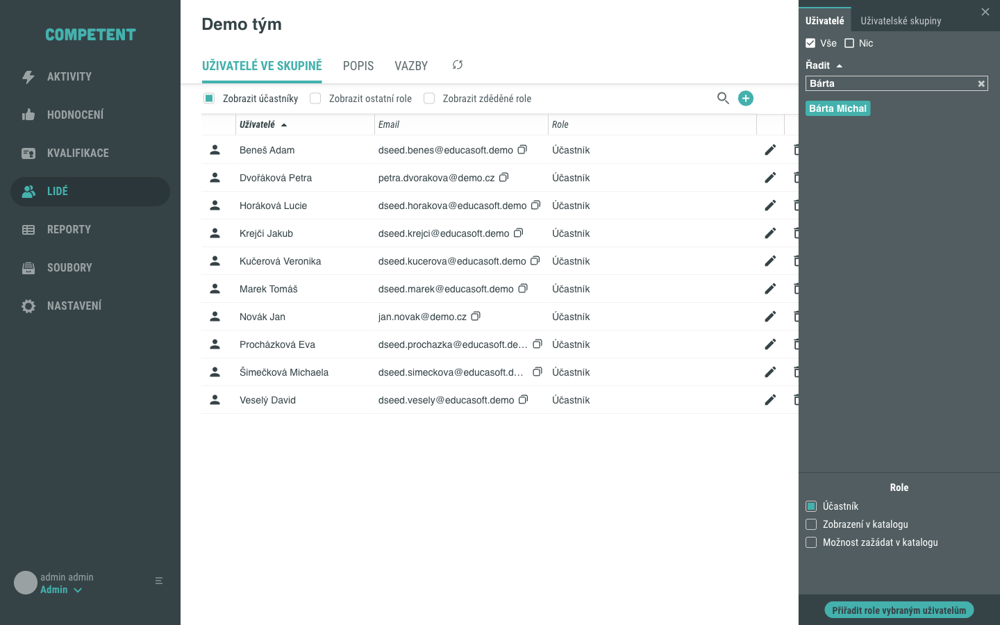
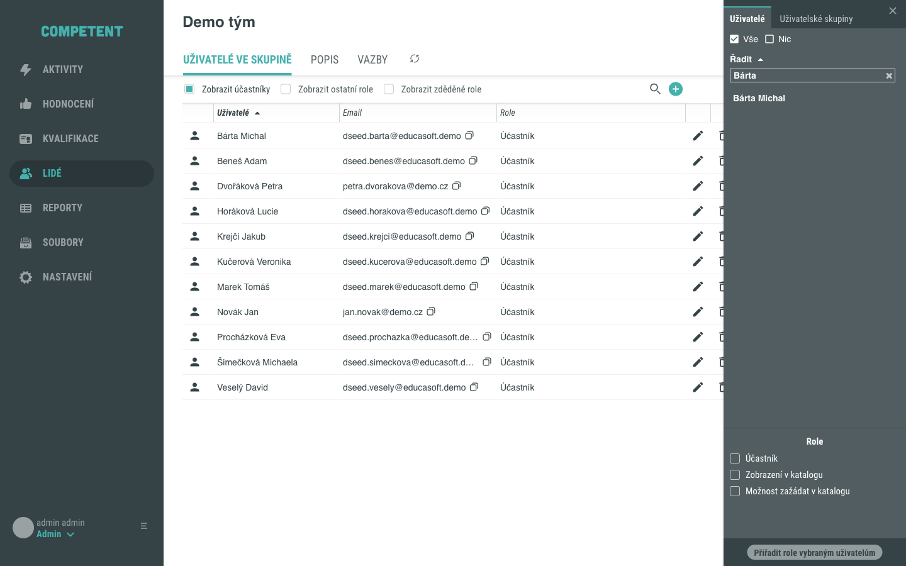
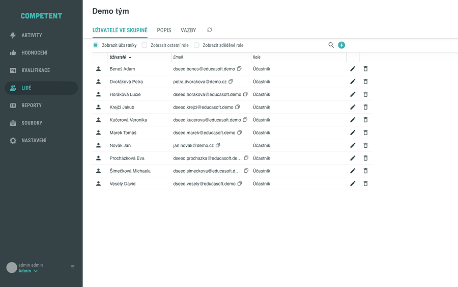
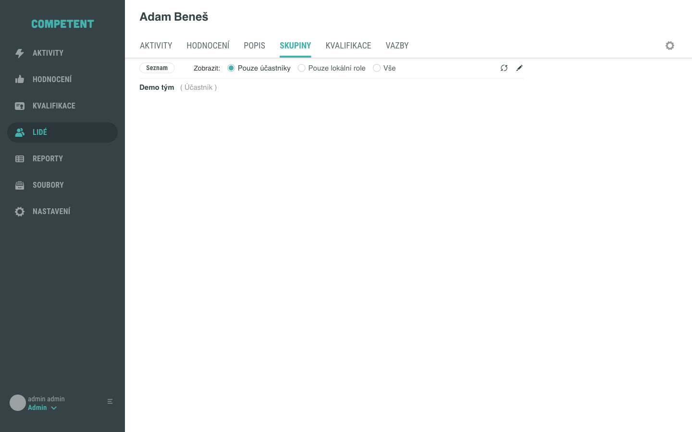
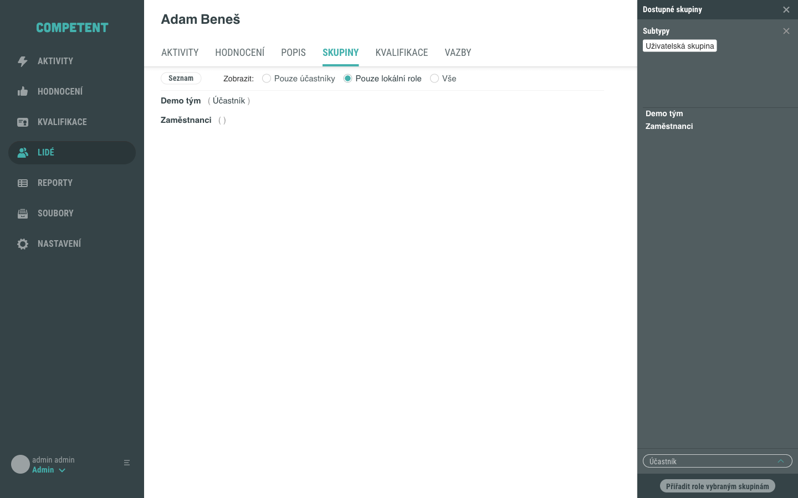

# Přiřazení uživatele do skupiny

Existujícího uživatele přidáte do existující uživatelské skupiny dvěma způsoby: z detailu skupiny, nebo z detailu konkrétního uživatele. V obou případech jde o **přiřazení role** ve skupině – přidání člena a přidělení jeho role je jedna a tatáž akce. Výchozí rolí členství je **Účastník**.

## Předpoklady

- Máte přístup do administrace Competent a do obrazovky **Lidé**.
- V systému existuje alespoň jedna uživatelská skupina a alespoň jeden uživatel, kterého chcete přiřadit.

Pokud skupina nebo uživatel dosud neexistují, vytvořte je nejdříve podle samostatných návodů (viz [Související stránky](#souvisejici-stranky)).

## Přiřazení z detailu skupiny

Toto je nejčastější způsob, když chcete do jedné skupiny přidat jednoho nebo více členů.

### 1. Otevřete tab Uživatelé ve skupině

V detailu skupiny zůstaňte na tabu **Uživatelé ve skupině**. V gridu vidíte stávající členy ve sloupcích **Uživatelé**, **Email** a **Role**.

### 2. Otevřete boční panel pro přidání člena

Nad gridem vpravo klikněte na zelené tlačítko **+**. Otevře se boční panel s taby **Uživatelé** a **Uživatelské skupiny** a se sekcí role.

### 3. Vyberte uživatele a roli

Na tabu **Uživatelé** vyhledejte uživatele v poli **Hledat jméno či email** a klikněte na jeho jméno. Můžete vybrat i více uživatelů najednou. Role **Účastník** je předvybraná, takže ji stačí ponechat.

!!! tip "Výběr podle skupiny"
    Na tabu **Uživatelské skupiny** můžete předvybrat uživatele podle jejich příslušnosti k jiné skupině. Pomocí tlačítek **Vše** a **Nic** rychle označíte nebo odznačíte celý seznam.

### 4. Potvrďte přiřazení

Klikněte na tlačítko **Přiřadit role vybraným uživatelům**. Uživatel se objeví v gridu členů s rolí **Účastník**.

Celý postup shrnuje následující animace:

Tím je postup dokončen.

### Odebrání člena

Člena odeberete kliknutím na ikonu koše u jeho řádku v gridu. Systém zobrazí potvrzovací dialog **Smazání – Uživatel**; akci potvrďte tlačítkem **Potvrdit**.

## Přiřazení z detailu uživatele

Druhý směr použijete, když chcete jednoho uživatele přiřadit do jedné nebo více skupin.

### 1. Otevřete tab Skupiny v detailu uživatele

V obrazovce **Lidé** otevřete v zobrazení **Uživatelé** detail požadovaného uživatele a přepněte se na tab **Skupiny**. Vidíte skupiny, ve kterých je uživatel členem, a jejich role. Pomocí přepínače **Zobrazit:** můžete filtrovat zobrazení na **Pouze účastníky**, **Pouze lokální role**, nebo **Vše**.

### 2. Otevřete boční panel s nabídkou skupin

Klikněte na editační ikonu (tužku). Otevře se boční panel s nabídkou dostupných skupin a s předvybranou rolí **Účastník**.

### 3. Vyberte skupiny a potvrďte

Vyberte jednu nebo více skupin, ponechte roli **Účastník** (nebo zvolte jinou) a klikněte na tlačítko **Přiřadit role vybraným skupinám**. Uživatel se tím stane členem zvolených skupin.

## Pozor na

- **Přidání člena je přiřazení role.** V rozhraní nenajdete samostatné tlačítko „Přidat" – členství vždy potvrzujete tlačítkem **Přiřadit role vybraným uživatelům** (z detailu skupiny), respektive **Přiřadit role vybraným skupinám** (z detailu uživatele).
- **Výchozí role je Účastník.** Ve výchozí instalaci je **Účastník** jediná role členství, kterou přiřadíte ručně. V bočním panelu jsou navíc volby **Zobrazení v katalogu** a **Možnost zažádat v katalogu**.
- **Zděděné role nelze odebrat z potomka.** Pokud má člen roli zděděnou z nadřazené skupiny, nelze ji z této skupiny odebrat – odebrat jdou jen role přidělené lokálně. Zděděné role jsou v gridu označené hvězdičkou.
- **Systémové role.** Role přiřazené systémem se zobrazují v hranatých závorkách a nelze je přiřadit ani odebrat ručně. Role **Účastník** je ve skupině manuální, na jiných místech (například u aktivity) může být systémová.
- **Existující kombinaci systém nezakládá znovu.** Pokud už uživatel danou roli ve skupině má, přiřazení se přeskočí.

## Související stránky

- [Detail skupiny](../../reference/detail-skupiny.md)
- [Import uživatelů](import-uzivatelu.md)
- [Vytvoření uživatele](vytvoreni-uzivatele.md)
- [Vytvoření uživatelské skupiny](vytvoreni-uzivatelske-skupiny.md)
- [Uživatelská skupina](../../concepts/skupina.md)
- [Přiřazení dle skupin](../../concepts/prirazeni-dle-skupin.md)
