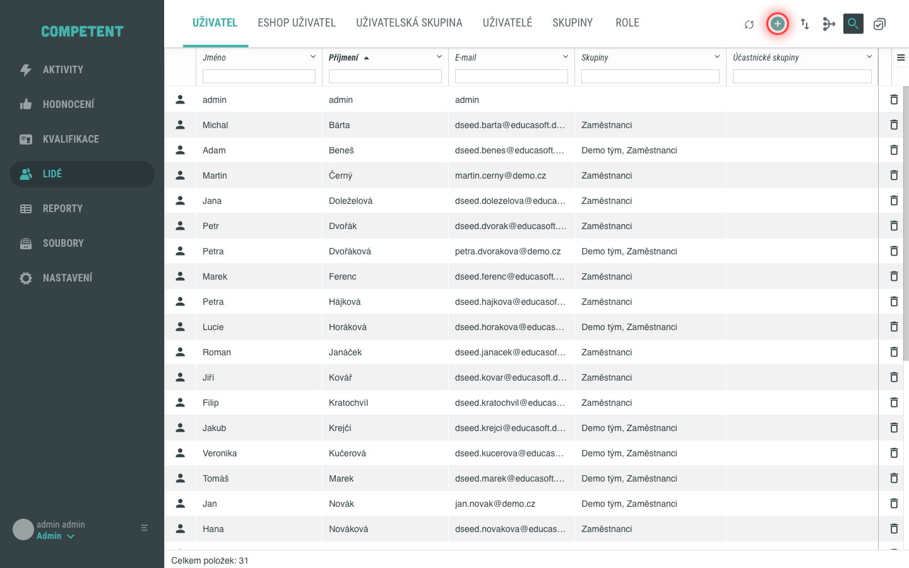
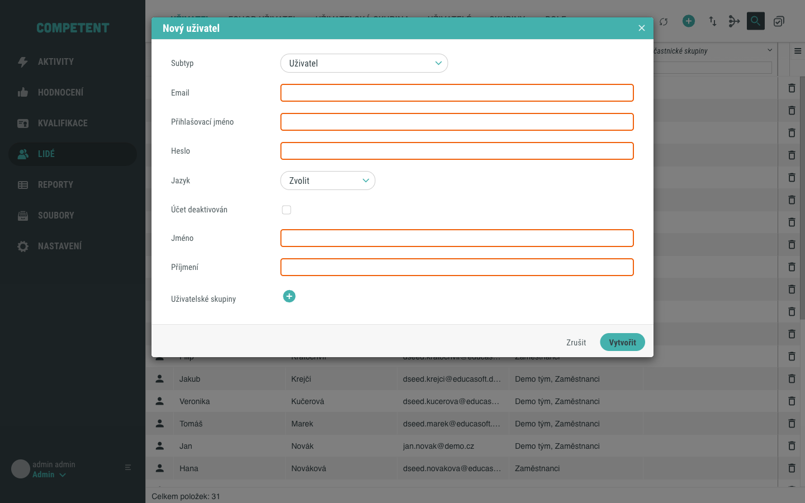
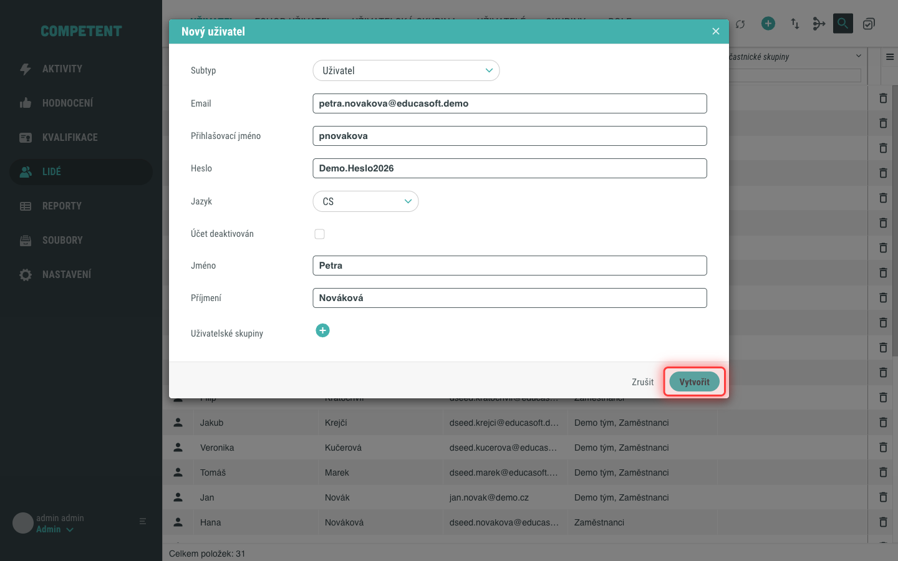
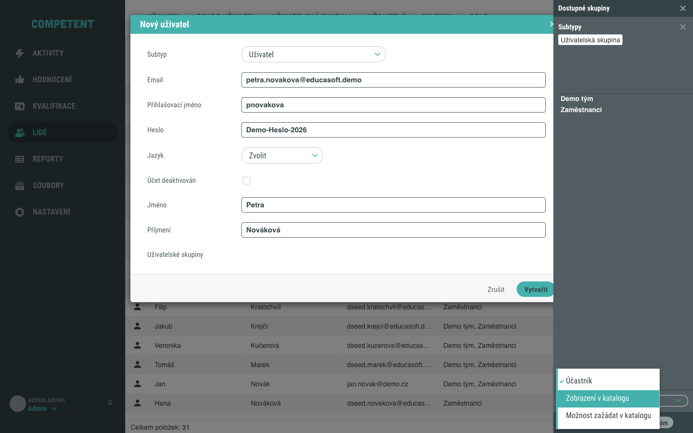
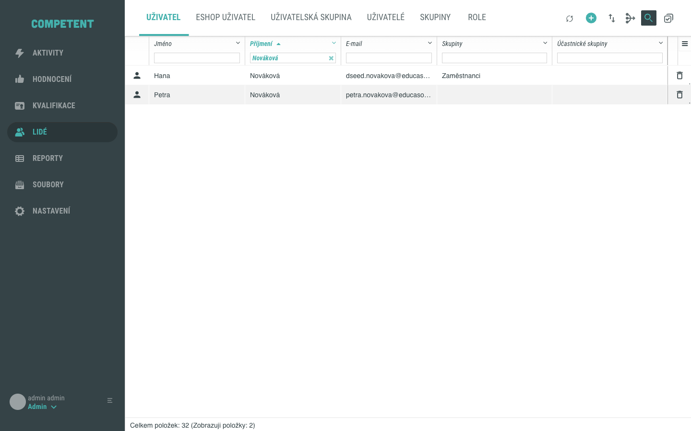
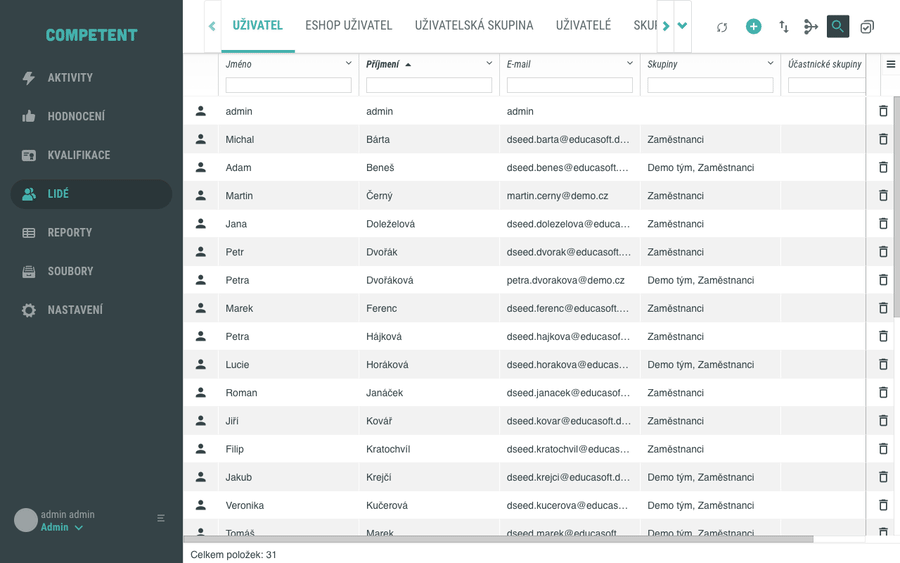

# Vytvoření uživatele v administraci

Nového uživatele vytvoříte v obrazovce **Lidé**, kde se evidují všichni uživatelé systému Competent. Tento návod vás provede vyplněním formuláře, povinnými poli a volitelným zařazením uživatele do skupiny.

## Předpoklady

- Máte přístup do administrace Competent a oprávnění vytvářet uživatele.
- V hlavním menu vidíte položku **Lidé**.
- Existující skupina není potřeba – zařazení do skupiny je volitelné.

## Postup

### 1. Otevřete formulář nového uživatele

V hlavním menu administrace klikněte na **Lidé**. Zůstaňte v tabu **Uživatel**, který je zvolený jako výchozí. V pravém horním rohu nad seznamem klikněte na tlačítko **Nový uživatel**.

### 2. Seznamte se s formulářem

Otevře se okno **Nový uživatel** s formulářem. Pole jsou uspořádána v tomto pořadí: **Subtyp**, **E-mail**, **Přihlašovací jméno**, **Heslo**, **Jazyk**, přepínač **Účet deaktivován**, **Jméno**, **Příjmení** a **Uživatelské skupiny**.

Povinná pole, která musíte vyplnit, jsou **E-mail**, **Přihlašovací jméno**, **Heslo**, **Jméno**, **Příjmení** a **Jazyk**.

### 3. Zvolte subtyp

V poli **Subtyp** vyberte typ uživatele. Subtyp se volí jako první, protože určuje, jaká pole formulář zobrazí. Ve výchozím stavu je předvybrán subtyp **Uživatel**. Některé subtypy mohou přidat další povinná pole.

### 4. Vyplňte údaje uživatele

Vyplňte jednotlivá pole:

- **E-mail** – e-mailová adresa uživatele. Musí být v systému unikátní.
- **Přihlašovací jméno** – jméno, kterým se uživatel přihlašuje. Musí být v systému unikátní.
- **Heslo** – vstupní heslo uživatele. Heslo se ukládá zabezpečeně a nikdy se nezobrazuje v čitelné podobě.
- **Jazyk** – jazyk rozhraní uživatele. Vyberte hodnotu z nabídky (tlačítko **Zvolit**).
- **Jméno** a **Příjmení** – křestní jméno a příjmení uživatele.

Přepínačem **Účet deaktivován** můžete účet rovnou založit jako neaktivní – uživatel se nepřihlásí, dokud účet neaktivujete.

### 5. Volitelně zařaďte uživatele do skupiny

Přes pole **Uživatelské skupiny** můžete uživatele rovnou zařadit do jedné nebo více skupin. Po kliknutí na tlačítko u tohoto pole se otevře boční panel **Dostupné skupiny**, ve kterém vyberete skupiny a roli, kterou v nich uživatel získá. Ve výchozím stavu je nabízena role **Účastník**.

Podrobnosti o uživatelských skupinách a rolích členů najdete v konceptu [Uživatelská skupina](../../concepts/skupina.md).

### 6. Vytvořte uživatele

Vyplnění formuláře potvrďte tlačítkem **Vytvořit**. Nový uživatel se uloží a objeví se v seznamu. Pokud ho chcete v seznamu rychle najít, využijte vyhledávání podle sloupce **Příjmení**.

Celý postup vytvoření uživatele shrnuje následující animace:

Tím je postup dokončen.

## Pozor na

- **E-mail a přihlašovací jméno musí být unikátní.** Pokud zadáte hodnotu, která už v systému existuje, systém vytvoření nepovolí a upozorní vás. V takovém případě zvolte jinou hodnotu.
- **Jazyk je povinný.** Dokud jazyk nevyberete, formulář vytvoření nedokončí a u pole se zobrazí upozornění, že je povinné.
- **Některé instalace mohou vyžadovat zařazení do skupiny.** V některých nastaveních Competent může být zařazení uživatele alespoň do jedné skupiny povinné – v takovém případě formulář bez skupiny vytvoření nedovolí.
- **Zda systém uživatele po vytvoření informuje e-mailem, závisí na nastavení vaší instalace.**

## Související stránky

- [Uživatelská skupina](../../concepts/skupina.md)
- [Vyhledávání a řazení uživatelů](vyhledavani-a-razeni-uzivatelu.md)
- [Přiřazení uživatele do skupiny](prirazeni-uzivatele-do-skupiny.md)
- [Import uživatelů](import-uzivatelu.md)
