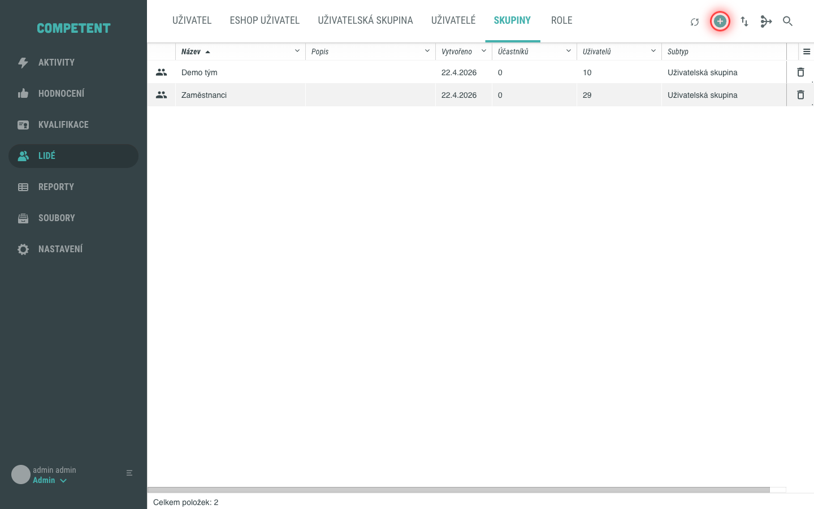
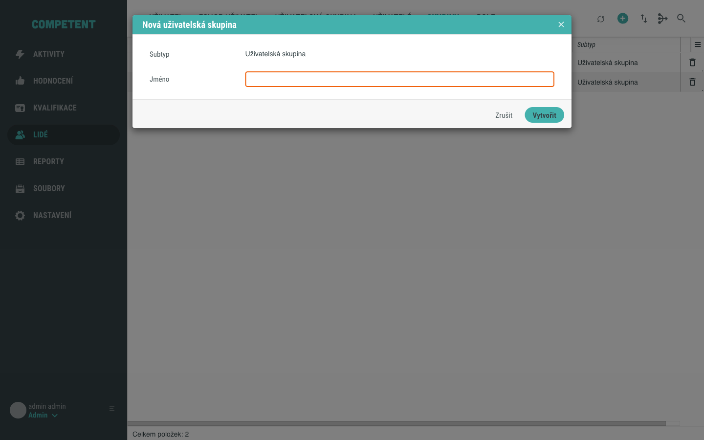
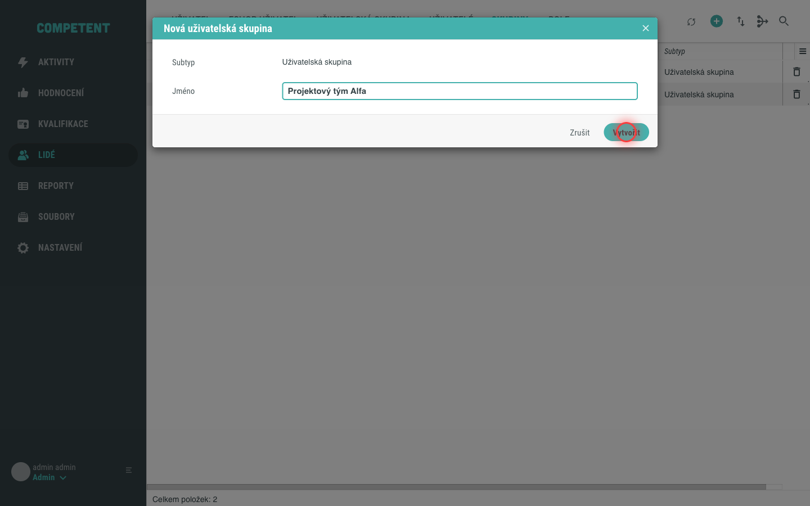
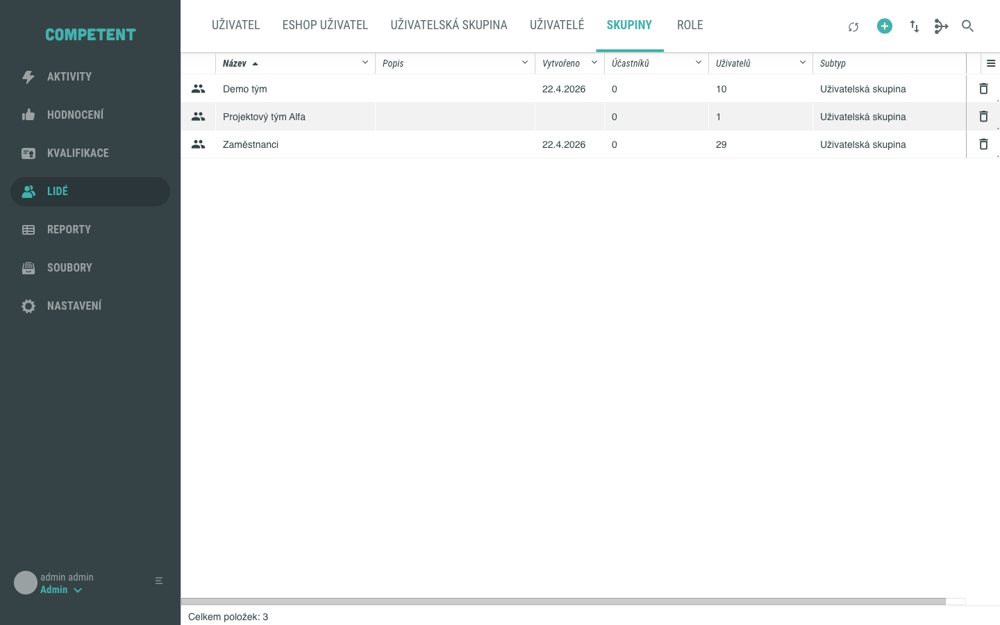

# Vytvoření uživatelské skupiny v administraci

Novou uživatelskou skupinu vytvoříte v obrazovce **Lidé** v zobrazení **Skupiny**. Formulář pro vytvoření je minimalistický – stačí vyplnit název. Tento návod vás provede celým postupem.

## Předpoklady

- Máte globální oprávnění vytvářet uživatelské skupiny.
- V hlavním menu vidíte položku **Lidé**.

!!! note "Stanete se vlastníkem skupiny"
    Vytvořením skupiny se automaticky stáváte jejím vlastníkem se všemi právy nad skupinou.

## Postup

### 1. Otevřete zobrazení Skupiny

V hlavním menu administrace klikněte na **Lidé** a přepněte se do zobrazení **Skupiny**. V pravém horním rohu nad seznamem klikněte na tlačítko **Nová uživatelská skupina**.

### 2. Seznamte se s formulářem

Otevře se okno **Nová uživatelská skupina** s pouhými dvěma poli: **Subtyp** a **Jméno**.

Pole **Subtyp** je předvybráno (ve výchozí instalaci je k dispozici jediná hodnota **Uživatelská skupina**). Subtyp se nastavuje pouze při vytváření a později ho už nelze měnit.

### 3. Zadejte název skupiny

Do pole **Jméno** zadejte název nové skupiny. Toto pole je povinné.

### 4. Vytvořte skupinu

Vyplnění potvrďte tlačítkem **Vytvořit**. Nová skupina se uloží a objeví se v seznamu skupin.

Celý postup vytvoření skupiny shrnuje následující animace:

Tím je postup dokončen.

## Pozor na

- **Subtyp nelze později změnit.** Subtyp se volí pouze při vytváření skupiny. Jeho pozdější změna není v rozhraní podporována.
- **Další údaje doplníte později.** Popis a další parametry skupiny nejsou součástí vytváření – doplníte je až v detailu skupiny.

## Související stránky

- [Uživatelská skupina](../../concepts/skupina.md)
- [Detail skupiny](../../reference/detail-skupiny.md)
- [Přiřazení uživatele do skupiny](prirazeni-uzivatele-do-skupiny.md)
