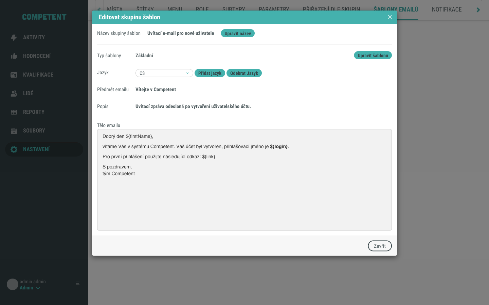
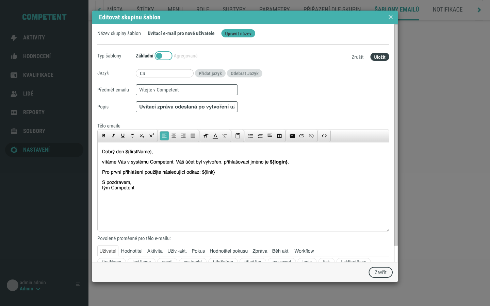
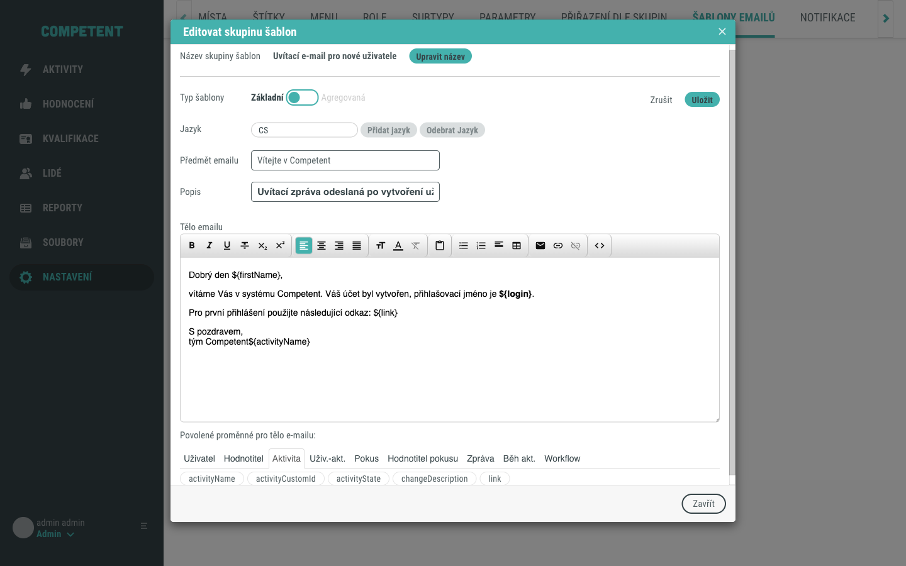
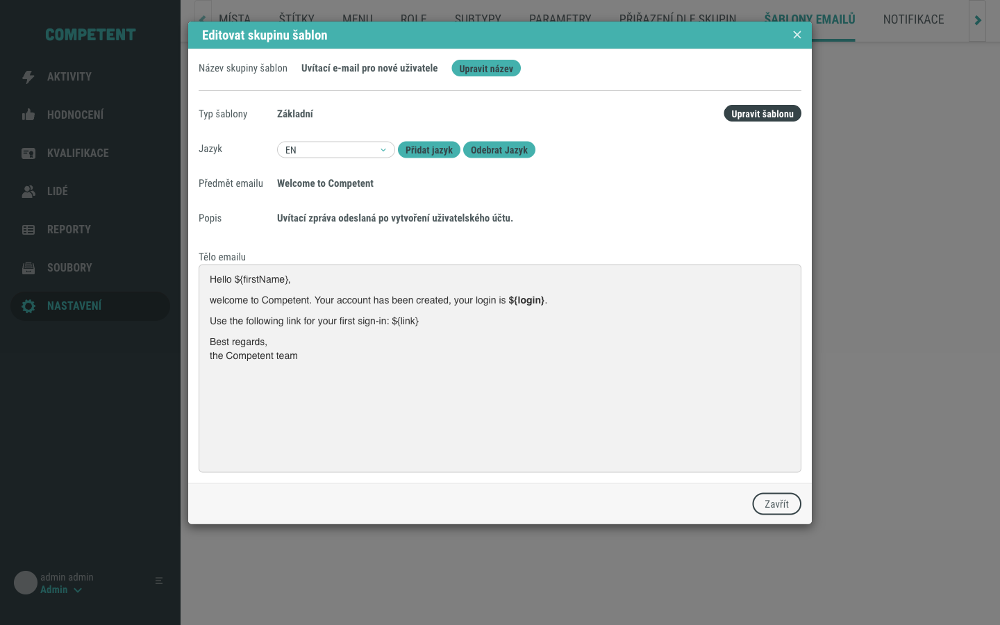
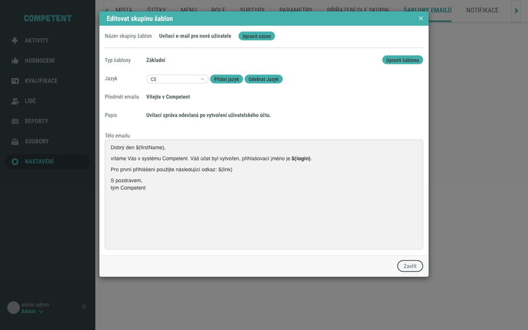

# Úprava šablony e-mailu

Na této stránce najdete postup, jak v sekci **Nastavení** upravit obsah e-mailové šablony: otevřít existující skupinu šablon, upravit předmět a tělo e-mailu ve WYSIWYG editoru, vložit do těla proměnnou a přepínat mezi jazykovými variantami. Popis samotné obrazovky a jejích polí najdete v referenci [Obrazovka Šablony e-mailů](../../reference/obrazovka-sablony-emailu.md). Jak e-mailové notifikace fungují jako celek vysvětluje [E-mailové notifikace](../../concepts/emailove-notifikace.md).

## Předpoklady

- Máte administrátorský přístup do Competent a oprávnění upravovat e-mailové šablony. Bez tohoto oprávnění se záložka **Šablony e-mailů** v Nastavení nezobrazí.
- V Nastavení existuje alespoň jedna skupina šablon, kterou chcete upravit.

## Postup

### 1. Otevřete záložku Šablony e-mailů

V hlavním menu klikněte na **Nastavení**. Nastavení se otevírá na jedné ze svých záložek (například **Místa**), proto v záhlaví obrazovky klikněte na záložku **Šablony e-mailů**. Zobrazí se seznam skupin šablon.

### 2. Otevřete skupinu šablon

V seznamu klikněte na řádek skupiny, kterou chcete upravit. Otevře se modální okno **Editovat skupinu šablon** v režimu pro čtení. Přehled všech polí okna najdete v referenci [Obrazovka Šablony e-mailů](../../reference/obrazovka-sablony-emailu.md).

### 3. Přepněte do režimu úprav

Klikněte na tlačítko **Upravit šablonu**. Pole se zpřístupní k editaci: **Předmět emailu** a **Popis** se změní na textová pole a u **Tělo emailu** se zobrazí WYSIWYG editor s formátovacím panelem. Pod editorem se objeví nápověda **Povolené proměnné pro tělo e-mailu:**.

### 4. Vložte do těla proměnnou

Do těla e-mailu můžete vkládat proměnné ve tvaru `${nazev}`, které se při odeslání nahradí konkrétními hodnotami (například jménem uživatele nebo názvem aktivity).

V editoru **Tělo emailu** klikněte na místo, kam chcete proměnnou vložit. V nápovědě **Povolené proměnné pro tělo e-mailu:** vyberte záložku se skupinou proměnných (například **Aktivita**) a klikněte na konkrétní proměnnou. Na pozici kurzoru se vloží zápis `${nazev}`, například `${activityName}`.

!!! tip
    Úplný seznam dostupných proměnných najdete přímo v editoru pod tělem e-mailu, rozdělený do záložek podle oblasti (Uživatel, Aktivita, Zpráva a další).

### 5. Upravte obsah pro další jazyk

Šablona je vícejazyčná. Každý jazyk je samostatná varianta s vlastním předmětem a tělem.

Správu jazyků (přidání a odebrání) provádějte **v režimu pro čtení** – tedy před vstupem do úprav nebo po jejich uložení či zrušení. Tlačítka **Přidat jazyk** a **Odebrat Jazyk** jsou aktivní pouze mimo editaci.

Chcete-li upravit jiný jazyk, postupujte takto:

1. Pokud jste v režimu úprav, klikněte na **Zrušit** (nebo nejprve uložte aktuální jazyk tlačítkem **Uložit**).
2. V režimu pro čtení vyberte požadovaný jazyk rozbalovacím polem **Jazyk**.
3. Teprve pak klikněte na **Upravit šablonu** a upravte obsah.

!!! warning
    Pokud přepnete rozbalovací pole **Jazyk** přímo uvnitř editace (v režimu úprav), uložený obsah druhého jazyka se nenačte. Vždy nejprve opusťte editaci a jazyk přepněte v režimu pro čtení.

### 6. Uložte změny

Po dokončení úprav klikněte na tlačítko **Uložit**. Okno se vrátí do režimu pro čtení a uložený obsah se zobrazí. Pokud chcete úpravy zahodit, klikněte místo toho na **Zrušit**. Modální okno zavřete tlačítkem **Zavřít**.

Tím je postup dokončen.

## Pozor na

- Obsah upravujete pro každý jazyk zvlášť. Pokud změníte text jen v jednom jazyce, ostatní jazykové varianty zůstanou beze změny.
- Tlačítka **Přidat jazyk** a **Odebrat Jazyk** jsou dostupná pouze v režimu pro čtení (mimo editaci). Chcete-li přepnout na jiný jazyk a upravit ho, nejprve opusťte editaci (**Uložit** nebo **Zrušit**), přepněte jazyk rozbalovacím polem a pak teprve vstupte do úprav. Přepnutí jazyka uvnitř editace nenačte uložený obsah druhé varianty.
- Režim pro čtení zobrazuje formátování těla e-mailu, ale proměnné `${...}` ponechává v původním tvaru. Nejde tedy o náhled odeslaného e-mailu, skutečné hodnoty se doplní až při odeslání.
- U typu **Agregovaná** šablona obsahuje navíc **Hlavičku** a **Patičku**, které obalují opakované tělo. U typu **Základní** upravujete pouze tělo.

## Související stránky

- [Obrazovka Šablony e-mailů](../../reference/obrazovka-sablony-emailu.md)
- [E-mailové notifikace](../../concepts/emailove-notifikace.md)
