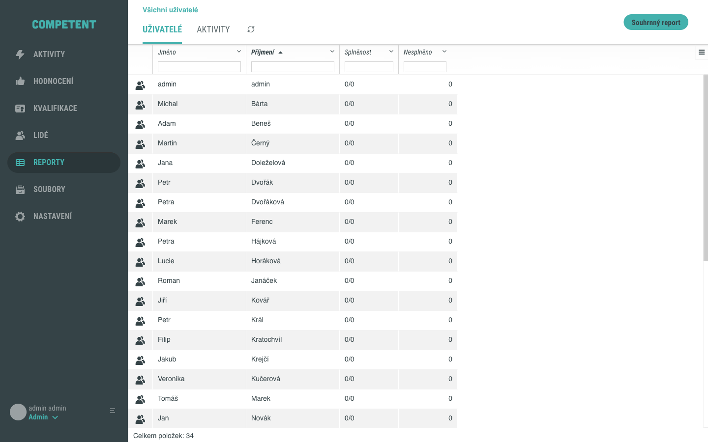
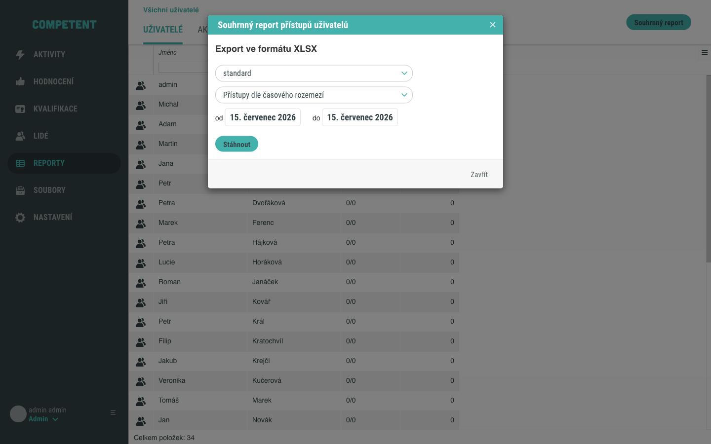
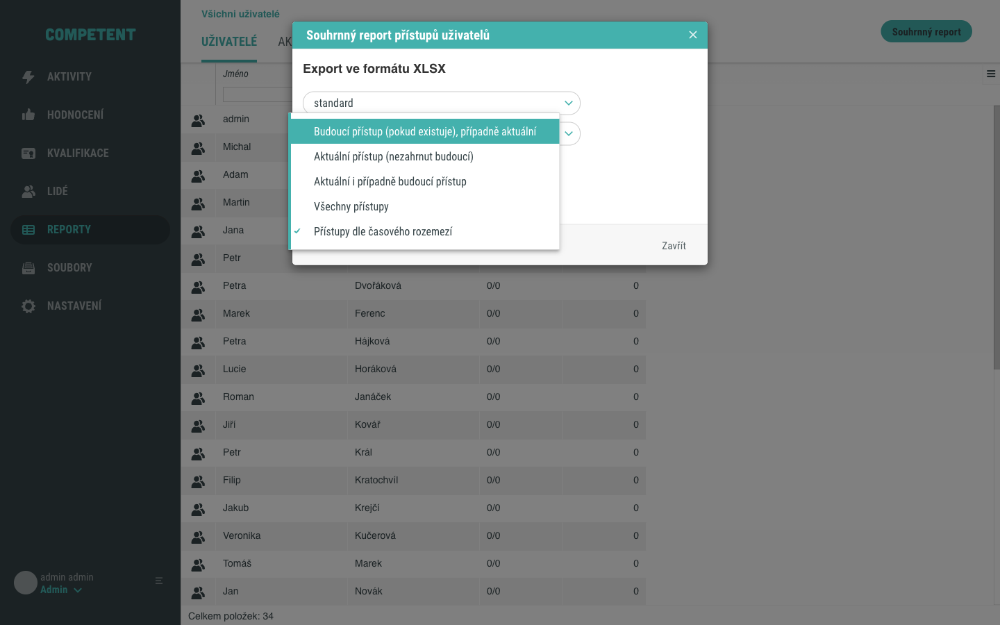
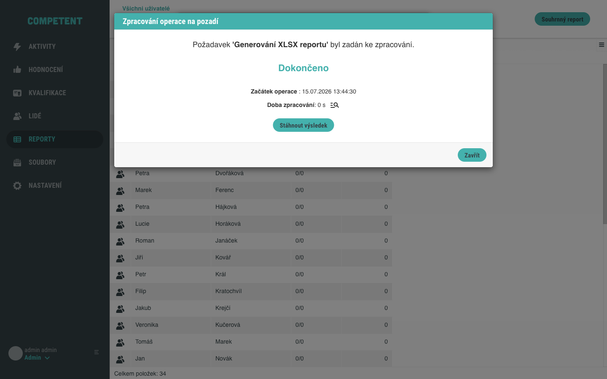
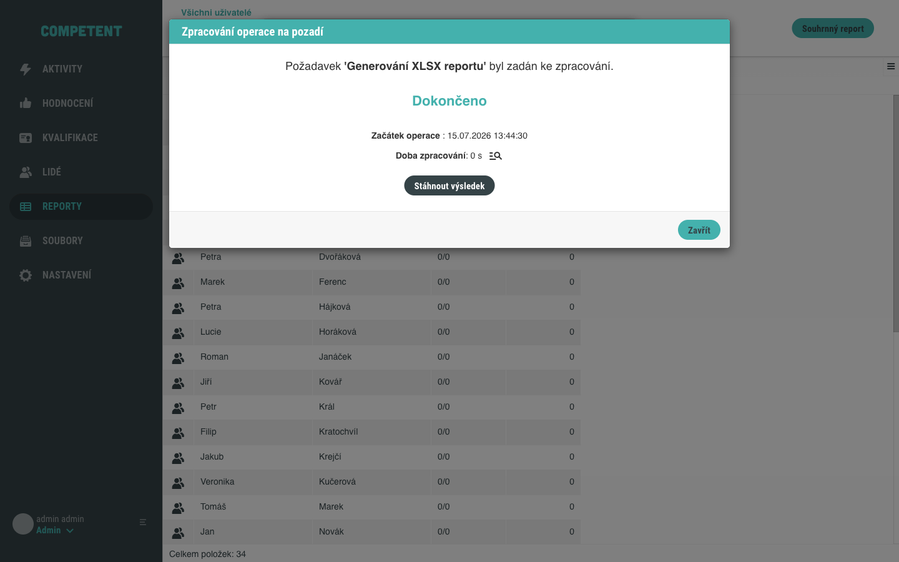

# Export reportu

Souhrnný report přístupů uživatelů vyexportujete do souboru XLSX z obrazovky **Reporty**. Tento návod popisuje postup od otevření obrazovky až po stažení výsledného souboru.

## Předpoklady

- Máte administrátorský přístup do Competent.

## Postup

### 1. Otevřete obrazovku Reporty

V hlavním menu administrace klikněte na **Reporty**. Otevře se obrazovka na záložce **Uživatelé** s tabulkou uživatelů a tlačítkem **Souhrnný report** v záhlaví.

### 2. Otevřete souhrnný report

Klikněte na tlačítko **Souhrnný report**. Otevře se modál **Souhrnný report přístupů uživatelů** s podnadpisem **Export ve formátu XLSX**.

### 3. Vyberte konfiguraci reportu

U konfigurace klikněte na **Zvolit** a vyberte požadovanou konfiguraci (výchozí je **standard**). Konfigurace určuje, které sloupce bude výsledný soubor obsahovat. Dostupné konfigurace závisí na nastavení systému.

### 4. Zvolte rozsah exportu

Rozsah exportovaných přístupů určíte jedním ze dvou způsobů:

- u filtru přístupů klikněte na **Zvolit** a vyberte jednu z možností (například **Všechny přístupy**), nebo
- vyberte **Přístupy dle časového rozmezí** a zadejte rozsah do polí **od** a **do**.

!!! note "Velký objem dat"
    Pokud export spustíte bez omezení rozsahu (volba **Všechny přístupy**), může jít o velký objem dat. Rozsah exportu je vhodné předem omezit.

### 5. Spusťte export

Klikněte na **Stáhnout**. Otevře se modál **Zpracování operace na pozadí**, který soubor připraví. U většího objemu dat modál zobrazuje průběh zpracování; jakmile je soubor připraven, zobrazí stav **Dokončeno**.

### 6. Stáhněte soubor

Klikněte na **Stáhnout výsledek**. Teprve tímto krokem prohlížeč stáhne soubor XLSX do složky stažených souborů.

Tím je postup dokončen.

## Ověření

Ve složce stažených souborů prohlížeče se objeví soubor XLSX se souhrnným reportem přístupů uživatelů.

## Pozor na

- **Stažení souboru proběhne až ve druhém kroku.** Tlačítko **Stáhnout** ve výchozím modálu spustí zpracování na pozadí; samotný soubor se stáhne až po kliknutí na **Stáhnout výsledek** v modálu **Zpracování operace na pozadí**.
- **Volba „Přístupy dle časového rozmezí"** aktivuje pole **od** a **do**, do kterých zadáte požadovaný rozsah.

## Související stránky

- [Obrazovka Reporty](../../reference/obrazovka-reporty.md)
- [Pokusy uživatele](../../concepts/pokusy-uzivatele.md)
- [Import uživatelů](../lide/import-uzivatelu.md)
