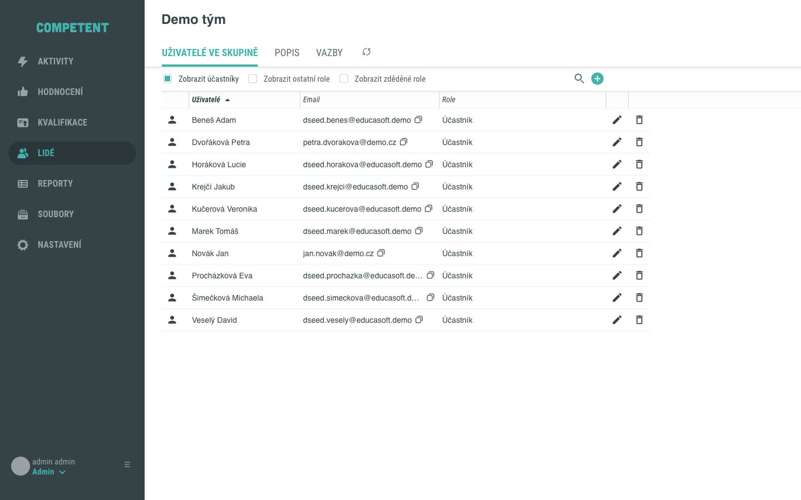
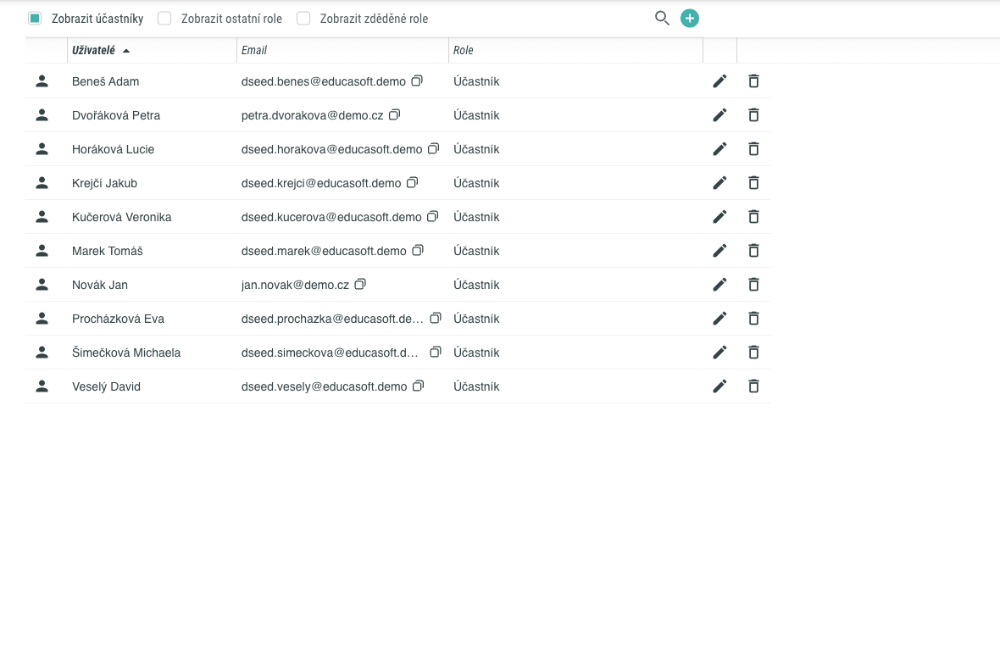
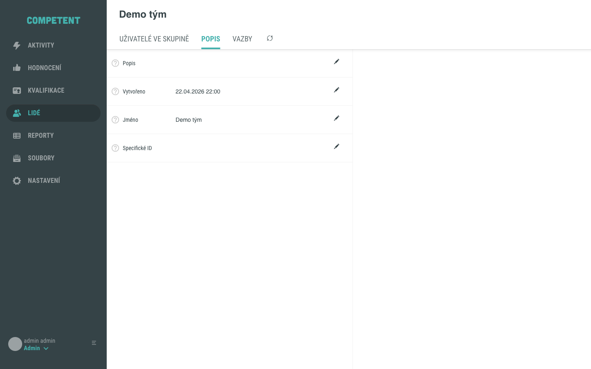
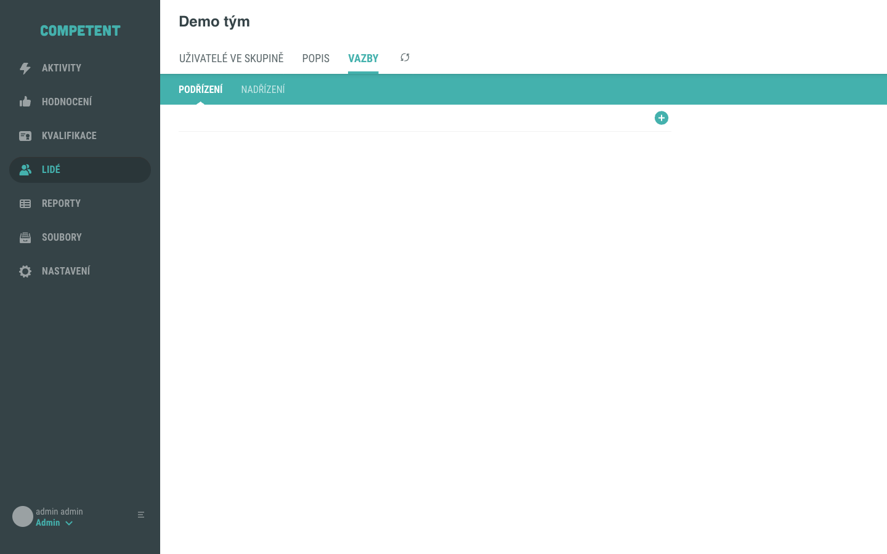

# Detail skupiny

Obrazovka **Detail skupiny** zobrazuje veškeré informace o konkrétní uživatelské skupině: seznam členů a jejich rolí, textový popis skupiny a hierarchické vazby na jiné skupiny. Slouží jako centrální místo pro správu členství – přidávání, editaci a odebírání členů.

Do Detailu skupiny se dostanete z přehledu **Lidé → tab Skupiny** kliknutím na ikonu řádku (tooltip „Detail uživatelské skupiny").

---

## Záhlaví

Záhlaví obrazovky zobrazuje **název skupiny**. Název je editovatelný přímo v záhlaví – kliknutím na ikonu tužky vedle názvu jej můžete upravit a uložit.

Pod záhlavím je umístěna lišta tabů pro přechod mezi jednotlivými oblastmi správy skupiny.

---

## Taby

Detail skupiny obsahuje tři taby:

| Tab | Obsah |
|---|---|
| **Uživatelé ve skupině** | Grid členů skupiny s jejich rolemi; přidávání, editace a odebírání členů; filtry zobrazení rolí. |
| **Popis** | Textový popis skupiny a parametry dle subtypu skupiny. |
| **Vazby** | Hierarchie skupin: podřízené a nadřazené skupiny. |

Po otevření Detailu skupiny je výchozím aktivním tabem **Uživatelé ve skupině**.

V záhlaví obrazovky jsou dále dostupné ikona **nastavení** (ozubené kolo) a ikona **obnovení dat**.

---

## Tab Uživatelé ve skupině

Tab **Uživatelé ve skupině** zobrazuje grid všech členů skupiny s jejich rolemi.

### Sloupce gridu

| Sloupec | Popis |
|---|---|
| **Uživatelé** | Jméno uživatele. Výchozí řazení je abecedně vzestupně (A → Z). |
| **Email** | E-mailová adresa uživatele. |
| **Role** | Přiřazené role zobrazené jako chipy. Zděděné role (převzaté z nadřazené skupiny v hierarchii) jsou označeny hvězdičkou `*`. Systémové role přiřazené automaticky systémem jsou zobrazeny v hranatých závorkách `[název role]`. |

### Filtry zobrazení rolí

Nad gridem jsou dostupné tři přepínače pro řízení toho, které záznamy jsou v gridu zobrazeny:

| Filtr | Popis |
|---|---|
| **Zobrazit účastníky** | Zobrazí členy s rolí Účastník. Ve výchozím stavu zapnuto. |
| **Zobrazit ostatní role** | Zobrazí členy, kteří mají přiřazeny jiné než Účastnické role. |
| **Zobrazit zděděné role** | Zobrazí členy, jejichž role jsou zděděny z nadřazené skupiny v hierarchii. |

### Akce v gridu

| Akce | Ikona | Popis |
|---|---|---|
| Přidat člena | **+** | Otevře boční panel pro výběr uživatelů a přiřazení rolí. Podrobnosti viz [Přiřazení uživatele do skupiny](../how-to/lide/prirazeni-uzivatele-do-skupiny.md). |
| Editovat role člena | ikona tužky | Otevře boční panel pro úpravu rolí daného člena. |
| Odebrat člena | ikona koše | Odebere člena ze skupiny. Dostupné pouze pro lokálně přiřazené role – člena, jehož přiřazení pochází výhradně ze zděděných rolí, nelze odebrat z tohoto pohledu. |

---

## Tab Popis

Tab **Popis** zobrazuje textový popis skupiny a parametry specifické pro subtyp skupiny.

---

## Tab Vazby

Tab **Vazby** spravuje hierarchické vztahy mezi skupinami. Obsahuje dva podtaby:

| Podtab | Popis |
|---|---|
| **Podřízení** | Skupiny, které jsou podřízeny aktuální skupině (aktuální skupina je jejich nadřazená). |
| **Nadřízení** | Skupiny, jimž je aktuální skupina podřízena (její nadřazené skupiny). |

Skupiny lze přidávat tlačítkem **+** a odebírat ikonou koše. Členství zděděná prostřednictvím hierarchie skupin se promítají do rolí členů jako zděděné role (označené `*` v gridu).

---

## Pozor na

!!! note "Zděděné role nelze odebrat z pohledu potomka"
    Role převzaté z nadřazené skupiny (označené `*` v gridu) nelze odebrat z Detailu podřízené skupiny. Zděděné členství lze ukončit pouze úpravou hierarchie ve skupině, ze které je role zděděna, nebo ve skupině, kde bylo členství původně přiřazeno.

!!! note "Sloupce Účastníků a Uživatelů"
    Hodnoty „Účastníků" (počet členů s rolí Účastník) a „Uživatelů" (celkový počet členů) jsou dostupné v přehledu **Lidé → tab Skupiny** jako sloupce přehledové tabulky. Na obrazovce Detail skupiny se tyto souhrnné počty nezobrazují – členové jsou evidováni v gridu tabu Uživatelé ve skupině.

---

## Související stránky

- [Přiřazení uživatele do skupiny](../how-to/lide/prirazeni-uzivatele-do-skupiny.md)
- [Vytvoření uživatelské skupiny](../how-to/lide/vytvoreni-uzivatelske-skupiny.md)
- [Uživatelská skupina: model a principy](../concepts/skupina.md)
- [Role a oprávnění](../concepts/role.md)
- [Detail uživatele](detail-uzivatele.md)
