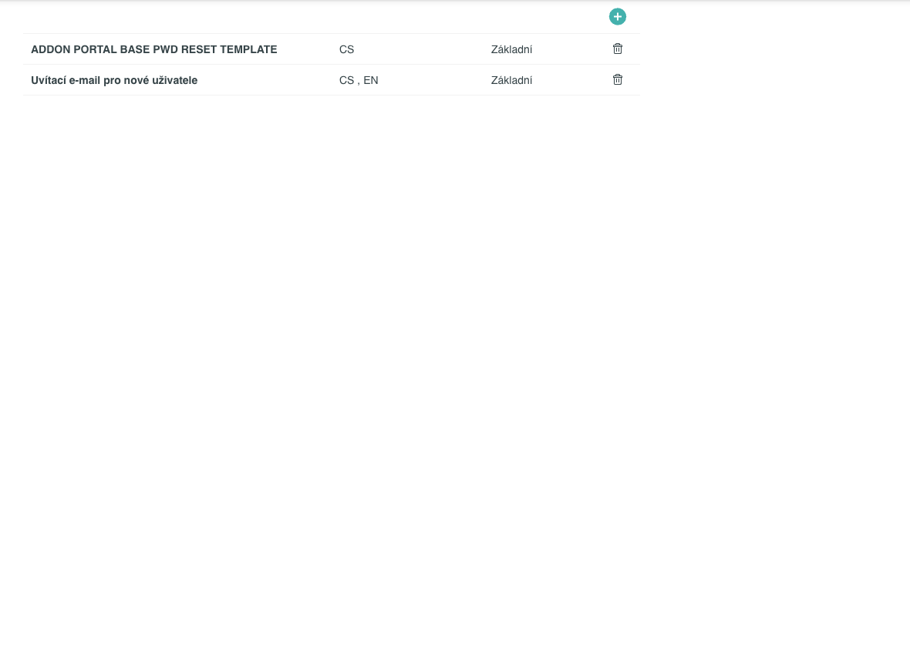

# Obrazovka Šablony Emailů

Tab **Šablony Emailů** v sekci **Nastavení** zobrazuje přehled skupin e-mailových šablon a umožňuje jejich správu. Tato stránka popisuje prvky a pole obrazovky – postup úpravy obsahu šablon naleznete v [Úpravě šablony e-mailu](../how-to/nastaveni/uprava-sablony-emailu.md).

---

## Seznam skupin šablon

Po přechodu na tab **Šablony Emailů** (Nastavení → Šablony Emailů) se zobrazí tabulka se všemi skupinami e-mailových šablon. Tabulka nemá vyhledávací pole ani filtry.

### Sloupce seznamu

| Sloupec | Popis |
|---|---|
| Název skupiny | Název skupiny šablon. Kliknutím na řádek se otevře modal **Editovat skupinu šablon**. |
| Jazyky | Jazykové varianty, ve kterých skupina existuje (například „CS, EN"). |
| Typ | Typ šablony: **Základní** nebo **Agregovaná**. |
| Akce | Ikona koše – smaže celou skupinu včetně všech jejích jazykových variant po potvrzení dialogu. |

### Přidání nové skupiny a prázdný stav

Tlačítko **„+"** v pravém horním rohu seznamu otevře modal **Nová skupina šablon** pro vytvoření nové skupiny.

Pokud zatím žádná skupina neexistuje, zobrazí se text „Zatím nebyly vytvořeny žádné šablony emailu" s odkazem **Vytvořit novou šablonu**.

---

## Modal Editovat skupinu šablon

Kliknutím na řádek skupiny v seznamu se otevře modal **Editovat skupinu šablon**. Modal zobrazuje aktuálně uložené hodnoty skupiny a umožňuje přecházet mezi jazykovými variantami.

### Pole modálu

| Pole | Popis |
|---|---|
| Název skupiny šablon | Název identifikující skupinu šablon v seznamu. |
| Typ šablony | Přepínač s hodnotami **Základní** a **Agregovaná**. U agregované šablony jsou navíc k dispozici pole **Hlavička** a **Patička** (viz níže). |
| Jazyk | Rozbalovací seznam jazykových variant skupiny. Přepnutím jazyka se načte obsah dané varianty (Předmět emailu, Popis, Tělo emailu). |
| Přidat jazyk | Tlačítko pro přidání nové jazykové varianty skupiny. Dostupné v režimu prohlížení (mimo editaci). |
| Odebrat Jazyk | Tlačítko pro odebrání aktuálně vybrané jazykové varianty. Dostupné v režimu prohlížení (mimo editaci). |
| Předmět emailu | Předmět e-mailu pro danou jazykovou variantu. Může obsahovat proměnné ve tvaru `${nazev}`. |
| Popis | Interní popis skupiny šablon. |
| Tělo emailu | Obsah e-mailu pro danou jazykovou variantu. Edituje se ve WYSIWYG editoru. Může obsahovat proměnné ve tvaru `${nazev}`. |
| Hlavička | Záhlaví obalující opakující se tělo. K dispozici pouze u **Agregované** šablony. |
| Patička | Zápatí obalující opakující se tělo. K dispozici pouze u **Agregované** šablony. |

### Nápověda proměnných

Pod polem **Tělo emailu** je nápověda **„Povolené proměnné pro tělo e-mailu:"**, která zobrazuje dostupné proměnné seřazené do záložek podle skupin.

Kliknutím na proměnnou se vloží na pozici kurzoru v poli Tělo emailu ve tvaru `${nazev}` (například `${firstName}`, `${login}`, `${activityName}`, `${link}`). Úplný seznam proměnných je dostupný přímo v editoru; dostupné proměnné se liší podle skupiny.

### Tlačítka modálu

| Tlačítko | Dostupnost | Funkce |
|---|---|---|
| Upravit šablonu | Režim prohlížení | Přepne modal do režimu editace; zpřístupní pole Předmět emailu a Tělo emailu (a Hlavičku + Patičku u agregované) pro úpravu. |
| Uložit | Režim editace | Uloží provedené změny. |
| Zrušit | Režim editace | Zahodí neuložené změny a vrátí se do režimu prohlížení. |
| Zavřít | Vždy | Zavře modal bez uložení. |

---

## Oprávnění

Tab **Šablony Emailů** se zobrazí pouze uživatelům s oprávněním pro správu e-mailových šablon. Uživatelům bez tohoto oprávnění se tab v sekci Nastavení nezobrazí.

---

## Pozor na

!!! warning "Smazání skupiny"
    Kliknutím na ikonu koše se odstraní celá skupina šablon včetně všech jazykových variant. Před smazáním systém zobrazí potvrzovací dialog.

---

## Související stránky

- [Úprava šablony e-mailu](../how-to/nastaveni/uprava-sablony-emailu.md)
- [E-mailové notifikace](../concepts/emailove-notifikace.md)
