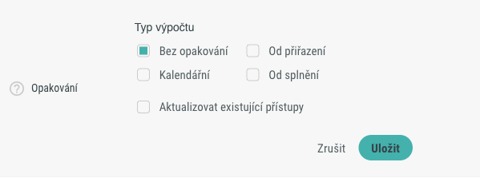
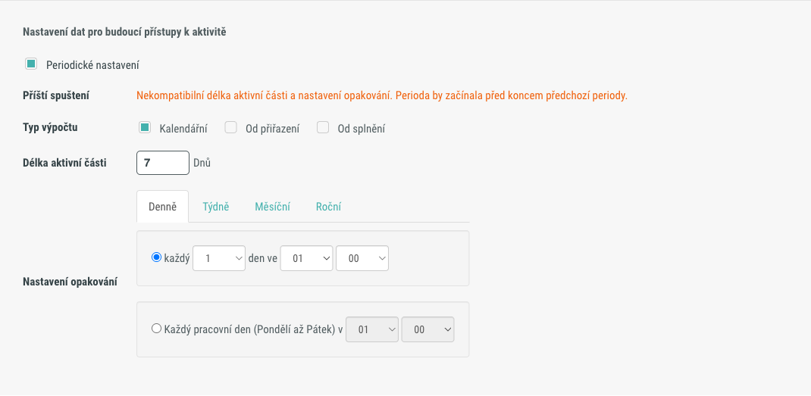
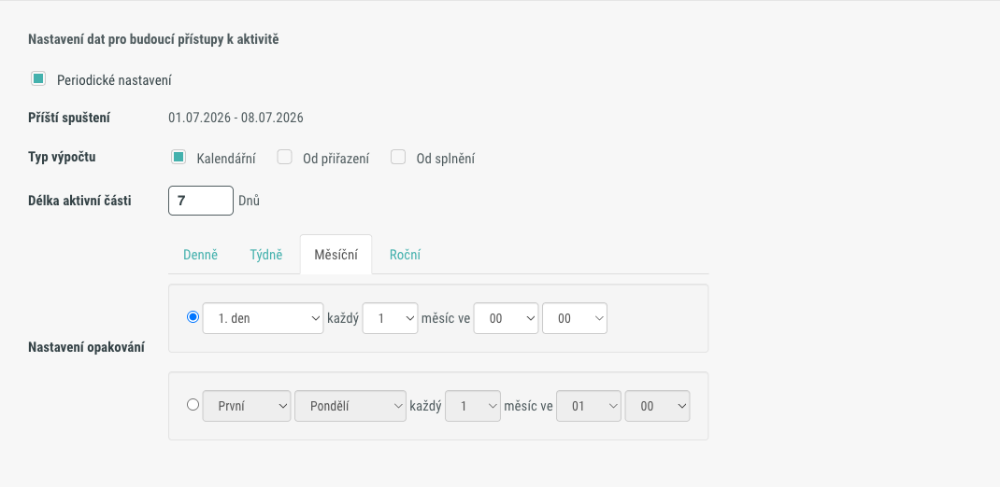
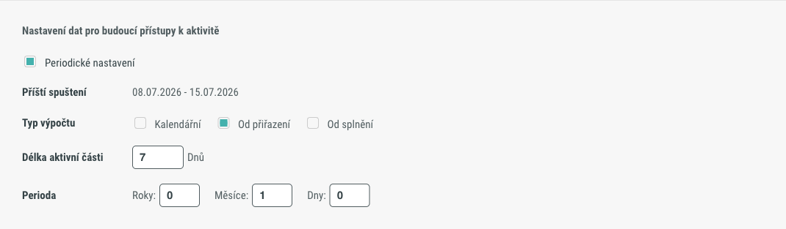
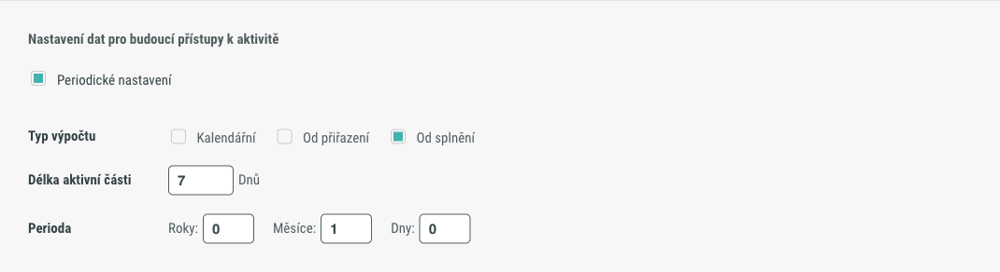

# Periodické nastavení

Periodické nastavení je komponenta, která umožňuje nakonfigurovat automatické opakování přístupu uživatele k aktivitě nebo sadě. Po vypršení aktuálního přístupu systém přístup automaticky obnoví podle nastavené periody. Typický příklad použití je každoroční školení BOZP.

Komponentu naleznete na dvou místech: jako výchozí konfiguraci aktivity (nebo sady) v tabu **Detaily**, a jako nastavení periodicity konkrétního přiřazení v kroku **Nastavení plnění** (tab **Uživatelé**).

---

## Místa použití

| Kontext | Kde naleznete komponentu | Popis |
|---------|--------------------------|-------|
| Tab **Detaily** | Pole **Opakování** – kliknutím otevřete editor periodického nastavení | Výchozí konfigurace opakování pro aktivitu nebo sadu. Změna se zde uloží pro nová přiřazení; tlačítkem **Aktualizovat existující přístupy** ji lze promítnout i do již existujících přiřazení. V editoru je dostupná volba **Bez opakování** (periodicita vypnuta). |
| Krok **Nastavení plnění** (tab Uživatelé) | Sekce **Periodické nastavení** | Periodicita konkrétního přiřazení nastavovaného právě v panelu přiřazení. Volba **Bez opakování** zde není dostupná – periodicitu pro konkrétní přiřazení buď zapnete, nebo pole nevyplníte. |

---

## Typ výpočtu

Pole **Typ výpočtu** určuje, od jakého okamžiku se perioda počítá.

| Typ výpočtu | Popis | Dostupné intervaly |
|-------------|-------|--------------------|
| **Kalendářní** | Příští přístup se spouští k pevnému kalendářnímu datu nebo dnu. | Denně, Týdně, Měsíční, Roční (viz [Nastavení opakování](#nastaveni-opakovani)) |
| **Od přiřazení** | Perioda se počítá od data přiřazení uživatele k aktivitě. | Délka aktivní části ve dnech + Perioda (Roky / Měsíce / Dny) |
| **Od splnění** | Perioda se počítá od data splnění aktivity uživatelem. | Délka aktivní části ve dnech + Perioda (Roky / Měsíce / Dny) |

---

## Nastavení opakování

Sekce **Nastavení opakování** je zobrazena u typu výpočtu **Kalendářní** a umožňuje zvolit interval opakování pomocí záložek.

### Denně

K dispozici jsou dvě varianty:

| Varianta | Parametry |
|----------|-----------|
| Každý n-tý den | „Každý" [1–31] „den ve" – výběr hodiny a minuty. |
| Každý pracovní den | „Každý pracovní den (Pondělí až Pátek) v" – výběr hodiny a minuty. |

### Týdně

| Parametr | Popis |
|----------|-------|
| **Pondělí / Úterý / Středa / Čtvrtek / Pátek / Sobota / Neděle** | Sedm zaškrtávacích polí – zvolte jeden nebo více dnů, ve které se perioda spustí. |
| **V čase** | Výběr hodiny a minuty spuštění. |

### Měsíční

Primární varianta kombinuje výběr dne a interval v měsících:

| Parametr | Hodnoty | Popis |
|----------|---------|-------|
| Den | „První pracovní den" / „1. den" … „31. den" / „Poslední pracovní den" / „Poslední den" | Den v měsíci, kdy se perioda spustí. |
| „Každý" [1–12] „měsíc ve" | Číslo měsíce 1–12 + hodina a minuta | Interval opakování a čas spuštění. |

K dispozici je také druhá (neaktivní) varianta s výběrem ordinálu a dne v týdnu (např. „první pondělí každého druhého měsíce").

### Roční

Primární varianta určuje pevný den v rámci zvoleného měsíce:

| Parametr | Hodnoty | Popis |
|----------|---------|-------|
| Měsíc | **Leden / Únor / Březen / Duben / Květen / Červen / Červenec / Srpen / Září / Říjen / Listopad / Prosinec** | Měsíc spuštění. |
| Den | „První pracovní den" / „1. den" … „31. den" / „Poslední pracovní den" / „Poslední den" | Den v daném měsíci. |
| Čas | Hodina a minuta | Čas spuštění. |

K dispozici je také druhá (neaktivní) varianta s výběrem ordinálu a dne v týdnu v daném měsíci (např. „první pondělí v lednu").

---

## Od přiřazení a Od splnění

Typy výpočtu **Od přiřazení** a **Od splnění** sdílejí stejné parametry. Sekce Nastavení opakování u nich není zobrazena – místo ní jsou přímo dostupná tato dvě pole:

| Parametr | Popis |
|----------|-------|
| **Délka aktivní části** (Dnů) | Počet dní, po které je přiřazení aktivní v rámci jedné periody. Po uplynutí tohoto počtu dní se přístup automaticky obnoví. |
| **Perioda** (Roky / Měsíce / Dny) | Interval opakování – jak často se přístup obnovuje. Zadává se jako tři číselné hodnoty: počet roků, měsíců a dní. Pole **Perioda** se zobrazuje pouze u typů **Od přiřazení** a **Od splnění**; u typu **Kalendářní** se nezobrazuje. |

---

## Příští spuštění

Pole **Příští spuštění** zobrazuje automaticky vypočtené datum a čas příštího obnovení přístupu. Slouží pouze ke kontrole – hodnota je jen pro čtení.

- Pole se **nezobrazuje** u typu výpočtu **Od splnění** (systém datum v okamžiku nastavení ještě nezná).
- Pokud je perioda nastavena chybně, zobrazí se v tomto poli chybová zpráva a tlačítko **Uložit** zůstane neaktivní.

---

## Aktualizovat existující přístupy

Tlačítko **Aktualizovat existující přístupy** je dostupné v editoru otvíraném z pole **Opakování** v tabu **Detaily**. Po uložení nového nastavení opakování toto tlačítko promítne změnu do již existujících přiřazení uživatelů – nejen do budoucích.

---

## Pozor na

!!! warning "Aktivity se schématem S termíny"
    Aktivity se schématem **S termíny** periodicky přiřadit nelze. Periodické nastavení je dostupné pouze u aktivit se schématem **Bez termínu**.

!!! note "Periodicita není automatické prodloužení přístupu"
    Nesouvisí s funkcí automatického prodloužení přístupu (pole **Počet dnů automatického prodloužení**) – jde o samostatné nastavení.

---

## Související stránky

- [Přiřazení uživatelů k aktivitě](../how-to/aktivity/prirazeni-uzivatelu-k-aktivite.md)
- [Detail aktivity](detail-aktivity.md)
- [Detail sady](detail-sady.md)
