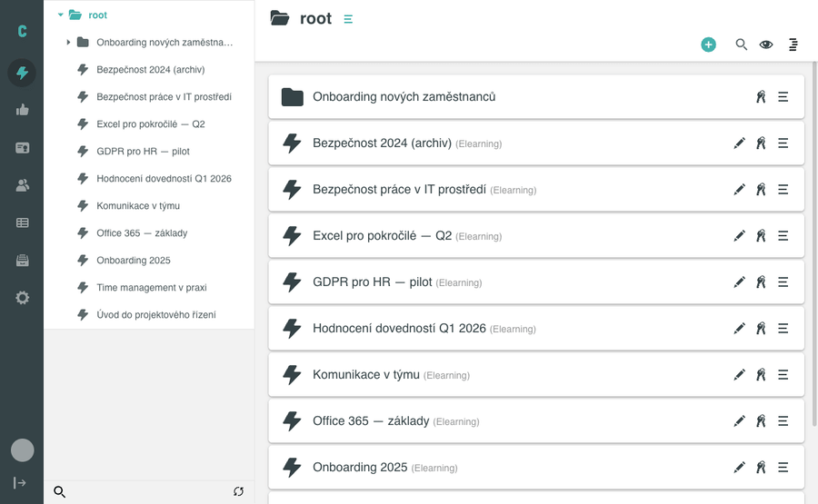

# Vytvoření nového objektu

V administraci Competent zakládáte nové objekty (složku, aktivitu, sadu, termínovou sadu) ze stromu aktivit. Nový objekt se vloží do právě otevřené složky a okamžitě se zobrazí ve stromu i v pravém panelu se seznamem obsahu.

## Než začnete

- Jste přihlášeni jako administrátor (nebo máte roli s oprávněním spravovat aktivity).
- V levém menu je otevřena sekce **AKTIVITY**.
- Zobrazení je přepnuto do stromu aktivit (ikona stromu).

## Postup

### 1. Otevřete nabídku pro vytvoření

Ve stromu klikněte na zelené tlačítko **+** na uzlu **root** (tooltip „Vytvoř novou položku"). Otevře se rozbalovací nabídka s pěti možnostmi:

- **Složka**
- **Aktivita**
- **Sada**
- **Termínová sada**
- **Import/Export**

### 2. Vyberte typ objektu

Najeďte myší na požadovanou položku. U položek **Aktivita**, **Sada** a **Termínová sada** se rozbalí podmenu:

- **Aktivita** → **Elearning** / **Školení**
- **Sada** → **Sada**
- **Termínová sada** → **Komplexní Sada**

Příklad: pro vytvoření e-learningové aktivity najeďte na **Aktivita** a z podmenu vyberte **Elearning**.

### 3. Zadejte název

Po výběru se otevře modální okno **Nový objekt** s polem pro zadání názvu (například „Vyplňte název nové aktivity" nebo „Vyplňte název nové složky" podle zvoleného typu). Zadejte název a potvrďte tlačítkem **Vytvořit**. Tlačítko **Zrušit** akci stornuje.

### 4. Ověření

Nový objekt se okamžitě zobrazí:

- ve stromu aktivit v levém panelu,
- v seznamu obsahu právě otevřené složky v pravé části.

U e-learningové aktivity je za názvem v závorce uveden podtyp: _(Elearning)_.

## Pozor na

- Do uzlu **root** a do **Složek** lze vkládat libovolný typ objektu (Složka, Aktivita, Sada, Termínová sada).
- Do **Termínové sady** lze vkládat pouze aktivity — nelze do ní vložit Sadu ani další Termínovou sadu.
- **Import/Export** v nabídce není typ objektu — otevírá nástroj **Import/Export**, ne dialog pro vytvoření.

## Související stránky

- [Přesun objektu](presun-objektu.md)
- [Vytvoření SCORM aktivity](vytvoreni-scorm-aktivity.md)
