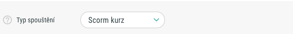
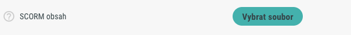
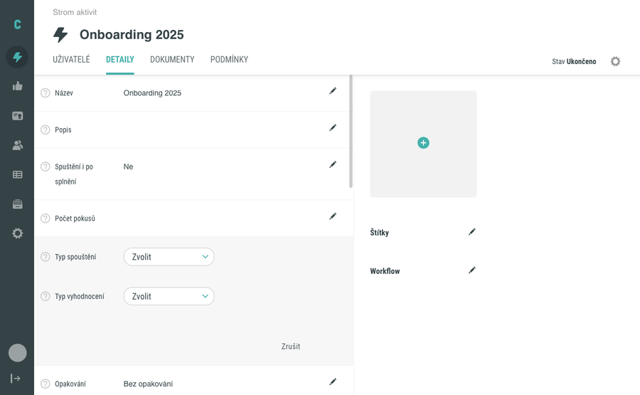

# Vytvoření SCORM aktivity

SCORM kurz v Competentu není samostatný typ aktivity, ale způsob jejího spuštění (launch type). Založíte běžnou e-learningovou aktivitu a v jejím detailu nastavíte **Typ spouštění** na **Scorm kurz**. Poté nahrajete ZIP balíček s SCORM kurzem.

## Než začnete

- Jste přihlášeni jako administrátor (nebo máte roli s oprávněním spravovat aktivity).
- Máte připravený SCORM balíček ve formátu **ZIP**, který splňuje specifikaci **SCORM 1.2**. Novější verze SCORM (2004) aktuálně nejsou podporovány.
- Víte, do které složky má aktivita patřit.

## Postup

### 1. Vytvořte e-learningovou aktivitu

Ve stromu aktivit klikněte v cílové složce na tlačítko **+** a zvolte **Aktivita → Elearning**. Vyplňte název (například „Školení BOZP") a potvrďte tlačítkem **Vytvořit**.

Podrobně viz [Vytvoření nového objektu](vytvoreni-noveho-objektu.md).

### 2. Otevřete detail aktivity

Klikněte na název aktivity v seznamu. Otevře se detailní zobrazení se záložkami:

- **Uživatelé**
- **Detaily**
- **Dokumenty**
- **Podmínky**

### 3. Nastavte Typ spouštění

Přepněte na záložku **Detaily**. Najděte pole **Typ spouštění** a z rozbalovacího seznamu vyberte **Scorm kurz**. Přehled dostupných voleb:

| Volba | Kdy použít |
|---|---|
| Žádný | Organizační entita, aktivita se nespouští |
| Nahrání souborů | Student nahrává soubory k ohodnocení |
| PDF soubor | Zobrazí se v integrovaném PDF prohlížeči |
| Url adresa | Přesměrování na externí URL |
| Video | YouTube / Vimeo / jiný provozovatel |
| Vložený kód | Embed kód pro vyskakovací okno |
| Formulář | JSON definice formuláře |
| iTrivio | iTrivio kurz |
| **Scorm kurz** | **SCORM 1.2 balíček** |
| Složené hodnocení | Dostupné pouze pro typ hodnocení „Body" |

Po výběru **Scorm kurz** se zároveň automaticky nastaví pole **Typ vyhodnocení** na **Prošel/Neprošel** — toto pole nemusíte vyplňovat ručně.

### 4. Nahrajte SCORM balíček

Po výběru **Scorm kurz** se zobrazí pole **SCORM obsah** s možností vybrat soubor z počítače. Vyberte ZIP balíček a potvrďte. Systém validuje manifest a strukturu balíčku:

- Pokud soubor není ZIP, zobrazí se hláška **„Přidaný soubor není ZIP soubor!"**
- Pokud ZIP neobsahuje platný SCORM 1.2 manifest, nahrávání se odmítne.

Pod uploadem je zaškrtávací volba **Používat uložená SCORM data**. Zaškrtněte ji, pokud chcete, aby kurz zaznamenával a využíval data o studentském průchodu (výchozí a doporučené nastavení).

### 5. Uložte aktivitu

Změny potvrďte tlačítkem **Uložit**.

## Ověření

- Na záložce **Detaily** zůstane **Typ spouštění** nastavený na **Scorm kurz**.
- U pole **SCORM obsah** se zobrazí jméno nahraného ZIP balíčku.
- Pole **Verze obsahu** obsahuje vygenerované číslo verze.

## Pozor na

- **Verze SCORM** — Competent podporuje pouze SCORM 1.2. Balíčky SCORM 2004 nebudou fungovat.
- **Aktualizace obsahu** — při výměně SCORM ZIPu klikněte na link **Změna verze**. Bez změny verze mohou stará studentská data způsobovat chyby.
- **Detekce chyb** — administrátor může globálně zapnout volbu **Detekovat chyby SCORM kurzů**, která se snaží automaticky opravit a restartovat problematické spuštění.

## Související stránky

- [Vytvoření nového objektu](vytvoreni-noveho-objektu.md)
- [Přesun objektu](presun-objektu.md)
