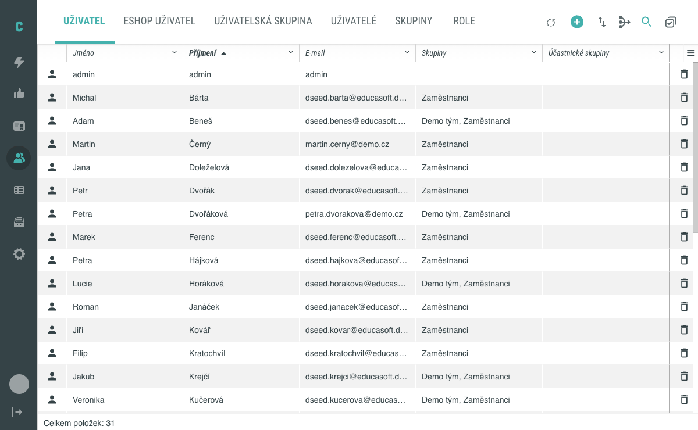
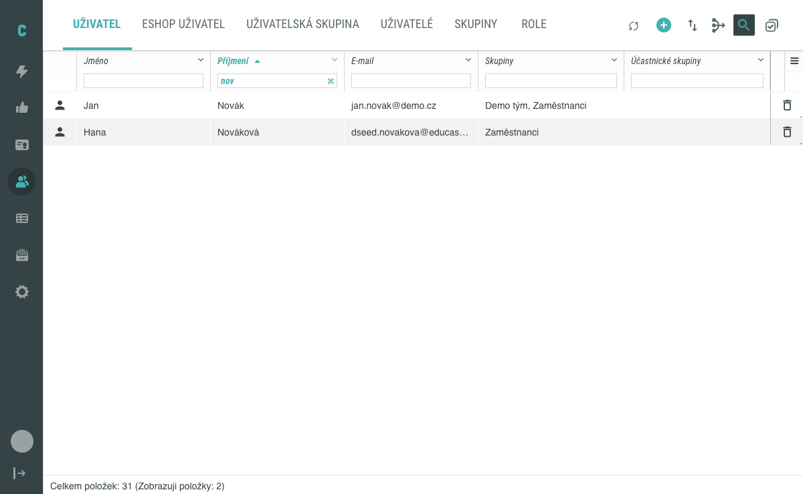
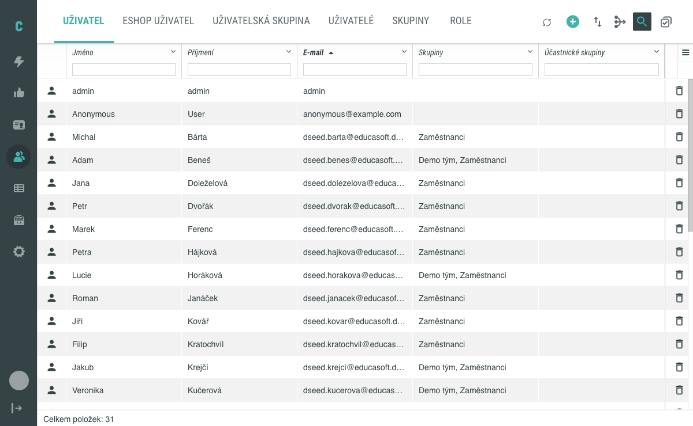
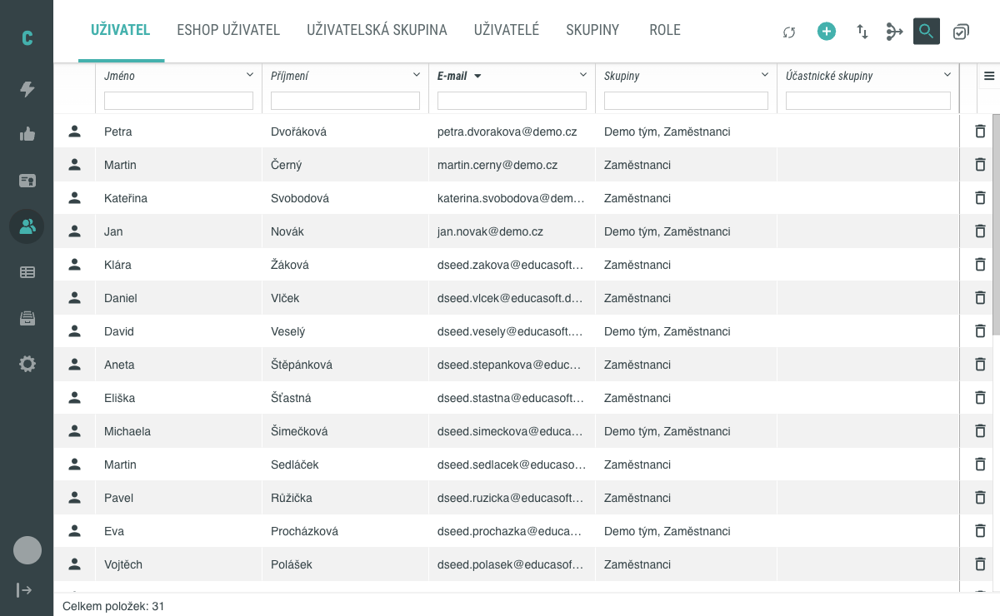
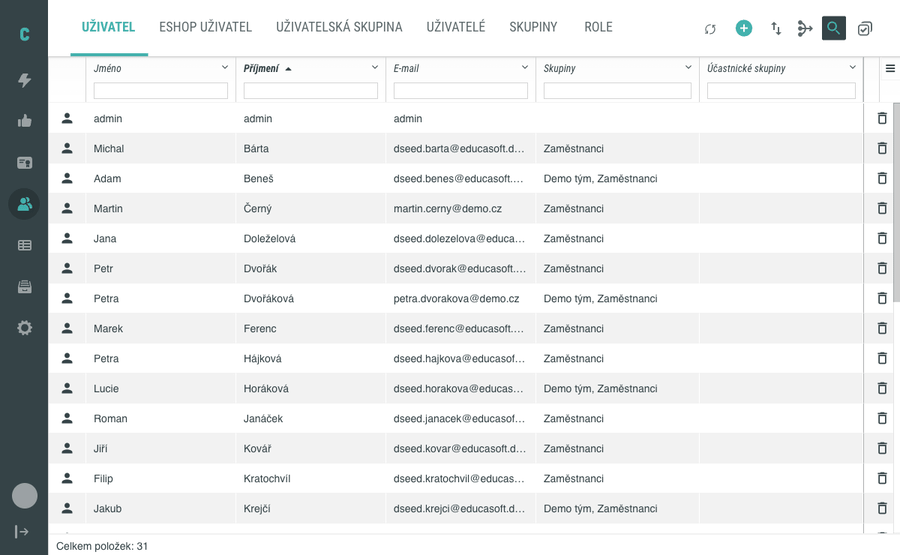

# Vyhledávání a řazení uživatelů v administraci

V obrazovce **Lidé** najdete všechny uživatele evidované v Competent. Když je uživatelů hodně, využijte vestavěné nástroje: vyhledávání podle textu (zadáním do pole pod záhlavím konkrétního sloupce) a řazení (kliknutím na záhlaví sloupce). Tento návod vás provede oběma postupy.

## Předpoklady

- Máte přístup do administrace Competent a vidíte v hlavním menu položku **Lidé**.
- V systému jsou uživatelé, mezi kterými chcete vyhledávat — v tabu **Uživatel** je viditelný seznam.

## Otevření seznamu uživatelů

V hlavním menu administrace klikněte na **Lidé**. Otevře se obrazovka se seznamem uživatelů. V horní liště vidíte taby pro různé pohledy (například **Uživatel**, **Skupiny**, **Role**); pro vyhledávání a řazení uživatelů zůstaňte v tabu **Uživatel**, který je zvolený jako výchozí.

Seznam je při prvním otevření seřazený podle sloupce **Příjmení** vzestupně (A–Z). Výchozí zobrazené sloupce jsou **Jméno**, **Příjmení**, **E-mail**, **Skupiny** a **Účastnické skupiny**.

## Vyhledávání podle textu

### 1. Aktivujte vyhledávání

V záhlaví obrazovky (vpravo nahoře nad seznamem) klikněte na ikonu lupy (**Vyhledávání**). Pod záhlavím každého sloupce se zobrazí textové pole, do kterého můžete zadat hledaný řetězec.

### 2. Zadejte hledaný řetězec

Klikněte do pole pod sloupcem, ve kterém chcete vyhledávat (například **Příjmení**), a začněte psát. Stačí zadat jen část hledaného slova — seznam se filtruje podle každého řetězce, který se v daném sloupci vyskytuje. Vyhledávání ignoruje rozdíl mezi velkými a malými písmeny i diakritiku.

Obsah seznamu se aktualizuje okamžitě s každým zadaným znakem; samostatné tlačítko pro spuštění vyhledávání není potřeba.

Po dokončení uvidíte v seznamu pouze řádky odpovídající zadanému kritériu. Ve spodním řádku tabulky se zobrazuje počet zobrazených položek vůči celkovému počtu (například „Celkem položek: 31 (Zobrazuji položky: 2)").

### 3. Kombinujte vyhledávání napříč sloupci (volitelné)

Vyhledávání lze kombinovat napříč více sloupci — zápisem do více polí současně systém zužuje výsledek na řádky vyhovující všem zadaným kritériím.

### 4. Vymažte filtr

Obsah pole vymažete kliknutím na křížek na pravém okraji pole nebo smazáním zadaného textu. Po vymazání se obnoví celý seznam.

## Řazení podle sloupce

### 1. Klikněte na záhlaví sloupce

Klikněte na záhlaví sloupce, podle kterého chcete řadit (například **E-mail**). Tabulka se přeřadí vzestupně podle hodnot v daném sloupci a vedle názvu sloupce se zobrazí šipka označující směr řazení.

### 2. Otočte směr řazení

Opětovným kliknutím na stejné záhlaví obrátíte směr řazení (sestupně, Z–A). Šipka u názvu sloupce se podle toho otočí.

### 3. Změňte řazení podle jiného sloupce

Kliknutím na záhlaví jiného sloupce přepnete řazení na nový sloupec; předchozí sloupec se přestane řadit. Řadit lze vždy pouze podle jednoho sloupce.

Řazení respektuje českou abecedu, takže znaky s diakritikou (Á, Č, Š, Ž) se zařazují na správné místo.

## Pozor na

- **Některé sloupce nemusí být řaditelné.** Pokud po kliknutí na záhlaví sloupce nedojde k žádné změně pořadí ani se neobjeví šipka, sloupec řazení nepodporuje. V takovém případě tabulku seřaďte podle jiného sloupce.
- **Řazení se po vyhledávání zachová.** Když nejprve nastavíte řazení a poté zadáte vyhledávací řetězec, výsledné řádky zůstanou seřazené podle původně zvoleného sloupce.
- **Vyhledávací pole platí pouze pro daný sloupec.** Řetězec zadaný v poli pod **Příjmením** se neporovnává s obsahem sloupců **Jméno** ani **E-mail**.

## Související stránky

- [Vytvoření uživatele — připravujeme](#)
- [Hromadné akce — připravujeme](#)
- [Zobrazení sloupců — připravujeme](#)
- [Detail uživatele — připravujeme](#)
