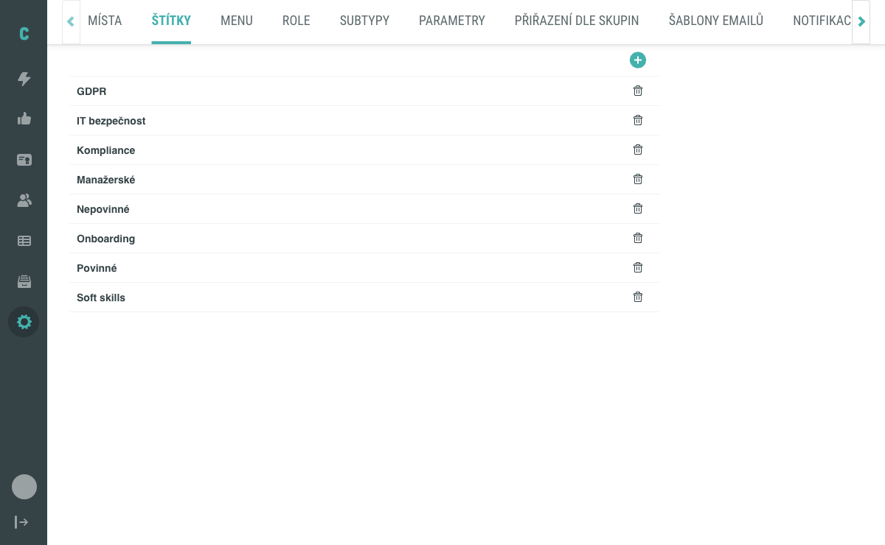
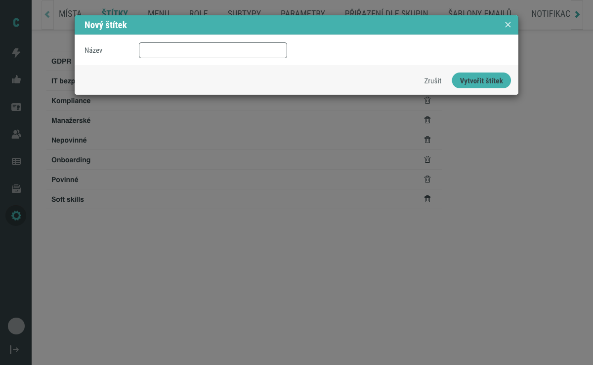
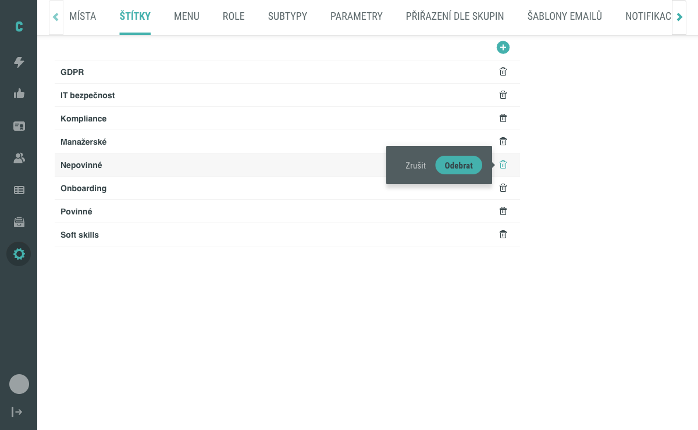

# Vytvoření a správa štítků

Na této stránce najdete postup, jak v sekci **Nastavení > Štítky** vytvořit nový štítek, upravit název existujícího a smazat štítek, který už není potřeba. Pro samotné přiřazení štítku k aktivitě viz [Přiřazení štítku k aktivitě](../aktivity/prirazovani-stitku.md). Co je štítek a jak souvisí s ostatními entitami popisuje [Co je štítek (koncept)](../../concepts/stitky.md).

## Předpoklady

- Máte přístup do administrace Competent a v sekci **Nastavení** vidíte záložku **Štítky**.
- Pro úpravu seznamu štítků není potřeba žádný předchozí stav — postup popisuje i situaci, kdy zatím žádný štítek neexistuje.

## Vytvoření štítku

### 1. Otevřete záložku Štítky v Nastavení

V hlavním menu klikněte na **Nastavení** a poté v záhlaví obrazovky na záložku **Štítky**. Zobrazí se seznam štítků seřazený abecedně.

### 2. Otevřete modální okno pro vytvoření štítku

Pokud již nějaké štítky existují, klikněte na **zelené tlačítko +** v záhlaví seznamu.

Pokud je seznam prázdný, zobrazí se uprostřed plochy text „Zatím nebyl vytvořen žádný štítek." a tlačítko **Vytvořit nový štítek** — kliknutím na něj otevřete stejné modální okno.

### 3. Zadejte název štítku

V modálním okně **Nový štítek** vyplňte pole **Název** a klikněte na tlačítko **Vytvořit štítek**.

Modální okno se zavře a nový štítek se objeví v seznamu na své abecední pozici.

!!! tip
    Pokud chcete vytváření přerušit, klikněte na **Zrušit** nebo na ikonu křížku v záhlaví modálního okna.

## Úprava štítku

### 1. Otevřete modální okno pro úpravu

V seznamu štítků klikněte na řádek se štítkem, jehož název chcete změnit. Zobrazí se modální okno **Editovat štítek** s předvyplněným polem **Název**.

### 2. Uložte změnu

Upravte hodnotu pole **Název** a klikněte na tlačítko **Uložit změny**. Modální okno se zavře a v seznamu se zobrazí nový název na příslušné abecední pozici.

Pokud chcete změnu zahodit, klikněte na **Zrušit**.

## Smazání štítku

### 1. Vyvolejte potvrzovací okno

V seznamu štítků klikněte na **ikonu koše** vedle štítku, který chcete odstranit. Zobrazí se inline potvrzovací okno s tlačítky **Zrušit** a **Odebrat**.

### 2. Potvrďte smazání

Klikněte na tlačítko **Odebrat**. Štítek je z aplikace okamžitě odstraněn a zmizí ze seznamu.

Pokud jste klikli na ikonu koše omylem, klikněte na **Zrušit** — štítek zůstane zachován.

## Pozor na

- **Smazání štítku je nevratné.** V uživatelském rozhraní není dostupný způsob, jak odstraněný štítek obnovit. Pokud má být přiřazení k aktivitám zachováno, štítek raději nemažte — postačí ho přejmenovat, případně přestat používat.
- **Smazaný štítek se automaticky odebere ze všech aktivit, kterým byl přiřazen.** Aktivity samy zůstanou beze změny obsahu, pouze z nich daný štítek zmizí. Potvrzovací okno přitom nezobrazuje, kolika aktivit se odstranění dotkne.
- **Vícejazyčný název.** Pokud Competent provozujete ve vícejazyčném prostředí, lze do pole **Název** zadat hodnoty pro více jazyků současně oddělené svislítkem (`|`) v pořadí, ve kterém jsou jazyky v systému nastavené. Detaily o vícejazyčném prostředí viz [Jazyková podpora — připravujeme](#).
- **Seznam štítků je vždy řazen abecedně podle názvu.** Manuálně položky přesouvat nelze — pořadí v seznamu vychází vždy z abecedního porovnání.

## Související stránky

- [Přiřazení štítku k aktivitě](../aktivity/prirazovani-stitku.md)
- [Co je štítek (koncept)](../../concepts/stitky.md)
